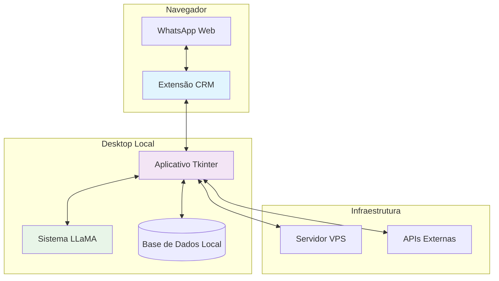
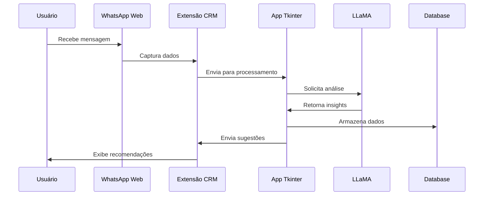
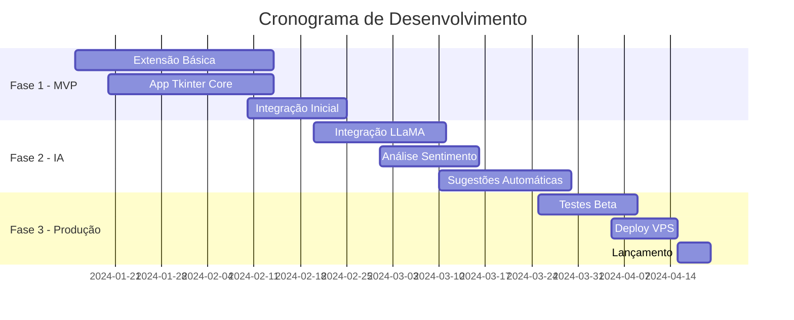

# CRM WhatsApp Web Extension

## 📋 Visão Geral do Projeto

Sistema integrado de CRM para WhatsApp Web composto por três componentes principais:

1. **Extensão CRM para WhatsApp Web** - Interface de usuário integrada ao navegador
2. **Aplicativo Desktop Tkinter** - Servidor/serviço local para processamento
3. **Sistema de Análise com LLaMA** - Inteligência artificial para análise de conversas

## 🏗️ Arquitetura do Sistema

## 🎯 Objetivos Principais

- **Automatização de CRM**: Integração nativa com WhatsApp Web para gestão de clientes
- **Análise Inteligente**: Processamento de conversas com IA local (LLaMA)
- **Escalabilidade**: Suporte tanto para operação local quanto em VPS
- **Eficiência Operacional**: Redução de tempo em tarefas repetitivas de atendimento

## 🔧 Componentes Técnicos

### 1. Extensão CRM (Browser Extension)
- **Tecnologia**: JavaScript, HTML5, CSS3
- **Funcionalidades**:
  - Interface integrada ao WhatsApp Web
  - Captura de dados de conversas
  - Sincronização com servidor local
  - Dashboard de métricas em tempo real

### 2. Aplicativo Desktop (Tkinter)
- **Tecnologia**: Python 3.9+, Tkinter, SQLite
- **Funcionalidades**:
  - Servidor HTTP local
  - Gerenciamento de dados
  - Interface de configuração
  - Monitoramento de sistema

### 3. Sistema de Análise (LLaMA)
- **Tecnologia**: LLaMA 2/3, Transformers, PyTorch
- **Funcionalidades**:
  - Análise de sentimento
  - Classificação de intenções
  - Sugestões de resposta
  - Relatórios automatizados

## 💻 Requisitos de Sistema

### Opção Local (Mínimo)
- **Processador**: 4 núcleos (Intel i5 ou AMD Ryzen 5)
- **Memória RAM**: 8GB (recomendado 16GB)
- **Armazenamento**: SSD 200GB
- **Sistema Operacional**: Windows 10/11, macOS 10.15+, Ubuntu 20.04+
- **Conexão**: Internet estável (mínimo 10 Mbps)

### Opção VPS (Recomendada)
- **Plano**: KVM 4
- **vCPU**: 4 núcleos
- **RAM**: 16GB
- **Disco**: 200GB NVMe
- **Largura de Banda**: 16TB/mês
- **Custo**: R$ 54,99/mês (promo) → R$ 129,99/mês

## 📊 Fluxo de Dados

## 🚀 Benefícios da Solução

### Para Empresas
- ✅ **ROI Mensurável**: Redução de 40-60% no tempo de atendimento
- ✅ **Escalabilidade**: Suporte a múltiplos atendentes simultaneamente
- ✅ **Compliance**: Dados processados localmente (LGPD)
- ✅ **Integração**: API para sistemas existentes

### Para Atendentes
- ✅ **Produtividade**: Sugestões automáticas de resposta
- ✅ **Contexto**: Histórico completo do cliente
- ✅ **Métricas**: Dashboard em tempo real
- ✅ **Automação**: Tarefas repetitivas automatizadas

## 📈 Roadmap de Desenvolvimento

## 🔒 Segurança e Privacidade

- **Criptografia**: AES-256 para dados sensíveis
- **Autenticação**: OAuth 2.0 + JWT tokens
- **Logs**: Auditoria completa de ações
- **Backup**: Rotinas automáticas de backup
- **LGPD**: Conformidade total com regulamentações

## 📞 Suporte e Manutenção

### Opção VPS - Benefícios Inclusos
- 🔧 **Suporte 24/7**: Equipe técnica especializada
- 💰 **Garantia 30 dias**: Reembolso integral
- 🔄 **Flexibilidade**: Cancelamento sem multa
- 📊 **Monitoramento**: Infraestrutura gerenciada
- 🚀 **Escalabilidade**: Upgrade automático de recursos

---

## 📋 Próximos Passos

1. **Análise de Requisitos Detalhada**
2. **Prototipagem da Extensão**
3. **Desenvolvimento do Core Tkinter**
4. **Integração com LLaMA**
5. **Testes e Validação**
6. **Deploy em Produção**

---

*Documento criado em: Janeiro 2024*  
*Versão: 1.0*  
*Status: Em Desenvolvimento*