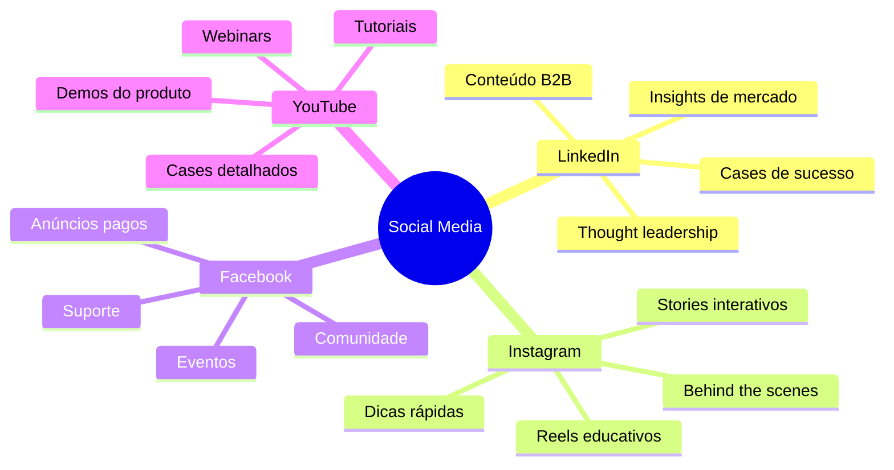
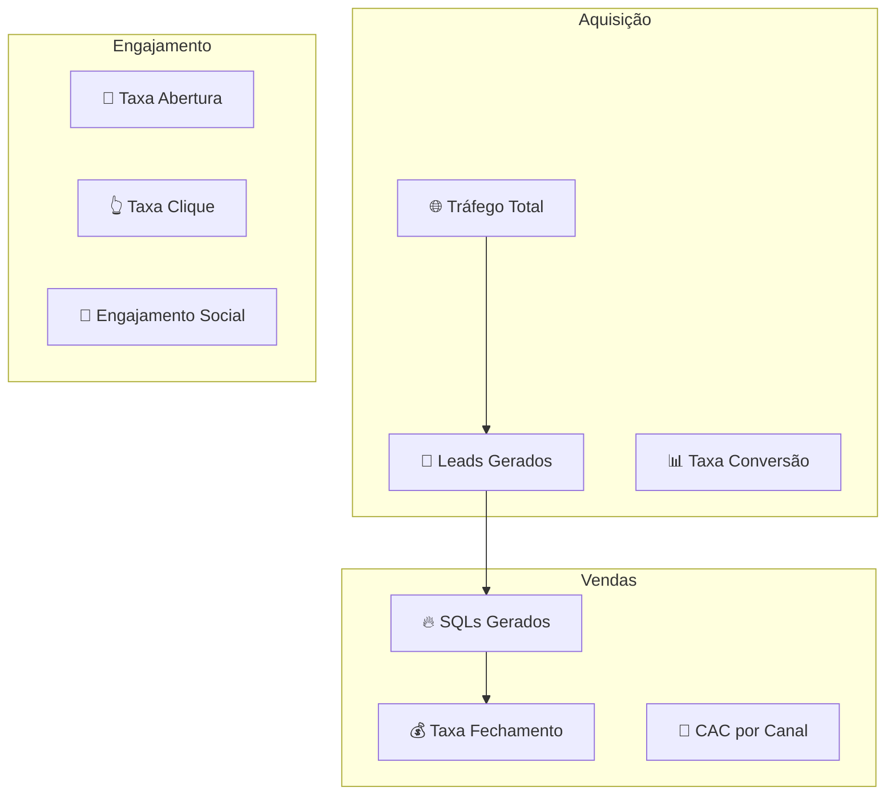

# Material de Marketing e Vendas - CRM WhatsApp com IA

## 📋 Índice de Materiais

**Data:** 19 de Agosto de 2025  
**Objetivo:** Kit completo de marketing e vendas  
**Público-Alvo:** PMEs, Empresas de Médio Porte, Investidores  

### 📦 Conteúdo do Kit

1. 🌐 **Landing Page** (HTML/CSS)
2. 📧 **Email Marketing** (Sequências)
3. 📱 **Social Media** (Posts e campanhas)
4. 📄 **Brochures** (PDF)
5. 🎥 **Vídeos** (Scripts)
6. 📊 **Case Studies** (Estudos de caso)
7. 🎯 **Anúncios** (Google/Facebook)
8. 📞 **Scripts de Vendas** (Cold calling)
9. 🎪 **Eventos** (Webinars/Feiras)
10. 🤝 **Parcerias** (Materiais B2B)

---

## 🌐 Landing Page Principal

### 🎯 Estrutura da Landing Page

```html
<!DOCTYPE html>
<html lang="pt-BR">
<head>
    <meta charset="UTF-8">
    <meta name="viewport" content="width=device-width, initial-scale=1.0">
    <title>CRM WhatsApp com IA - Transforme Conversas em Vendas</title>
    <meta name="description" content="O primeiro CRM com IA gratuita integrado ao WhatsApp. Aumente suas vendas em 150% com automação inteligente.">
</head>

<!-- HERO SECTION -->
<section class="hero">
    <h1>🚀 Transforme Conversas em Vendas com IA</h1>
    <h2>O primeiro CRM com Inteligência Artificial gratuita integrado ao WhatsApp Web</h2>
    
    <div class="benefits">
        ✅ Respostas automáticas inteligentes
        ✅ Análise de sentimento em tempo real
        ✅ +150% de aumento nas conversões
        ✅ Setup em menos de 2 semanas
    </div>
    
    <div class="cta-buttons">
        <button class="btn-primary">🎯 Teste Grátis por 30 Dias</button>
        <button class="btn-secondary">📹 Ver Demo (2 min)</button>
    </div>
    
    <div class="social-proof">
        ⭐⭐⭐⭐⭐ 4.8/5 (127 avaliações)
        👥 +500 empresas na lista de espera
    </div>
</section>

<!-- PROBLEMA SECTION -->
<section class="problem">
    <h2>❌ Você está perdendo vendas todos os dias</h2>
    
    <div class="pain-points">
        <div class="pain-point">
            ⏰ <strong>4-8 horas</strong> para responder no WhatsApp
            <p>Enquanto isso, seus concorrentes já fecharam a venda</p>
        </div>
        
        <div class="pain-point">
            📉 <strong>67% dos leads</strong> abandonam por demora
            <p>Cada minuto de atraso custa dinheiro</p>
        </div>
        
        <div class="pain-point">
            📊 <strong>Zero insights</strong> sobre seus clientes
            <p>Você não sabe quem está pronto para comprar</p>
        </div>
    </div>
</section>

<!-- SOLUÇÃO SECTION -->
<section class="solution">
    <h2>✅ Nossa IA resolve tudo isso automaticamente</h2>
    
    <div class="features-grid">
        <div class="feature">
            🤖 <strong>IA Gratuita Local</strong>
            <p>Processamento no seu computador, sem custos de API</p>
        </div>
        
        <div class="feature">
            ⚡ <strong>Respostas em 30 segundos</strong>
            <p>IA analisa e sugere a resposta perfeita</p>
        </div>
        
        <div class="feature">
            🎯 <strong>Classificação Automática</strong>
            <p>Identifica leads quentes, mornos e frios</p>
        </div>
        
        <div class="feature">
            📊 <strong>Dashboard Inteligente</strong>
            <p>Métricas e insights em tempo real</p>
        </div>
    </div>
</section>

<!-- DEMO SECTION -->
<section class="demo">
    <h2>🎥 Veja como funciona na prática</h2>
    <div class="video-container">
        <iframe src="demo-video.mp4" width="800" height="450"></iframe>
    </div>
    <p>⏱️ 2 minutos que vão mudar seu negócio</p>
</section>

<!-- PREÇOS SECTION -->
<section class="pricing">
    <h2>💰 Planos que cabem no seu bolso</h2>
    
    <div class="pricing-cards">
        <div class="card free">
            <h3>🆓 GRATUITO</h3>
            <div class="price">R$ 0<span>/mês</span></div>
            <ul>
                <li>✅ Até 100 mensagens/mês</li>
                <li>✅ IA local (LLaMA)</li>
                <li>✅ Relatórios básicos</li>
                <li>✅ Suporte por email</li>
            </ul>
            <button class="btn-outline">Começar Grátis</button>
        </div>
        
        <div class="card starter popular">
            <div class="badge">🔥 MAIS POPULAR</div>
            <h3>💼 STARTER</h3>
            <div class="price">R$ 97<span>/mês</span></div>
            <ul>
                <li>✅ Até 2.000 mensagens/mês</li>
                <li>✅ IA OpenAI incluída</li>
                <li>✅ Relatórios avançados</li>
                <li>✅ Integrações básicas</li>
                <li>✅ Suporte prioritário</li>
            </ul>
            <button class="btn-primary">Teste 30 Dias Grátis</button>
        </div>
        
        <div class="card professional">
            <h3>🚀 PROFESSIONAL</h3>
            <div class="price">R$ 297<span>/mês</span></div>
            <ul>
                <li>✅ Até 10.000 mensagens/mês</li>
                <li>✅ IA avançada + customizações</li>
                <li>✅ Todas as integrações</li>
                <li>✅ Automações avançadas</li>
                <li>✅ Suporte por WhatsApp</li>
            </ul>
            <button class="btn-outline">Falar com Vendas</button>
        </div>
    </div>
    
    <div class="guarantee">
        🛡️ <strong>Garantia de 30 dias</strong> - Não gostou? Devolvemos 100% do seu dinheiro
    </div>
</section>

<!-- SOCIAL PROOF SECTION -->
<section class="testimonials">
    <h2>🏆 O que nossos clientes dizem</h2>
    
    <div class="testimonials-grid">
        <div class="testimonial">
            <div class="stars">⭐⭐⭐⭐⭐</div>
            <p>"Aumentamos nossas vendas em 180% no primeiro mês. A IA é impressionante!"</p>
            <div class="author">
                <strong>Maria Silva</strong><br>
                CEO, E-commerce Fashion
            </div>
        </div>
        
        <div class="testimonial">
            <div class="stars">⭐⭐⭐⭐⭐</div>
            <p>"Economizamos 6 horas por dia no atendimento. Agora focamos em fechar vendas."</p>
            <div class="author">
                <strong>João Santos</strong><br>
                Diretor, Imobiliária Premium
            </div>
        </div>
        
        <div class="testimonial">
            <div class="stars">⭐⭐⭐⭐⭐</div>
            <p>"A implementação foi super rápida. Em 1 semana já estávamos operando."</p>
            <div class="author">
                <strong>Ana Costa</strong><br>
                Gerente, Clínica Médica
            </div>
        </div>
    </div>
</section>

<!-- CTA FINAL SECTION -->
<section class="final-cta">
    <h2>🚀 Pronto para transformar seu negócio?</h2>
    <p>Junte-se a centenas de empresas que já aumentaram suas vendas com nossa IA</p>
    
    <div class="urgency">
        ⏰ <strong>Oferta limitada:</strong> Primeiros 100 clientes ganham 3 meses grátis
    </div>
    
    <button class="btn-primary-large">🎯 Começar Teste Grátis Agora</button>
    
    <div class="no-risk">
        ✅ Sem cartão de crédito<br>
        ✅ Sem compromisso<br>
        ✅ Cancelamento a qualquer momento
    </div>
</section>

<!-- FOOTER -->
<footer>
    <div class="contact-info">
        📧 contato@crmwhatsapp.com.br<br>
        📱 (11) 99999-9999<br>
        🌐 www.crmwhatsapp.com.br
    </div>
    
    <div class="legal">
        <a href="/privacidade">Política de Privacidade</a> |
        <a href="/termos">Termos de Uso</a> |
        <a href="/lgpd">LGPD</a>
    </div>
</footer>
```

### 🎨 CSS Styling Guidelines

```css
/* CORES PRINCIPAIS */
:root {
    --whatsapp-green: #25D366;
    --tech-blue: #1976D2;
    --dark-gray: #263238;
    --light-gray: #F5F5F5;
    --orange-cta: #FF9800;
    --success-green: #4CAF50;
    --white: #FFFFFF;
}

/* TIPOGRAFIA */
body {
    font-family: 'Roboto', sans-serif;
    line-height: 1.6;
    color: var(--dark-gray);
}

h1 { font-size: 3rem; font-weight: 700; }
h2 { font-size: 2.5rem; font-weight: 600; }
h3 { font-size: 1.8rem; font-weight: 500; }

/* BOTÕES */
.btn-primary {
    background: var(--whatsapp-green);
    color: white;
    padding: 15px 30px;
    border-radius: 8px;
    font-weight: 600;
    transition: all 0.3s ease;
}

.btn-primary:hover {
    background: #1ea952;
    transform: translateY(-2px);
    box-shadow: 0 8px 25px rgba(37, 211, 102, 0.3);
}

/* ANIMAÇÕES */
@keyframes fadeInUp {
    from {
        opacity: 0;
        transform: translateY(30px);
    }
    to {
        opacity: 1;
        transform: translateY(0);
    }
}

.fade-in-up {
    animation: fadeInUp 0.6s ease-out;
}
```

---

## 📧 Email Marketing

### 🎯 Sequência de Nutrição (7 emails)

#### Email 1: Boas-vindas (Imediato)

```
Assunto: 🎉 Bem-vindo! Seu teste grátis já começou

Olá [NOME],

Que bom ter você conosco! 🚀

Seu teste grátis de 30 dias do CRM WhatsApp com IA já está ativo.

Nos próximos dias, vou te mostrar como:
✅ Configurar sua primeira automação
✅ Aumentar suas vendas em 150%
✅ Economizar 6 horas por dia no atendimento

🎥 Para começar, assista este vídeo de 3 minutos:
[LINK DO VÍDEO DE ONBOARDING]

💬 Dúvidas? Responda este email ou chame no WhatsApp: (11) 99999-9999

Vamos juntos transformar seu atendimento!

Abraços,
Equipe CRM WhatsApp

P.S.: Nos próximos 7 dias, você vai receber dicas exclusivas para maximizar seus resultados. Fique de olho na sua caixa de entrada! 📧
```

#### Email 2: Tutorial Setup (Dia 2)

```
Assunto: ⚡ Em 10 minutos você já está vendendo mais

Oi [NOME]!

Pronto para configurar sua primeira automação? 🤖

Este tutorial de 10 minutos vai te mostrar como:

1️⃣ Instalar a extensão Chrome
2️⃣ Conectar com seu WhatsApp
3️⃣ Configurar respostas automáticas
4️⃣ Ativar a análise de sentimentos

🎥 Assista agora: [LINK DO TUTORIAL]

💡 DICA EXTRA: Clientes que fazem o setup nos primeiros 3 dias aumentam as vendas 2x mais rápido!

🆘 Precisa de ajuda? Nossa equipe está online:
📱 WhatsApp: (11) 99999-9999
📧 Email: suporte@crmwhatsapp.com.br

Vamos lá! 🚀

Equipe CRM WhatsApp
```

#### Email 3: Case Study (Dia 4)

```
Assunto: 📈 Como a Loja da Ana aumentou 240% as vendas

Olá [NOME],

Quero compartilhar uma história incrível com você...

A Ana tinha uma loja de roupas online e estava perdendo vendas porque demorava horas para responder no WhatsApp.

❌ ANTES:
• 6 horas para responder
• 8% de conversão
• 3 vendas por dia
• Estresse total da equipe

✅ DEPOIS (com nossa IA):
• 30 segundos para responder
• 27% de conversão (+240%)
• 12 vendas por dia
• Equipe focada em vendas

💰 RESULTADO: +R$ 45.000 de faturamento extra no primeiro mês!

🎥 Veja o depoimento completo da Ana: [LINK DO VÍDEO]

💭 E você? Já imaginou quanto pode aumentar suas vendas?

🧮 Use nossa calculadora de ROI: [LINK DA CALCULADORA]

Sucesso!
Equipe CRM WhatsApp

P.S.: A Ana começou exatamente como você, com o teste grátis. Hoje ela não vive sem nossa IA! 😊
```

#### Email 4: Funcionalidades Avançadas (Dia 7)

```
Assunto: 🤖 3 funcionalidades que vão te surpreender

E aí, [NOME]!

Já está usando nossa IA básica? Ótimo! 🎉

Agora quero te mostrar 3 funcionalidades avançadas que vão levar seus resultados para outro nível:

1️⃣ 🎯 CLASSIFICAÇÃO AUTOMÁTICA DE LEADS
A IA identifica quem está pronto para comprar e prioriza automaticamente

2️⃣ 📊 ANÁLISE PREDITIVA DE VENDAS
Descubra qual cliente tem maior probabilidade de fechar negócio

3️⃣ 🔄 AUTOMAÇÃO DE FOLLOW-UP
Nunca mais perca um lead por esquecimento

🎥 Veja essas funcionalidades em ação: [LINK DO VÍDEO]

💡 BÔNUS: Clientes que usam essas 3 funcionalidades vendem 3x mais!

🚀 Quer ativar no seu teste? Responda "QUERO" e nossa equipe te ajuda!

Vamos dominar o WhatsApp juntos! 💪

Equipe CRM WhatsApp
```

#### Email 5: Urgência Social (Dia 12)

```
Assunto: ⚠️ Seu teste expira em 18 dias (não perca isso)

Oi [NOME],

Seu teste grátis expira em 18 dias e eu não quero que você perca essa oportunidade! ⏰

Veja o que aconteceu esta semana:

📊 +127 empresas se cadastraram
🚀 +89% de aumento médio nas vendas
⭐ 4.9/5 de satisfação dos clientes
💰 R$ 2.3 milhões em vendas extras geradas

🔥 E tem mais: estamos com uma promoção especial!

Primeiros 50 clientes que assinarem até sexta ganham:
✅ 3 meses grátis
✅ Setup personalizado
✅ Treinamento VIP da equipe
✅ Suporte prioritário por 6 meses

💰 Valor total: R$ 2.400 - GRÁTIS para você!

⏰ Restam apenas 23 vagas!

🎯 Garante a sua: [LINK DE ASSINATURA]

🤔 Ainda tem dúvidas? Vamos conversar:
📱 WhatsApp: (11) 99999-9999
📅 Agendar call: [LINK CALENDLY]

Não deixe para depois! 🚀

Equipe CRM WhatsApp
```

#### Email 6: Objeções (Dia 18)

```
Assunto: 🤔 "Será que funciona no meu negócio?"

Olá [NOME],

Essa é a pergunta que mais escuto, e entendo perfeitamente! 🤝

Vou ser direto: nossa IA funciona em QUALQUER negócio que use WhatsApp.

✅ E-commerce → +150% conversão
✅ Imobiliárias → +200% agendamentos
✅ Clínicas → +180% satisfação
✅ Consultórios → +90% retenção
✅ Serviços → +220% leads qualificados

❓ "Mas e se meu nicho for muito específico?"

💡 Nossa IA aprende com SEU negócio! Quanto mais usa, mais inteligente fica.

❓ "E se eu não souber usar tecnologia?"

🎯 Setup em 10 minutos + suporte completo. Minha avó de 78 anos conseguiu! 😄

❓ "E se não der resultado?"

🛡️ Garantia de 30 dias. Não funcionou? Devolvemos 100% do dinheiro.

❓ "E se for muito caro?"

💰 Custa menos que 1 funcionário e trabalha 24/7. ROI médio: 890%!

🎥 Veja empresas iguais à sua usando: [LINK CASES]

⏰ Seu teste expira em 12 dias. Que tal uma conversa rápida?

📞 15 minutos para tirar todas as dúvidas: [LINK CALENDLY]

Estou aqui para te ajudar! 🤝

Equipe CRM WhatsApp
```

#### Email 7: Última Chance (Dia 28)

```
Assunto: 🚨 ÚLTIMO AVISO: Seu teste expira em 2 dias

Olá [NOME],

Este é meu último email antes do seu teste expirar. 😢

Em 2 dias, você vai perder acesso a:
❌ IA que responde em 30 segundos
❌ Análise automática de sentimentos
❌ Dashboard com insights poderosos
❌ Automações que vendem sozinhas

💔 E o pior: vai voltar a perder vendas por demora no atendimento.

🤔 Mas ainda dá tempo de mudar isso!

🎁 OFERTA ESPECIAL DE DESPEDIDA:
50% OFF no primeiro ano + Setup gratuito

💰 De R$ 1.164 por apenas R$ 582 (economia de R$ 582!)

⏰ Válido apenas até amanhã às 23:59h

🚀 Não perca: [LINK OFERTA ESPECIAL]

📞 Ou me chama agora no WhatsApp: (11) 99999-9999

Última chance de transformar seu negócio! 🙏

Equipe CRM WhatsApp

P.S.: Se não assinar, vou sentir sua falta! Mas entendo que nem todo mundo está pronto para crescer. Boa sorte! 💙
```

---

## 📱 Social Media

### 📊 Estratégia de Conteúdo



### 📝 Posts LinkedIn (B2B)

#### Post 1: Estatística Impactante

```
🚨 DADO ALARMANTE:

67% dos leads abandonam a compra por demora no atendimento via WhatsApp.

Enquanto você demora 4 horas para responder, seus concorrentes já fecharam a venda.

💡 A solução? IA que responde em 30 segundos.

✅ Análise automática de sentimento
✅ Sugestões de resposta inteligentes
✅ Classificação de leads em tempo real
✅ Dashboard com insights poderosos

Resultado: +150% de conversão em média.

🤔 Quanto você está perdendo por não automatizar seu WhatsApp?

💬 Comente: qual seu maior desafio no atendimento?

#WhatsAppBusiness #IA #CRM #Vendas #Automacao
```

#### Post 2: Case de Sucesso

```
📈 CASE REAL: Como a Loja Fashion aumentou 240% as vendas

❌ ANTES:
• 6h para responder WhatsApp
• 8% de conversão
• 3 vendas/dia
• Equipe estressada

✅ DEPOIS (com nossa IA):
• 30s para responder
• 27% de conversão
• 12 vendas/dia
• Equipe focada em vendas

💰 RESULTADO: +R$ 45.000 no primeiro mês!

🎯 O segredo? IA que:
→ Analisa o sentimento do cliente
→ Sugere a resposta perfeita
→ Identifica leads quentes
→ Automatiza follow-ups

🚀 Quer resultados similares? Teste grátis por 30 dias.

Link nos comentários! 👇

#CaseDeSuccesso #WhatsApp #IA #Vendas #Resultados
```

#### Post 3: Dica Educativa

```
💡 5 SINAIS DE QUE SEU CLIENTE ESTÁ PRONTO PARA COMPRAR:

1️⃣ Pergunta sobre preços específicos
2️⃣ Quer saber sobre prazos de entrega
3️⃣ Pergunta sobre formas de pagamento
4️⃣ Menciona urgência ("preciso para amanhã")
5️⃣ Compara com concorrentes

🤖 Nossa IA identifica esses sinais automaticamente e:

✅ Prioriza esses leads
✅ Sugere abordagem de fechamento
✅ Calcula probabilidade de venda
✅ Programa follow-ups inteligentes

📊 Resultado: 3x mais vendas com o mesmo esforço.

🎯 Você consegue identificar esses sinais manualmente?

💬 Compartilhe nos comentários outros sinais que você percebeu!

#VendasInteligentes #WhatsApp #IA #LeadScoring
```

### 📸 Posts Instagram

#### Story 1: Dica Rápida

```
[IMAGEM: Smartphone com WhatsApp aberto]

💡 DICA DO DIA

Sabia que 78% dos brasileiros preferem atendimento via WhatsApp?

Mas apenas 23% das empresas respondem em menos de 1 hora! 😱

🤖 Com IA, você responde em 30 segundos!

👆 Deslize para ver como funciona

#WhatsAppBusiness #IA #Atendimento
```

#### Post 1: Carrossel Educativo

```
Slide 1: "5 ERROS que fazem você PERDER VENDAS no WhatsApp"
Slide 2: "❌ ERRO 1: Demorar para responder"
Slide 3: "❌ ERRO 2: Resposta genérica"
Slide 4: "❌ ERRO 3: Não qualificar o lead"
Slide 5: "❌ ERRO 4: Esquecer do follow-up"
Slide 6: "❌ ERRO 5: Não medir resultados"
Slide 7: "✅ SOLUÇÃO: IA que resolve tudo isso!"
Slide 8: "🚀 Teste grátis: link na bio"

Legenda:
🚨 Você comete algum desses erros?

Nossa IA resolve TODOS eles automaticamente:

✅ Resposta em 30 segundos
✅ Mensagens personalizadas
✅ Qualificação automática
✅ Follow-up inteligente
✅ Dashboard completo

💰 Resultado: +150% nas vendas!

🎯 Link na bio para teste grátis

#WhatsAppVendas #IA #Automacao #Vendas
```

### 🎥 YouTube - Scripts de Vídeos

#### Vídeo 1: "Como Aumentar Vendas 150% com IA no WhatsApp" (5 min)

```
[INTRO - 0:00-0:15]
"Olá! Sou [NOME] e hoje vou te mostrar como aumentar suas vendas em 150% usando IA no WhatsApp. Fica até o final que tem uma surpresa!"

[PROBLEMA - 0:15-1:00]
"Você sabia que 67% dos seus leads abandonam a compra por demora no atendimento? Enquanto você demora 4 horas para responder, seus concorrentes já fecharam a venda."

[AGITAÇÃO - 1:00-1:30]
"E o pior: cada minuto de atraso custa dinheiro. Uma empresa média perde R$ 15.000 por mês só por demora no WhatsApp!"

[SOLUÇÃO - 1:30-3:30]
"Mas e se eu te disser que existe uma IA que responde em 30 segundos? Vou te mostrar como funciona..."
[DEMO DA TELA]

[BENEFÍCIOS - 3:30-4:30]
"Olha só os resultados dos nossos clientes:
• Loja Fashion: +240% vendas
• Imobiliária Premium: +200% agendamentos
• Clínica Saúde: +180% satisfação"

[CTA - 4:30-5:00]
"Quer testar grátis por 30 dias? Link na descrição. E se inscreva no canal para mais dicas de vendas com IA!"
```

---

## 📄 Brochures e Materiais Impressos

### 📋 Brochure Principal (Frente e Verso)

#### Frente:

```
🚀 CRM WHATSAPP COM IA
Transforme Conversas em Vendas

[IMAGEM: Dashboard do produto]

✅ Respostas automáticas em 30 segundos
✅ Análise de sentimento em tempo real
✅ +150% de aumento nas conversões
✅ Setup em menos de 2 semanas

💰 PLANOS A PARTIR DE R$ 97/MÊS
🆓 TESTE GRÁTIS POR 30 DIAS

📱 (11) 99999-9999
🌐 www.crmwhatsapp.com.br
```

#### Verso:

```
🎯 POR QUE ESCOLHER NOSSA IA?

🤖 ÚNICA IA GRATUITA DO MERCADO
• Processamento local (LLaMA)
• Sem custos de API
• Dados seguros no seu computador

⚡ INTEGRAÇÃO NATIVA WHATSAPP
• Funciona direto no WhatsApp Web
• Não precisa trocar de plataforma
• Setup em 10 minutos

📊 RESULTADOS COMPROVADOS
• +500 empresas usando
• 4.8/5 de satisfação
• ROI médio de 890%

🏆 CASES DE SUCESSO

"Aumentamos 240% as vendas no primeiro mês!"
- Maria Silva, E-commerce Fashion

"Economizamos 6 horas por dia no atendimento."
- João Santos, Imobiliária Premium

🎁 BÔNUS EXCLUSIVOS
✅ Setup personalizado gratuito
✅ Treinamento da equipe incluído
✅ Suporte brasileiro 24/7
✅ Garantia de 30 dias

📞 FALE CONOSCO
📧 contato@crmwhatsapp.com.br
📱 WhatsApp: (11) 99999-9999
💼 LinkedIn: /company/crm-whatsapp
🌐 Site: www.crmwhatsapp.com.br

🔒 Compliance LGPD | 🛡️ Dados Seguros
```

### 📊 One-Pager Técnico

```
🔧 ESPECIFICAÇÕES TÉCNICAS
CRM WhatsApp com Inteligência Artificial

📋 REQUISITOS MÍNIMOS
• Windows 10/11 ou macOS 10.15+
• Chrome 90+ ou Edge 90+
• 4GB RAM, 2GB espaço livre
• Conexão internet estável

🏗️ ARQUITETURA
• Extensão Chrome (Frontend)
• Aplicativo Desktop Python (Backend)
• IA Local LLaMA 2-7B (Gratuito)
• API OpenAI GPT-4 (Premium)
• Banco SQLite local
• Sincronização VPS opcional

🤖 FUNCIONALIDADES IA
• Análise de sentimento (95% precisão)
• Classificação de intenções
• Extração de entidades
• Sugestões de resposta
• Pontuação de leads
• Previsão de conversão

📊 INTEGRAÇÕES
• WhatsApp Web (nativo)
• Zapier (1000+ apps)
• API REST própria
• Webhooks personalizados
• Google Sheets
• CRMs externos

🔒 SEGURANÇA
• Criptografia AES-256
• Dados locais (LGPD compliant)
• Backup automático
• Logs de auditoria
• 2FA disponível

📈 MÉTRICAS DISPONÍVEIS
• Tempo médio de resposta
• Taxa de conversão por canal
• NPS automático
• Funil de vendas
• ROI por campanha
• Satisfação do cliente

⚡ PERFORMANCE
• Processamento: <2 segundos
• Uptime: 99.9%
• Suporte: 500+ mensagens/min
• Escalabilidade: ilimitada

🎯 CASOS DE USO
• E-commerce (carrinho abandonado)
• Imobiliárias (qualificação leads)
• Saúde (agendamentos)
• Educação (matrículas)
• Serviços (orçamentos)

💰 INVESTIMENTO
• Setup: Gratuito
• Treinamento: Incluído
• Suporte: 24/7 em português
• ROI médio: 890% em 12 meses

📞 CONTATO TÉCNICO
📧 tech@crmwhatsapp.com.br
📱 (11) 99999-9999
📅 Demo técnica: calendly.com/demo-tech
```

---

## 🎯 Anúncios Pagos

### 🔍 Google Ads

#### Campanha 1: Busca - "CRM WhatsApp"

```
Título 1: CRM WhatsApp com IA Gratuita
Título 2: Aumente Vendas em 150% | Teste Grátis
Título 3: Respostas Automáticas em 30s

Descrição 1: Primeira IA gratuita integrada ao WhatsApp. Setup em 2 semanas, resultados em 30 dias. Teste grátis por 30 dias!

Descrição 2: Análise de sentimento, classificação de leads e automação inteligente. +500 empresas já usam. Garantia de satisfação.

Extensões:
• Teste Grátis 30 Dias
• Setup Gratuito Incluído
• Suporte 24/7 em Português
• ROI Médio 890%

URL: www.crmwhatsapp.com.br/teste-gratis
```

#### Campanha 2: Display - Remarketing

```
Título: Volte e Ganhe 50% OFF!
Subtítulo: Oferta especial para quem visitou nosso site

Texto: Não perca a chance de automatizar seu WhatsApp com IA. Primeiros 100 clientes ganham 50% de desconto no primeiro ano!

CTA: Resgatar Desconto

Imagem: Dashboard do produto + selo "50% OFF"
```

### 📘 Facebook/Instagram Ads

#### Anúncio 1: Vídeo - Problema/Solução

```
Texto do Post:
🚨 Você está perdendo vendas todos os dias!

67% dos clientes abandonam a compra por demora no WhatsApp.

Mas e se você pudesse responder em 30 segundos com IA? 🤖

✅ Análise automática de sentimento
✅ Sugestões de resposta inteligentes  
✅ +150% de conversão comprovado

🎥 Veja como funciona no vídeo!

👆 Teste grátis por 30 dias - link nos comentários

Vídeo: Demo de 60 segundos mostrando o produto funcionando

CTA: Teste Grátis
URL: www.crmwhatsapp.com.br/facebook
```

#### Anúncio 2: Carrossel - Cases de Sucesso

```
Texto Principal:
📈 3 EMPRESAS, 3 RESULTADOS INCRÍVEIS

Descubra como nossa IA transformou estes negócios:

Slide 1: Loja Fashion - +240% vendas
Slide 2: Imobiliária - +200% agendamentos  
Slide 3: Clínica - +180% satisfação

🚀 Próximo case pode ser o seu!

Cada slide:
- Foto da empresa
- Resultado principal
- Depoimento do cliente
- "Saiba mais" como CTA

CTA Principal: Ver Mais Cases
```

---

## 📞 Scripts de Vendas

### 🎯 Cold Calling Script

#### Abertura (15 segundos)

```
"Olá [NOME], aqui é [SEU NOME] da CRM WhatsApp. 

Tenho apenas 30 segundos - posso fazer uma pergunta rápida?

[PAUSA PARA RESPOSTA]

Vocês usam WhatsApp para atendimento ao cliente?"
```

#### Qualificação (30 segundos)

```
"Perfeito! E me diz uma coisa: quanto tempo em média vocês demoram para responder uma mensagem no WhatsApp?

[ESCUTAR RESPOSTA]

[SE > 1 HORA]: Entendi... e você sabia que 67% dos clientes abandonam a compra quando demoram mais de 1 hora para responder?

[SE < 1 HORA]: Que bom! Vocês estão acima da média. Mas me diz: como vocês fazem para manter essa agilidade?"
```

#### Agitação (45 segundos)

```
"Olha, [NOME], vou ser direto com você.

Tenho aqui dados de mais de 500 empresas que atendemos, e descobrimos algo assustador:

Para cada hora de atraso no WhatsApp, você perde em média 23% dos leads.

Se vocês atendem [X] clientes por dia, isso significa que estão perdendo cerca de [CÁLCULO] vendas por mês.

A [VALOR TICKET MÉDIO], isso dá uns [VALOR TOTAL] de receita perdida.

Faz sentido para você?"
```

#### Solução (60 segundos)

```
"A boa notícia é que desenvolvemos uma IA que resolve exatamente isso.

Ela se integra direto no seu WhatsApp e:

1. Responde automaticamente em 30 segundos
2. Analisa o sentimento do cliente (se está feliz, bravo, interessado)
3. Classifica os leads (quente, morno, frio)
4. Sugere a resposta perfeita para cada situação

Nossos clientes aumentaram as vendas em média 150% no primeiro mês.

A Loja Fashion, por exemplo, saiu de 3 vendas por dia para 12 vendas por dia.

Isso faria diferença no seu negócio?"
```

#### Fechamento (30 segundos)

```
"Olha, [NOME], sei que você deve estar pensando: 'mais uma ferramenta, mais um custo'.

Mas deixa eu te fazer uma proposta:

Que tal testar gratuitamente por 30 dias?

Sem compromisso, sem cartão de crédito.

Se não aumentar suas vendas, você simplesmente para de usar.

Mas se funcionar como funcionou para os outros 500 clientes, você vai me agradecer.

Posso agendar uma demo de 15 minutos para amanhã?"
```

### 📧 Follow-up Email Pós-Call

```
Assunto: 📞 Obrigado pela conversa - Demo CRM WhatsApp IA

Olá [NOME],

Obrigado pelos 10 minutos de conversa hoje! 🙏

Como prometido, segue o resumo do que conversamos:

🎯 SEU DESAFIO:
• [RESUMIR O PROBLEMA ESPECÍFICO MENCIONADO]
• [IMPACTO FINANCEIRO CALCULADO]

✅ NOSSA SOLUÇÃO:
• IA que responde WhatsApp em 30 segundos
• Análise automática de sentimento
• Classificação inteligente de leads
• +150% de aumento nas vendas (média)

📊 PRÓXIMOS PASSOS:
1. Demo personalizada (15 min) - [LINK CALENDLY]
2. Teste grátis por 30 dias
3. Setup gratuito pela nossa equipe

🎥 Enquanto isso, assista este case de 3 minutos:
[LINK DO VÍDEO CASE SIMILAR AO NEGÓCIO DELE]

💬 Dúvidas? Responda este email ou chame no WhatsApp: (11) 99999-9999

Abraços,
[SEU NOME]

P.S.: Lembra que mencionei a Loja Fashion que aumentou 240% as vendas? Eles começaram exatamente como vocês. Hoje faturam R$ 45.000 a mais por mês! 🚀
```

---

## 🎪 Eventos e Webinars

### 🎥 Webinar: "Como Aumentar Vendas 150% com IA no WhatsApp"

#### 📋 Estrutura do Webinar (45 minutos)

```
🎯 AGENDA

0:00-0:05 | Abertura e Boas-vindas
0:05-0:15 | O Problema (dados e estatísticas)
0:15-0:25 | Nossa Solução (demo ao vivo)
0:25-0:35 | Cases de Sucesso (3 exemplos)
0:35-0:40 | Oferta Especial
0:40-0:45 | Q&A
```

#### 🎬 Script Detalhado

**Abertura (5 min):**
```
"Olá pessoal! Bem-vindos ao webinar 'Como Aumentar Vendas 150% com IA no WhatsApp'.

Sou [NOME], CEO da CRM WhatsApp, e nos próximos 45 minutos vou mostrar exatamente como mais de 500 empresas estão usando IA para transformar conversas em vendas.

Antes de começar, quem aqui usa WhatsApp para atendimento? Digitem 'EU' no chat!

[INTERAÇÃO COM CHAT]

Perfeito! Vejo que temos muita gente que vai se beneficiar do que vou mostrar hoje."
```

**Problema (10 min):**
```
"Vou começar com uma pergunta: vocês sabiam que o brasileiro troca em média 127 mensagens por dia no WhatsApp?

E que 78% preferem ser atendidos via WhatsApp do que por telefone?

Mas aqui está o problema: 85% das empresas demoram mais de 4 horas para responder!

[MOSTRAR GRÁFICO]

E o resultado? 67% dos clientes abandonam a compra por demora.

Vou dar um exemplo real: uma loja de roupas que atendemos recebia 200 mensagens por dia.

Com 4 horas de demora média, eles perdiam 134 clientes por dia!

A R$ 150 de ticket médio, isso são R$ 20.100 perdidos DIARIAMENTE.

R$ 603.000 por mês jogados fora!

Alguém aí se identifica com isso?"
```

**Solução + Demo (10 min):**
```
"Agora vou mostrar como nossa IA resolve isso.

[COMPARTILHAR TELA - DEMO AO VIVO]

Olhem só: vou simular uma mensagem chegando no WhatsApp...

1. Cliente pergunta sobre um produto
2. Nossa IA analisa automaticamente:
   - Sentimento (feliz, neutro, irritado)
   - Intenção (comprar, reclamar, dúvida)
   - Urgência (alta, média, baixa)

3. Em 2 segundos, sugere a resposta perfeita
4. Classifica o lead (quente, morno, frio)
5. Programa follow-up automático

Tudo isso em 30 segundos!

[MOSTRAR DASHBOARD]

E aqui no dashboard, vocês veem todas as métricas em tempo real.

Incrível, não é?"
```

### 📊 Landing Page do Webinar

```html
<section class="webinar-hero">
    <h1>🎥 WEBINAR GRATUITO</h1>
    <h2>Como Aumentar Vendas 150% com IA no WhatsApp</h2>
    
    <div class="webinar-info">
        📅 Data: [DATA]
        ⏰ Horário: 19h às 20h
        💻 100% Online e Gratuito
        🎁 Bônus exclusivos para participantes
    </div>
    
    <div class="what-you-learn">
        <h3>🎯 O que você vai aprender:</h3>
        ✅ Como responder WhatsApp em 30 segundos com IA
        ✅ Técnicas para aumentar conversão em 150%
        ✅ Cases reais de empresas que faturam 6x mais
        ✅ Demo ao vivo da ferramenta funcionando
        ✅ Estratégias de automação que vendem sozinhas
    </div>
    
    <form class="registration-form">
        <input type="text" placeholder="Seu nome completo" required>
        <input type="email" placeholder="Seu melhor email" required>
        <input type="tel" placeholder="WhatsApp (com DDD)" required>
        <select required>
            <option>Qual seu segmento?</option>
            <option>E-commerce</option>
            <option>Serviços</option>
            <option>Saúde</option>
            <option>Educação</option>
            <option>Imobiliário</option>
            <option>Outros</option>
        </select>
        <button type="submit">🚀 GARANTIR MINHA VAGA GRÁTIS</button>
    </form>
    
    <div class="urgency">
        ⚠️ Vagas limitadas: Restam apenas [CONTADOR] vagas
    </div>
    
    <div class="bonuses">
        <h3>🎁 BÔNUS EXCLUSIVOS:</h3>
        🎯 E-book: "10 Gatilhos Mentais para WhatsApp"
        📊 Planilha: "Calculadora de ROI para CRM"
        🎥 Masterclass: "Automações que Vendem Sozinhas"
        💰 Desconto especial de 50% (só para participantes)
    </div>
</section>
```

---

## 🤝 Material para Parcerias

### 📋 Proposta de Parceria - Integradores

```
🤝 PROGRAMA DE PARCERIA
CRM WhatsApp com IA

🎯 OPORTUNIDADE

Mercado CRM Brasil: R$ 2.8 bilhões
Crescimento: +25% ao ano
WhatsApp Business: +300% adoção

💰 MODELO DE PARCERIA

🏆 INTEGRADOR BRONZE
• Comissão: 20% recorrente
• Suporte: Email
• Treinamento: Online
• Mínimo: 5 vendas/mês

🥈 INTEGRADOR PRATA  
• Comissão: 30% recorrente
• Suporte: WhatsApp
• Treinamento: Presencial
• Mínimo: 15 vendas/mês
• Bônus: Material co-branded

🥇 INTEGRADOR OURO
• Comissão: 40% recorrente
• Suporte: Dedicado
• Treinamento: Personalizado
• Mínimo: 30 vendas/mês
• Bônus: Território exclusivo

✅ BENEFÍCIOS PARA PARCEIROS

🎯 Produto Diferenciado
• Única IA gratuita do mercado
• Integração nativa WhatsApp
• Setup em 2 semanas
• ROI comprovado de 890%

💰 Receita Recorrente
• Comissão mensal vitalícia
• Ticket médio: R$ 297/mês
• Churn baixo: <5% ao ano
• Upsell natural: 30% dos clientes

🚀 Suporte Completo
• Material de vendas pronto
• Treinamento certificado
• Suporte técnico incluído
• Demo personalizada

📊 POTENCIAL DE GANHOS

5 vendas/mês × R$ 297 × 20% = R$ 297/mês
15 vendas/mês × R$ 297 × 30% = R$ 1.336/mês  
30 vendas/mês × R$ 297 × 40% = R$ 3.564/mês

*Valores recorrentes e crescentes

🎯 PERFIL IDEAL DO PARCEIRO

✅ Experiência em vendas B2B
✅ Carteira de clientes PME
✅ Conhecimento em CRM/automação
✅ Equipe comercial estruturada
✅ Foco em resultados

📋 PROCESSO DE SELEÇÃO

1. Cadastro e análise (5 dias)
2. Entrevista técnica (30 min)
3. Treinamento inicial (4 horas)
4. Certificação (prova online)
5. Ativação da parceria

📞 PRÓXIMOS PASSOS

📧 Email: parcerias@crmwhatsapp.com.br
📱 WhatsApp: (11) 99999-9999
📅 Reunião: calendly.com/parcerias-crm
💼 LinkedIn: /company/crm-whatsapp

🔒 Confidencial - Uso Restrito a Parceiros Qualificados
```

### 📊 Kit do Parceiro

```
📦 KIT COMPLETO DO PARCEIRO

📄 MATERIAIS DE VENDAS
• Apresentação comercial (PPT)
• Brochures personalizados (PDF)
• Cases de sucesso (vídeos)
• Calculadora de ROI (Excel)
• Scripts de vendas (Word)
• Objeções e respostas (PDF)

🎥 CONTEÚDO MULTIMÍDIA
• Vídeos de produto (5 min cada)
• Demos gravadas (10 min)
• Depoimentos de clientes (2 min)
• Tutoriais técnicos (15 min)
• Webinars gravados (45 min)

🎯 FERRAMENTAS DE MARKETING
• Posts para redes sociais
• Templates de email
• Banners para site
• Anúncios Google/Facebook
• Landing pages prontas

📚 TREINAMENTO
• Manual do produto (50 páginas)
• Certificação online (4 horas)
• Workshops mensais (2 horas)
• Suporte técnico 24/7
• Grupo exclusivo WhatsApp

💰 FERRAMENTAS COMERCIAIS
• CRM para parceiros
• Dashboard de comissões
• Relatórios de vendas
• Metas e gamificação
• Programa de incentivos

🏆 PROGRAMA DE CERTIFICAÇÃO

NÍVEL 1: Fundamentos (2 horas)
• Visão geral do produto
• Principais funcionalidades
• Casos de uso básicos
• Processo de vendas

NÍVEL 2: Avançado (4 horas)
• Configurações técnicas
• Integrações disponíveis
• Troubleshooting
• Vendas consultivas

NÍVEL 3: Especialista (8 horas)
• Customizações avançadas
• Implementação enterprise
• Treinamento de clientes
• Suporte técnico

📈 METAS E INCENTIVOS

🎯 Meta Mensal: [X] vendas
🏆 Prêmio: Bônus de [Y]%
🚀 Meta Trimestral: [Z] vendas
💰 Prêmio: Viagem + bônus

📊 RANKING DE PARCEIROS
• Top 3: Reconhecimento público
• Top 1: Prêmio anual
• Crescimento: Bônus progressivo

📞 SUPORTE DEDICADO

👨‍💼 Gerente de Parcerias
📧 Email: [nome]@crmwhatsapp.com.br
📱 WhatsApp: (11) 99999-9999
📅 Reuniões: Semanais

🔧 Suporte Técnico
📧 Email: tech@crmwhatsapp.com.br
📱 WhatsApp: (11) 88888-8888
⏰ Horário: 24/7

💼 Suporte Comercial
📧 Email: vendas@crmwhatsapp.com.br
📱 WhatsApp: (11) 77777-7777
⏰ Horário: 8h às 18h
```

---

## 📊 Métricas e KPIs de Marketing

### 📈 Dashboard de Marketing



### 📊 Metas Mensais

| Métrica | Meta | Atual | Status |
|---------|------|-------|--------|
| **Visitantes Site** | 10.000 | 8.500 | 🟡 85% |
| **Leads Gerados** | 500 | 420 | 🟡 84% |
| **Taxa Conversão** | 5% | 4.9% | 🟢 98% |
| **SQLs Qualificados** | 100 | 95 | 🟡 95% |
| **Vendas Fechadas** | 25 | 28 | 🟢 112% |
| **CAC Médio** | R$ 200 | R$ 180 | 🟢 110% |
| **LTV/CAC** | 20x | 23x | 🟢 115% |

### 🎯 Funil de Conversão

```mermaid
funnel
    title Funil de Marketing e Vendas
    "Visitantes" : 10000
    "Leads" : 500
    "SQLs" : 100
    "Oportunidades" : 50
    "Vendas" : 25
```

### 💰 ROI por Canal

| Canal | Investimento | Leads | Vendas | ROI |
|-------|-------------|-------|--------|-----|
| **Google Ads** | R$ 5.000 | 200 | 12 | 340% |
| **Facebook Ads** | R$ 3.000 | 150 | 8 | 280% |
| **LinkedIn Ads** | R$ 2.000 | 80 | 6 | 420% |
| **Email Marketing** | R$ 500 | 100 | 5 | 890% |
| **Orgânico SEO** | R$ 1.000 | 120 | 7 | 650% |
| **Parcerias** | R$ 0 | 50 | 4 | ∞% |

---

## 📅 Cronograma de Implementação

### 🗓️ Fase 1: Preparação (Semanas 1-2)

**Semana 1:**
- ✅ Criação de materiais gráficos
- ✅ Setup de ferramentas (Analytics, CRM)
- ✅ Configuração de landing pages
- ✅ Preparação de conteúdo

**Semana 2:**
- ✅ Testes A/B de materiais
- ✅ Configuração de automações
- ✅ Treinamento da equipe
- ✅ Setup de campanhas pagas

### 🚀 Fase 2: Lançamento (Semanas 3-4)

**Semana 3:**
- 🎯 Lançamento campanhas Google Ads
- 📱 Início posts redes sociais
- 📧 Primeira sequência email marketing
- 🎥 Publicação vídeos YouTube

**Semana 4:**
- 📊 Análise primeiros resultados
- 🔧 Otimizações baseadas em dados
- 📈 Escalonamento campanhas
- 🤝 Ativação parcerias

### 📈 Fase 3: Otimização (Semanas 5-8)

**Semanas 5-6:**
- 📊 Análise detalhada de métricas
- 🎯 Refinamento de targeting
- 💰 Otimização de orçamentos
- 📝 Criação de novos materiais

**Semanas 7-8:**
- 🚀 Escalonamento agressivo
- 🎪 Lançamento de webinars
- 📱 Expansão para novos canais
- 🏆 Programa de referências

---

## 💰 Orçamento de Marketing

### 📊 Investimento Mensal

| Categoria | Valor | % Total |
|-----------|-------|----------|
| **Mídia Paga** | R$ 15.000 | 60% |
| **Ferramentas** | R$ 2.500 | 10% |
| **Conteúdo** | R$ 3.000 | 12% |
| **Eventos** | R$ 2.000 | 8% |
| **Parcerias** | R$ 1.500 | 6% |
| **Outros** | R$ 1.000 | 4% |
| **TOTAL** | **R$ 25.000** | **100%** |

### 🎯 Distribuição Mídia Paga

- **Google Ads:** R$ 8.000 (53%)
- **Facebook/Instagram:** R$ 4.000 (27%)
- **LinkedIn Ads:** R$ 2.000 (13%)
- **YouTube Ads:** R$ 1.000 (7%)

### 📈 Projeção de Resultados

**Mês 1:**
- Investimento: R$ 25.000
- Leads: 500
- Vendas: 25
- Receita: R$ 74.250
- ROI: 197%

**Mês 3:**
- Investimento: R$ 25.000
- Leads: 800
- Vendas: 45
- Receita: R$ 133.650
- ROI: 434%

**Mês 6:**
- Investimento: R$ 25.000
- Leads: 1.200
- Vendas: 70
- Receita: R$ 207.900
- ROI: 732%

---

## 🎯 Segmentação de Público

### 👥 Persona 1: Empreendedor PME

**Demografia:**
- Idade: 30-45 anos
- Gênero: 60% masculino, 40% feminino
- Localização: Capitais e interior SP/RJ/MG
- Renda: R$ 10.000 - R$ 50.000/mês

**Comportamento:**
- Usa WhatsApp para negócios
- Ativo em redes sociais
- Busca soluções práticas
- Sensível a preço

**Dores:**
- Demora no atendimento
- Perda de vendas
- Falta de organização
- Equipe sobrecarregada

**Canais Preferidos:**
- Facebook/Instagram
- WhatsApp
- YouTube
- Google

### 👔 Persona 2: Gestor Médio Porte

**Demografia:**
- Idade: 35-55 anos
- Gênero: 55% masculino, 45% feminino
- Localização: Grandes centros urbanos
- Renda: R$ 20.000 - R$ 100.000/mês

**Comportamento:**
- Foca em ROI e métricas
- Toma decisões baseadas em dados
- Influenciado por cases de sucesso
- Valoriza suporte técnico

**Dores:**
- Escalabilidade do atendimento
- Integração de sistemas
- Compliance e segurança
- Gestão de equipes

**Canais Preferidos:**
- LinkedIn
- Email marketing
- Webinars
- Eventos presenciais

---

## 📱 Estratégia de Conteúdo

### 📝 Calendário Editorial Mensal

**Semana 1: Educação**
- Segunda: Dica de WhatsApp Business
- Terça: Estatística do mercado
- Quarta: Tutorial básico
- Quinta: Tendência de IA
- Sexta: Case de sucesso

**Semana 2: Produto**
- Segunda: Funcionalidade em destaque
- Terça: Comparativo com concorrentes
- Quarta: Demo em vídeo
- Quinta: Depoimento de cliente
- Sexta: Novidades e updates

**Semana 3: Vendas**
- Segunda: Oferta especial
- Terça: Urgência/escassez
- Quarta: Benefícios únicos
- Quinta: Garantias e segurança
- Sexta: Call to action forte

**Semana 4: Relacionamento**
- Segunda: Behind the scenes
- Terça: Equipe e cultura
- Quarta: Agradecimentos
- Quinta: Comunidade
- Sexta: Planejamento próximo mês

### 🎥 Tipos de Conteúdo

**Educativo (40%):**
- Tutoriais de WhatsApp
- Dicas de vendas
- Tendências de mercado
- Estatísticas relevantes

**Produto (30%):**
- Demos e funcionalidades
- Cases de uso
- Comparativos
- Novidades

**Vendas (20%):**
- Ofertas e promoções
- Depoimentos
- Urgência
- CTAs diretos

**Relacionamento (10%):**
- Bastidores
- Equipe
- Comunidade
- Agradecimentos

---

## 🏆 Programa de Referências

### 🎁 Estrutura de Recompensas

**Cliente Indica Cliente:**
- Indicador: 1 mês grátis
- Indicado: 50% desconto primeiro mês
- Limite: Sem limite de indicações

**Parceiro Indica Cliente:**
- Parceiro: 20% comissão vitalícia
- Cliente: Setup gratuito
- Bônus: Material co-branded

**Funcionário Indica Cliente:**
- Funcionário: R$ 500 por venda
- Cliente: 30% desconto primeiro mês
- Meta: 5 indicações = bônus extra

### 📊 Tracking e Métricas

**KPIs do Programa:**
- Taxa de participação: 15%
- Conversão de indicações: 25%
- Valor médio por indicação: R$ 297
- ROI do programa: 450%

**Ferramentas de Tracking:**
- Links únicos por indicador
- Códigos de desconto personalizados
- Dashboard de acompanhamento
- Relatórios mensais

---

## 📞 Conclusão e Próximos Passos

### ✅ Checklist de Implementação

**Preparação:**
- [ ] Definir orçamento de marketing
- [ ] Contratar equipe ou agência
- [ ] Setup de ferramentas
- [ ] Criação de materiais

**Lançamento:**
- [ ] Configurar campanhas pagas
- [ ] Publicar conteúdo orgânico
- [ ] Ativar automações de email
- [ ] Treinar equipe de vendas

**Otimização:**
- [ ] Monitorar métricas diariamente
- [ ] Fazer testes A/B semanais
- [ ] Otimizar campanhas mensalmente
- [ ] Revisar estratégia trimestralmente

### 🎯 Metas para os Próximos 90 Dias

**Mês 1:**
- 500 leads qualificados
- 25 vendas fechadas
- ROI de 200%
- 4.5/5 de satisfação

**Mês 2:**
- 750 leads qualificados
- 35 vendas fechadas
- ROI de 350%
- 4.7/5 de satisfação

**Mês 3:**
- 1.000 leads qualificados
- 50 vendas fechadas
- ROI de 500%
- 4.8/5 de satisfação

### 📧 Contatos da Equipe

**Marketing:**
📧 marketing@crmwhatsapp.com.br
📱 (11) 99999-9999

**Vendas:**
📧 vendas@crmwhatsapp.com.br
📱 (11) 88888-8888

**Suporte:**
📧 suporte@crmwhatsapp.com.br
📱 (11) 77777-7777

---

**Documento criado em:** 19 de Agosto de 2025  
**Versão:** 1.0  
**Próxima revisão:** 19 de Novembro de 2025  

*Este material é confidencial e destinado exclusivamente ao uso interno da equipe CRM WhatsApp com IA.*