# Plano de Negócios - CRM WhatsApp com IA

## 📊 Sumário Executivo

**Data:** 19 de Agosto de 2025  
**Empresa:** CRM WhatsApp Solutions  
**Produto:** Sistema CRM Inteligente para WhatsApp Web  
**Mercado-Alvo:** PMEs e Empresas de Médio Porte no Brasil  

### 🎯 Proposta de Valor

Solução inovadora que integra inteligência artificial ao atendimento via WhatsApp, oferecendo automação inteligente, análise de sentimentos e insights preditivos para maximizar conversões e satisfação do cliente.

### 💰 Projeção Financeira (3 anos)

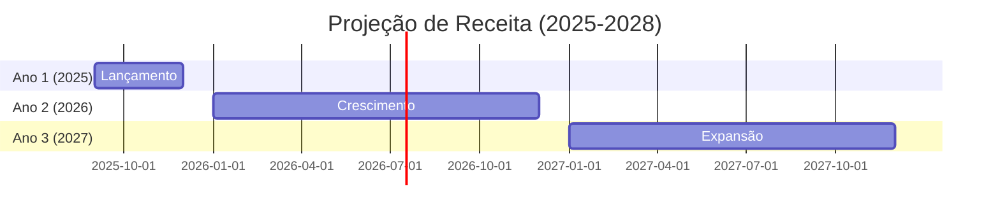

| Ano | Clientes | Receita Anual | Crescimento |
|-----|----------|---------------|-------------|
| **2025** | 150 | R$ 432.000 | - |
| **2026** | 850 | R$ 2.448.000 | 467% |
| **2027** | 2.100 | R$ 6.048.000 | 147% |

---

## 🌍 Análise de Mercado

### 📈 Tamanho do Mercado (TAM/SAM/SOM)

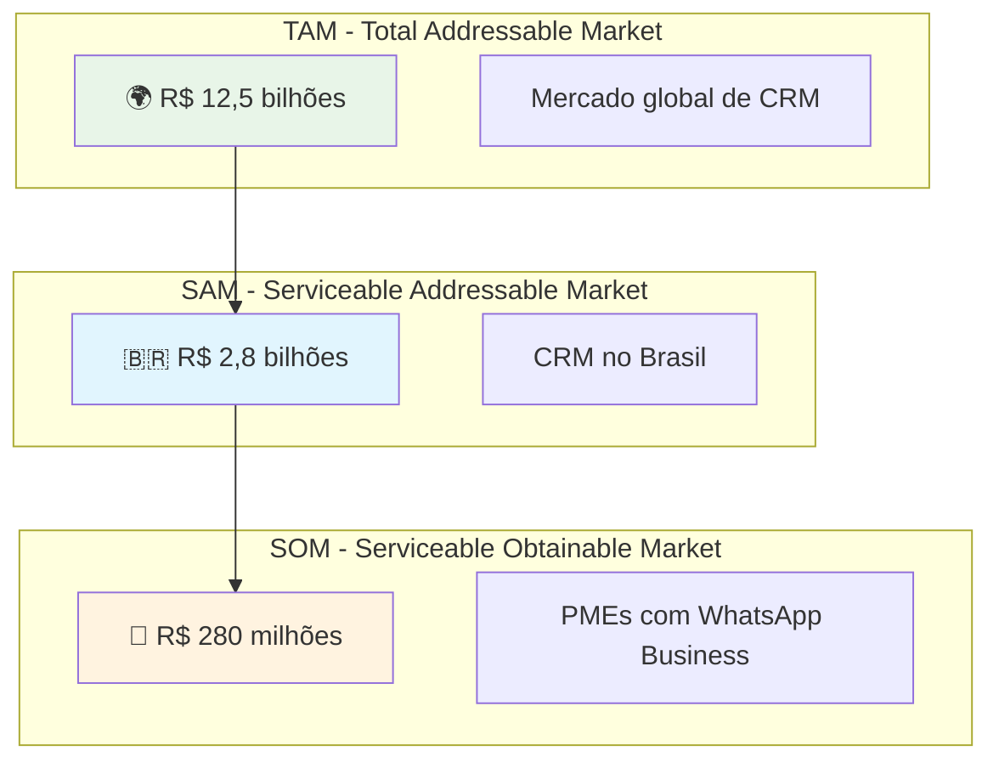

### 📊 Segmentação de Mercado

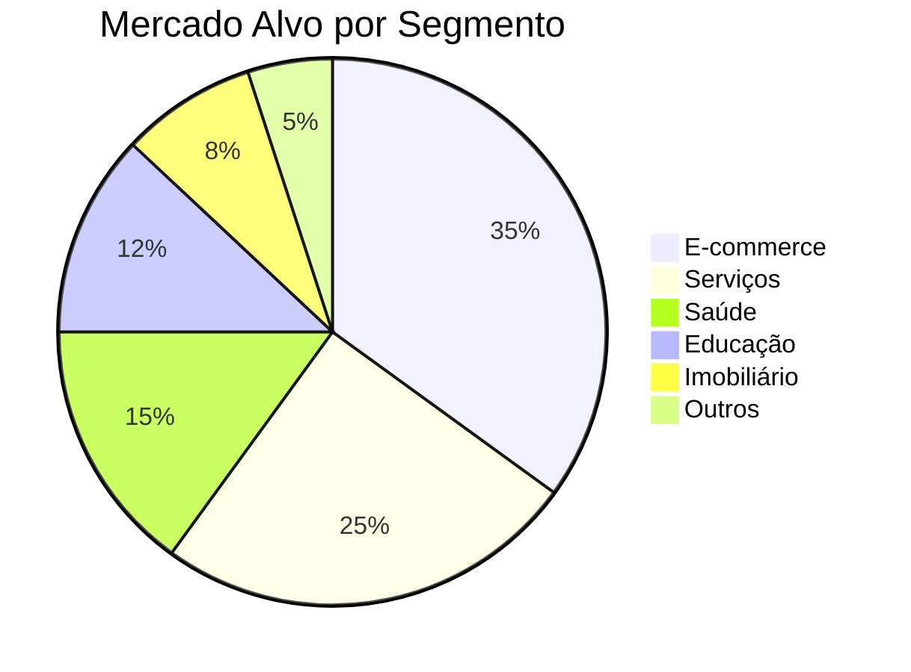

### 🏢 Perfil do Cliente Ideal (ICP)

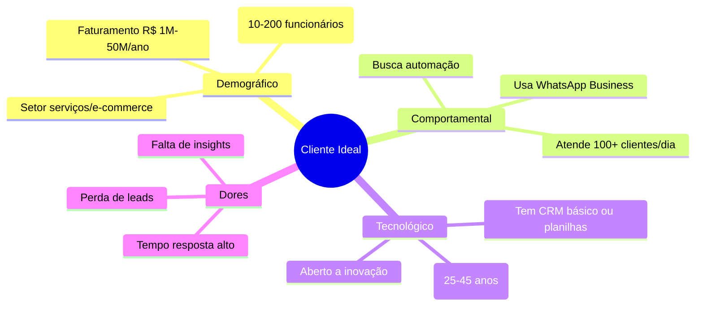

### 📈 Tendências de Mercado

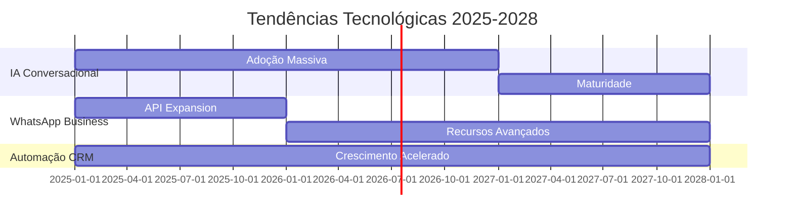

**Drivers de Crescimento:**
- 📱 **WhatsApp**: 99% de penetração no Brasil (140M usuários)
- 🤖 **IA Generativa**: Crescimento de 847% em adoção empresarial
- 💼 **Transformação Digital**: 78% das PMEs investindo em automação
- 📊 **Data-Driven**: Demanda por insights em tempo real

---

## 🎯 Estratégia Go-to-Market

### 🚀 Fases de Lançamento

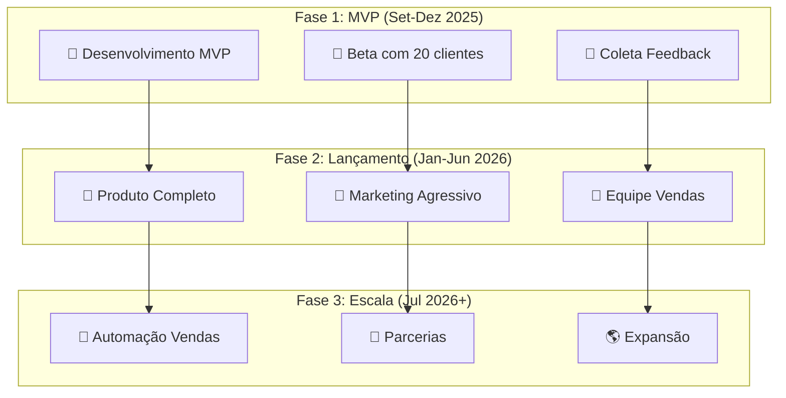

### 📢 Estratégia de Marketing

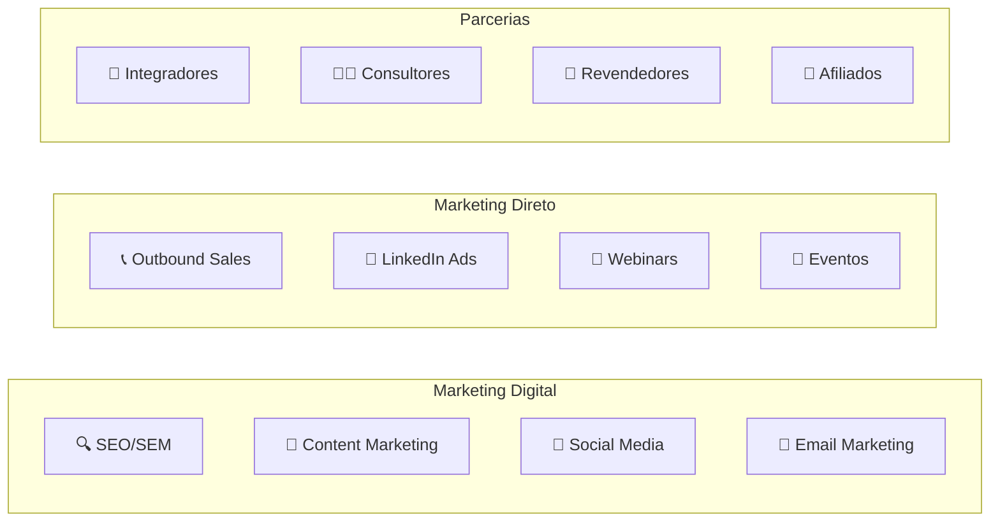

### 💰 Modelo de Aquisição de Clientes

| Canal | CAC | LTV | LTV/CAC | Conversão |
|-------|-----|-----|---------|----------|
| **Inbound Marketing** | R$ 180 | R$ 3.600 | 20x | 8% |
| **Outbound Sales** | R$ 420 | R$ 7.200 | 17x | 12% |
| **Parcerias** | R$ 240 | R$ 4.800 | 20x | 15% |
| **Indicações** | R$ 90 | R$ 5.400 | 60x | 25% |

---

## 🏗️ Modelo de Negócio

### 💼 Estrutura de Receita

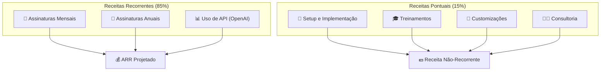

### 📊 Projeção de Receita por Plano

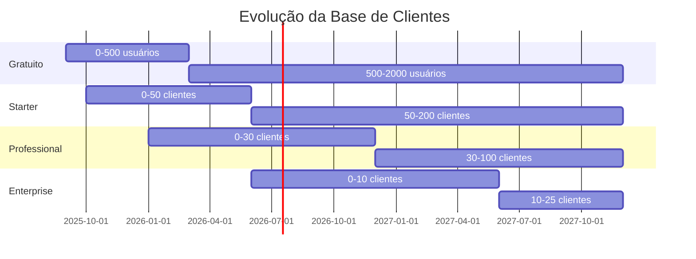

### 💹 Métricas-Chave (KPIs)

| Métrica | Meta Ano 1 | Meta Ano 2 | Meta Ano 3 |
|---------|-------------|-------------|-------------|
| **MRR** | R$ 36.000 | R$ 204.000 | R$ 504.000 |
| **ARR** | R$ 432.000 | R$ 2.448.000 | R$ 6.048.000 |
| **Churn Rate** | <8% | <5% | <3% |
| **CAC** | R$ 250 | R$ 180 | R$ 120 |
| **LTV** | R$ 4.200 | R$ 6.800 | R$ 9.600 |
| **LTV/CAC** | 16.8x | 37.8x | 80x |

---

## 🏢 Análise Competitiva

### 🥊 Principais Concorrentes

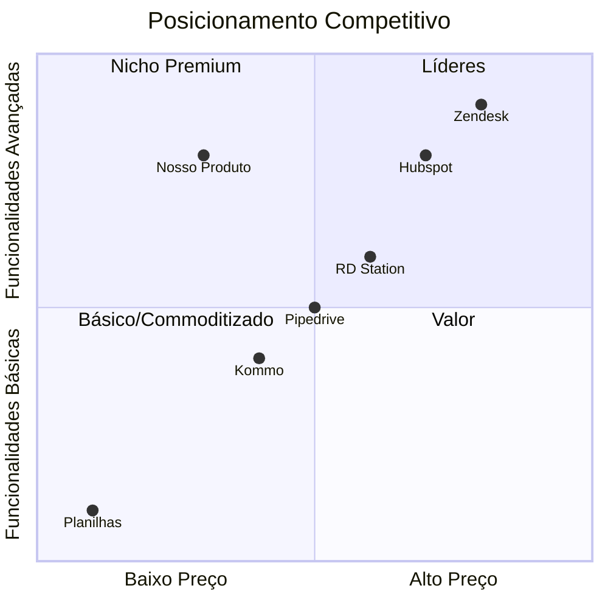

### 🎯 Vantagens Competitivas

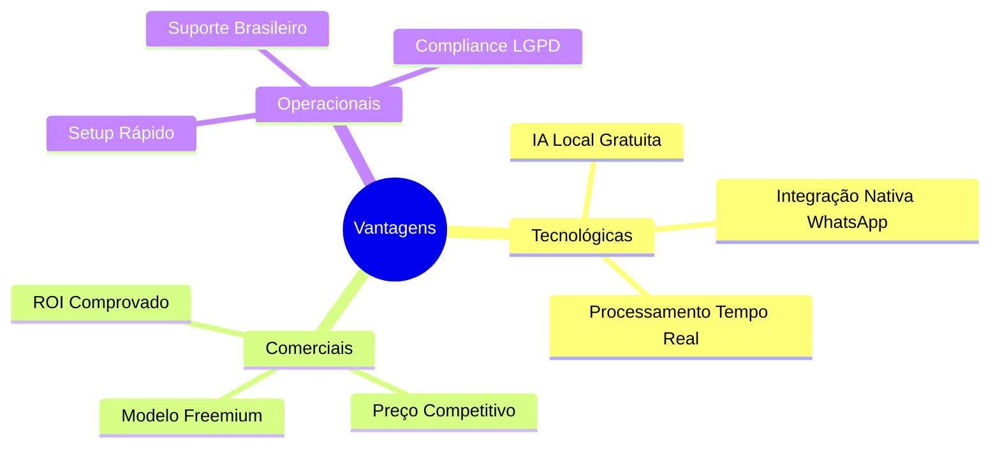

### 📊 Matriz Competitiva

| Funcionalidade | Nosso CRM | Zendesk | HubSpot | RD Station |
|----------------|-----------|---------|---------|------------|
| **WhatsApp Nativo** | ✅ | ❌ | ❌ | ⚠️ |
| **IA Gratuita** | ✅ | ❌ | ❌ | ❌ |
| **Preço Acessível** | ✅ | ❌ | ❌ | ✅ |
| **Setup < 2 semanas** | ✅ | ❌ | ⚠️ | ✅ |
| **Suporte BR** | ✅ | ⚠️ | ⚠️ | ✅ |
| **LGPD Compliant** | ✅ | ✅ | ✅ | ✅ |

---

## 👥 Plano Operacional

### 🏗️ Estrutura Organizacional

```mermaid
organizationchart
    CEO["👨‍💼 CEO"]
    CTO["👨‍💻 CTO"]
    CMO["👩‍💼 CMO"]
    CFO["👨‍💰 CFO"]
    
    CEO --> CTO
    CEO --> CMO
    CEO --> CFO
    
    CTO --> DEV1["👨‍💻 Dev Frontend"]
    CTO --> DEV2["👩‍💻 Dev Backend"]
    CTO --> DEV3["👨‍🔬 AI Engineer"]
    CTO --> QA["🧪 QA Engineer"]
    
    CMO --> MARKETING["📢 Marketing"]
    CMO --> SALES["💼 Vendas"]
    CMO --> SUCCESS["😊 Customer Success"]
    
    CFO --> FINANCE["💰 Financeiro"]
    CFO --> HR["👥 RH"]
```

### 📅 Cronograma de Contratações

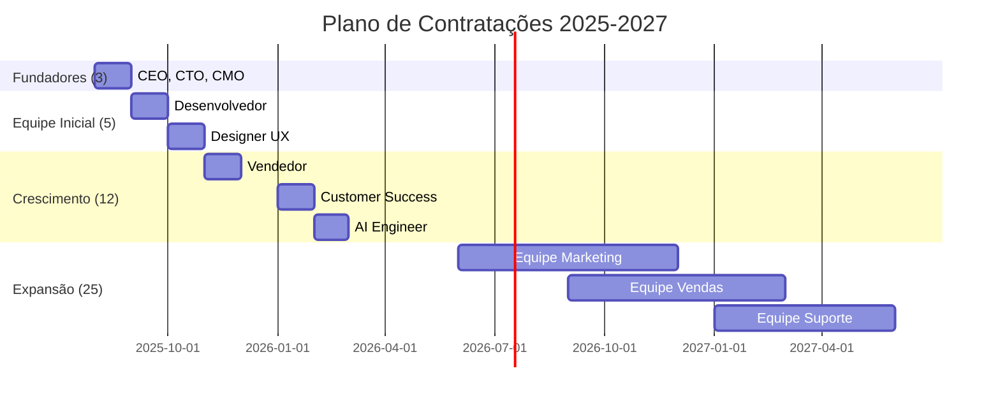

### 💰 Estrutura de Custos

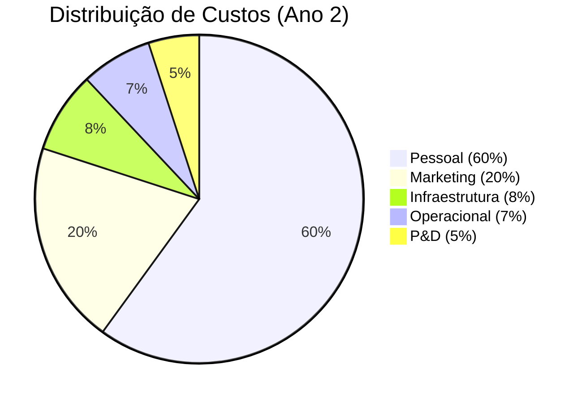

---

## 💰 Projeções Financeiras

### 📊 Demonstrativo de Resultados (3 anos)

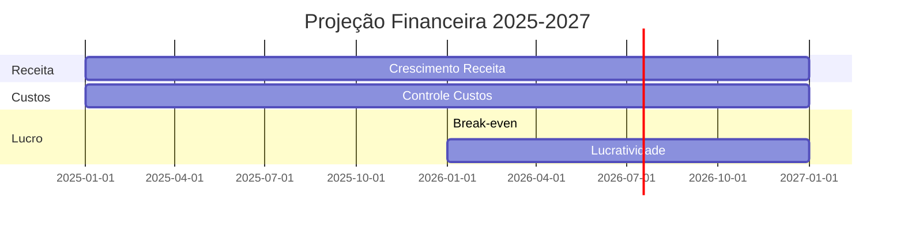

| Item | 2025 | 2026 | 2027 |
|------|------|------|------|
| **RECEITA BRUTA** | R$ 432.000 | R$ 2.448.000 | R$ 6.048.000 |
| Assinaturas | R$ 360.000 | R$ 2.040.000 | R$ 5.040.000 |
| Serviços | R$ 72.000 | R$ 408.000 | R$ 1.008.000 |
| **CUSTOS DIRETOS** | R$ 86.400 | R$ 489.600 | R$ 1.209.600 |
| APIs (OpenAI) | R$ 36.000 | R$ 204.000 | R$ 504.000 |
| Infraestrutura | R$ 50.400 | R$ 285.600 | R$ 705.600 |
| **RECEITA LÍQUIDA** | R$ 345.600 | R$ 1.958.400 | R$ 4.838.400 |
| **CUSTOS OPERACIONAIS** | R$ 420.000 | R$ 1.200.000 | R$ 2.400.000 |
| Pessoal | R$ 300.000 | R$ 720.000 | R$ 1.440.000 |
| Marketing | R$ 80.000 | R$ 360.000 | R$ 720.000 |
| Outros | R$ 40.000 | R$ 120.000 | R$ 240.000 |
| **EBITDA** | **(R$ 74.400)** | **R$ 758.400** | **R$ 2.438.400** |
| **Margem EBITDA** | **-17%** | **31%** | **40%** |

### 💹 Fluxo de Caixa

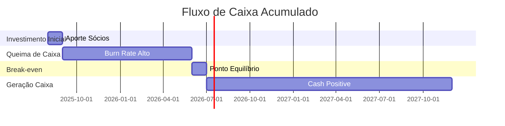

### 🎯 Necessidade de Capital

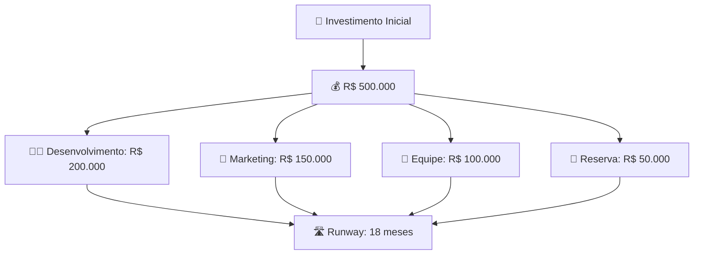

---

## 🎯 Estratégia de Crescimento

### 🚀 Alavancas de Crescimento

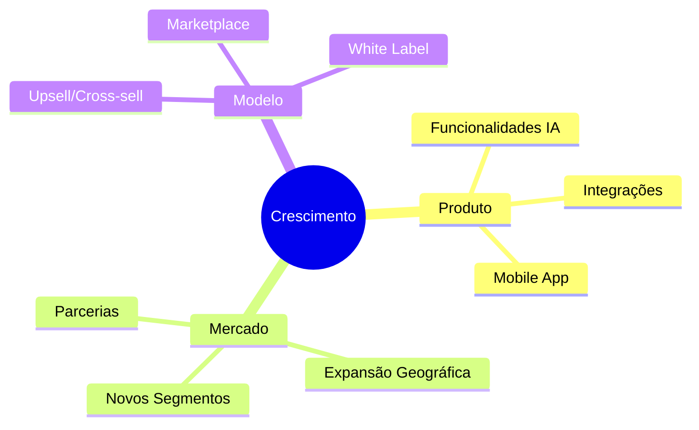

### 📈 Roadmap de Produto

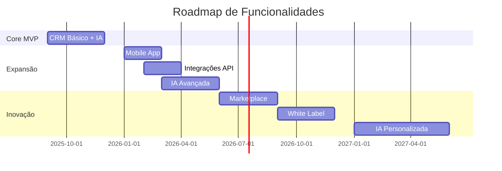

### 🌎 Expansão Internacional

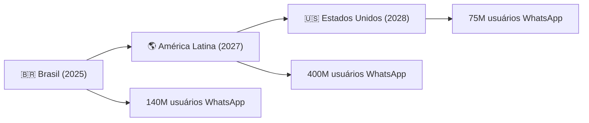

---

## ⚠️ Análise de Riscos

### 🎯 Matriz de Riscos

```mermaid
quadrantChart
    title Matriz de Riscos
    x-axis Baixa Probabilidade --> Alta Probabilidade
    y-axis Baixo Impacto --> Alto Impacto
    
    quadrant-1 Monitorar
    quadrant-2 Mitigar
    quadrant-3 Aceitar
    quadrant-4 Evitar
    
    "Mudança API WhatsApp": [0.7, 0.9]
    "Concorrente Grande": [0.6, 0.8]
    "Regulação IA": [0.4, 0.7]
    "Recessão Econômica": [0.5, 0.6]
    "Problema Técnico": [0.3, 0.5]
    "Perda Talento": [0.4, 0.4]
```

### 🛡️ Planos de Mitigação

| Risco | Probabilidade | Impacto | Mitigação |
|-------|---------------|---------|----------|
| **Mudança API WhatsApp** | Alta | Alto | Diversificar canais, parcerias oficiais |
| **Concorrente Grande** | Média | Alto | Foco em nicho, inovação constante |
| **Regulação IA** | Baixa | Alto | Compliance proativo, lobby |
| **Recessão** | Média | Médio | Modelo freemium, flexibilidade |
| **Problema Técnico** | Baixa | Médio | Testes rigorosos, backup |

---

## 🎯 Conclusões e Próximos Passos

### ✅ Fatores Críticos de Sucesso

1. **🚀 Time-to-Market**: Lançar antes da concorrência
2. **💰 Product-Market Fit**: Validar demanda real
3. **🔧 Execução Técnica**: Produto estável e escalável
4. **📢 Go-to-Market**: Estratégia de aquisição eficiente
5. **💼 Equipe**: Talentos certos nas posições certas

### 📅 Cronograma Executivo

```mermaid
gantt
    title Marcos Principais 2025-2026
    dateFormat  YYYY-MM-DD
    
    section Preparação
    Captação Recursos    :2025-08-19, 30d
    Montagem Equipe      :2025-09-01, 45d
    
    section Desenvolvimento
    MVP Development      :2025-09-15, 90d
    Beta Testing        :2025-12-01, 60d
    
    section Lançamento
    Go-to-Market        :2026-01-15, 180d
    Scale-up            :2026-07-01, 365d
```

### 🎯 Metas de Curto Prazo (6 meses)

- ✅ **Captação**: R$ 500.000 em investimento
- ✅ **Equipe**: 8 pessoas contratadas
- ✅ **Produto**: MVP funcional
- ✅ **Clientes**: 50 clientes beta
- ✅ **Receita**: R$ 50.000 MRR

### 🚀 Visão de Longo Prazo (3 anos)

- 🎯 **Liderança**: Top 3 em CRM WhatsApp no Brasil
- 🌎 **Expansão**: Presença em 5 países da América Latina
- 💰 **Receita**: R$ 6M+ ARR
- 👥 **Equipe**: 25+ colaboradores
- 🏆 **Exit**: IPO ou aquisição estratégica

---

## 📞 Chamada para Ação

### 🤝 Oportunidade de Investimento

**Buscamos investidores estratégicos para:**
- 💰 Aporte inicial de R$ 500.000
- 🚀 Acelerar desenvolvimento e go-to-market
- 🌎 Capturar oportunidade de mercado única
- 📈 Retorno projetado de 10-20x em 3-5 anos

### 📧 Contatos

**Equipe Fundadora:**
- 📧 Email: founders@crmwhatsapp.com.br
- 📱 WhatsApp: (11) 99999-9999
- 💼 LinkedIn: /company/crm-whatsapp
- 📅 Pitch Deck: calendly.com/crm-whatsapp-pitch

---

*Plano de Negócios - CRM WhatsApp com IA*  
*Versão: 1.0 | Data: 19/08/2025*  
*Confidencial - Uso Restrito*

**Este documento contém informações confidenciais e estratégicas. Distribuição restrita a investidores e parceiros qualificados.**