# Proposta Comercial - CRM WhatsApp com IA

## 🎯 Solução Inovadora para Atendimento Inteligente

**Data:** 19 de Agosto de 2025  
**Versão:** 1.0  
**Validade:** 30 dias  

---

## 📋 Resumo Executivo

Apresentamos uma solução revolucionária de CRM integrado ao WhatsApp Web com inteligência artificial, oferecendo automação inteligente de atendimento, análise de sentimentos em tempo real e sugestões personalizadas de resposta.

### 🚀 Diferenciais Competitivos

- ✅ **Integração Nativa**: Extensão browser que funciona diretamente no WhatsApp Web
- 🧠 **IA Avançada**: Processamento local gratuito (LLaMA) + opção premium (OpenAI)
- 📊 **Analytics Inteligente**: Dashboards em tempo real com insights preditivos
- 🔒 **Segurança LGPD**: Processamento local com proteção total de dados
- ⚡ **Implementação Rápida**: Deploy em 2 semanas

---

## 💰 Estrutura de Preços - Modelo Freemium

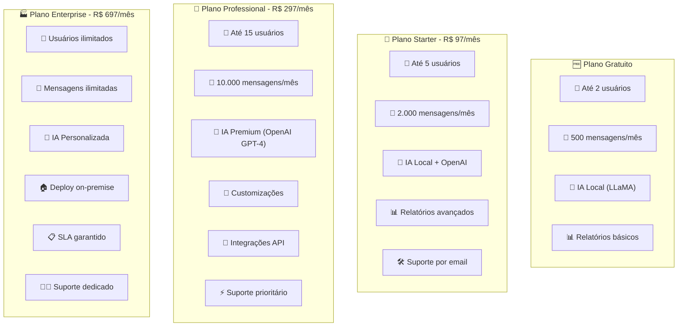

### 📊 Comparativo de Planos

| Funcionalidade | 🆓 Gratuito | 💼 Starter | 🏢 Professional | 🏭 Enterprise |
|----------------|-------------|------------|------------------|----------------|
| **Usuários** | 2 | 5 | 15 | Ilimitado |
| **Mensagens/mês** | 500 | 2.000 | 10.000 | Ilimitado |
| **IA Local (LLaMA)** | ✅ | ✅ | ✅ | ✅ |
| **OpenAI API** | ❌ | ✅ Básico | ✅ GPT-4 | ✅ Personalizado |
| **Análise Sentimento** | ✅ | ✅ | ✅ | ✅ |
| **Sugestões IA** | 10/dia | 100/dia | Ilimitado | Ilimitado |
| **Relatórios** | Básicos | Avançados | Premium | Customizados |
| **Integrações** | ❌ | 3 | 10 | Ilimitadas |
| **Suporte** | Comunidade | Email | Prioritário | Dedicado |
| **SLA** | ❌ | ❌ | 99% | 99.9% |
| **Preço/mês** | **Grátis** | **R$ 97** | **R$ 297** | **R$ 697** |

---

## 🧠 Modelos de IA Disponíveis

### 🆓 Processamento Local (Incluído)

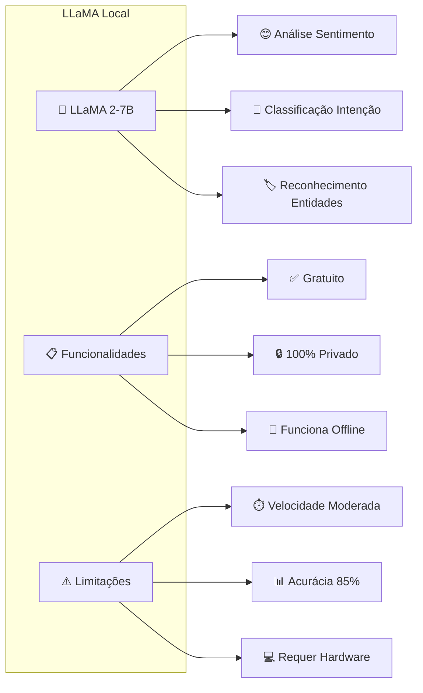

### 💎 Processamento via API (Premium)

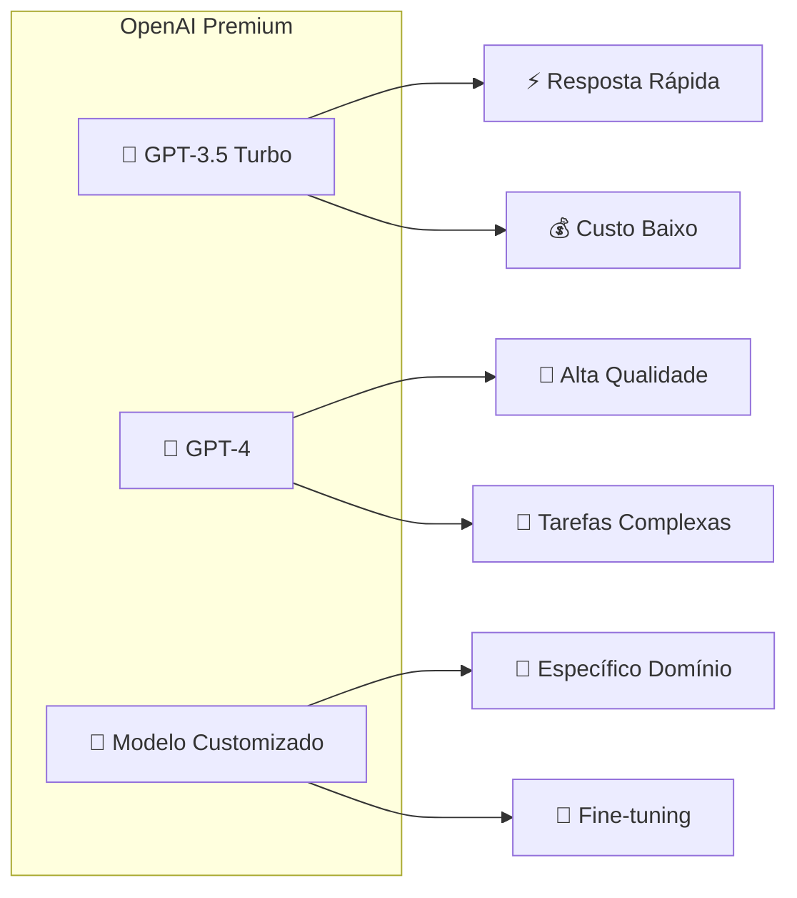

**Custos de API (repassados):**
- GPT-3.5 Turbo: R$ 0,002 por 1K tokens
- GPT-4: R$ 0,03 por 1K tokens de entrada + R$ 0,06 por 1K tokens de saída
- Estimativa mensal: R$ 15-50 (Starter) | R$ 50-200 (Professional)

---

## 🎁 Pacotes de Implementação

### 📦 Pacote Básico - R$ 1.497

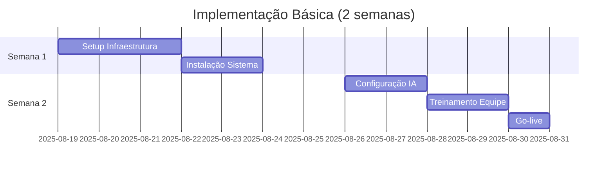

**Inclui:**
- ✅ Instalação completa do sistema
- ✅ Configuração IA local (LLaMA)
- ✅ Treinamento para 5 usuários
- ✅ Suporte por 30 dias
- ✅ Documentação técnica

### 📦 Pacote Avançado - R$ 2.997

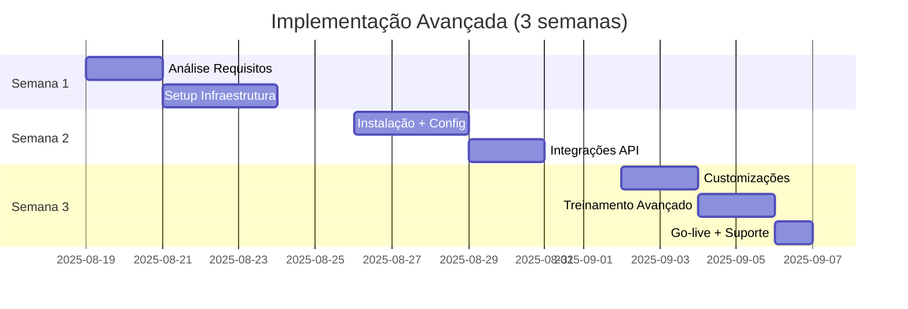

**Inclui tudo do Básico +**
- ✅ Integração com CRM existente
- ✅ Customização de prompts IA
- ✅ Dashboard personalizado
- ✅ Treinamento para 15 usuários
- ✅ Suporte por 90 dias

### 📦 Pacote Enterprise - R$ 7.497

**Implementação completa em 4-6 semanas**

**Inclui tudo do Avançado +**
- ✅ Deploy on-premise ou cloud dedicada
- ✅ Fine-tuning modelo IA específico
- ✅ Integrações complexas (ERP, etc.)
- ✅ SLA 99.9% com suporte 24/7
- ✅ Treinamento ilimitado
- ✅ Suporte por 12 meses

---

## 💡 Funcionalidades por Plano

### 🆓 Plano Gratuito - Funcionalidades

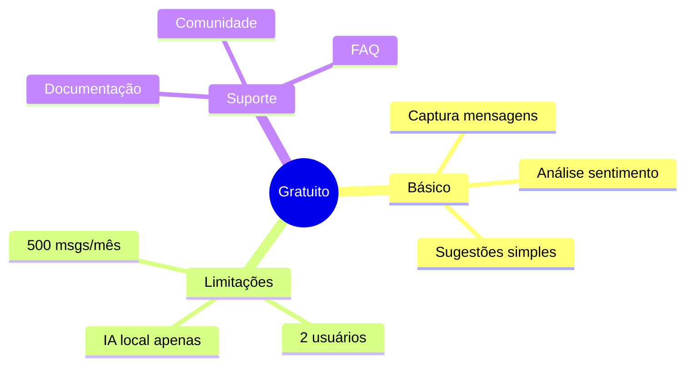

### 💼 Plano Starter - Funcionalidades

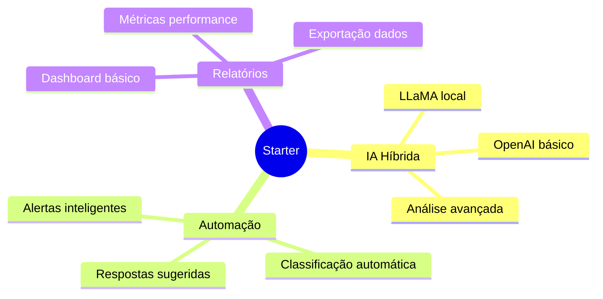

### 🏢 Plano Professional - Funcionalidades

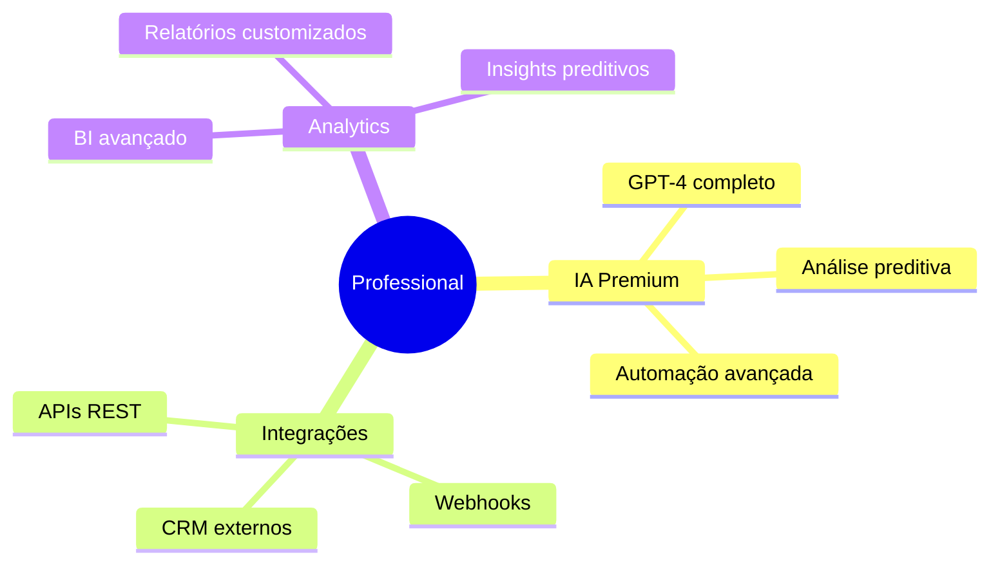

---

## 📈 ROI Estimado por Plano

### 💰 Análise de Retorno sobre Investimento

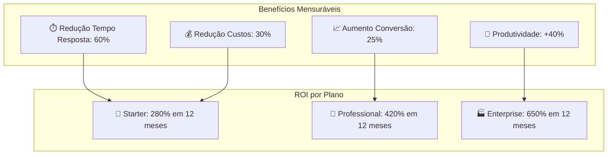

### 📊 Projeção Financeira (12 meses)

| Métrica | Starter | Professional | Enterprise |
|---------|---------|--------------|------------|
| **Investimento Inicial** | R$ 2.661 | R$ 6.561 | R$ 15.861 |
| **Economia Operacional** | R$ 2.400/mês | R$ 8.500/mês | R$ 25.000/mês |
| **Aumento Receita** | R$ 1.800/mês | R$ 6.200/mês | R$ 18.500/mês |
| **ROI 12 meses** | **280%** | **420%** | **650%** |
| **Payback** | 4,2 meses | 3,6 meses | 2,8 meses |

---

## 🔧 Especificações Técnicas

### 🖥️ Requisitos de Sistema

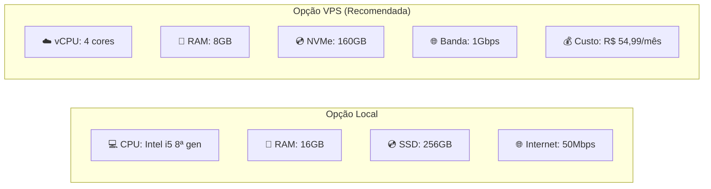

### 🔒 Segurança e Compliance

- ✅ **LGPD Compliant**: Processamento local de dados pessoais
- ✅ **Criptografia**: AES-256 para dados em trânsito e repouso
- ✅ **Auditoria**: Logs completos de todas as operações
- ✅ **Backup**: Backup automático diário com retenção de 30 dias
- ✅ **Acesso**: Controle de acesso baseado em roles (RBAC)

---

## 📞 Condições Comerciais

### 💳 Formas de Pagamento

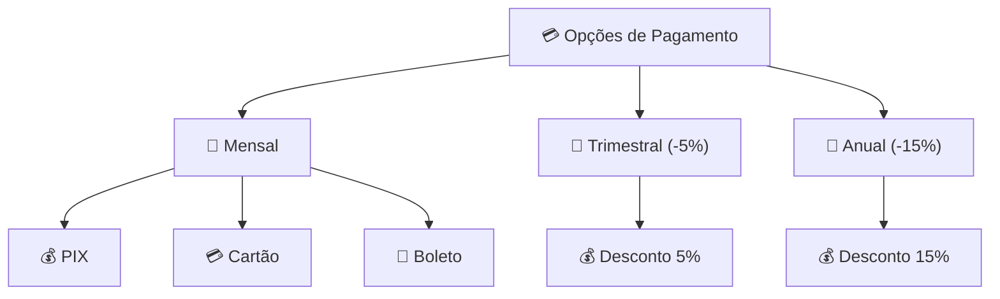

### 📋 Termos e Condições

- **Período Mínimo**: 12 meses (exceto plano gratuito)
- **Cancelamento**: 30 dias de antecedência
- **Suporte**: Incluído conforme plano contratado
- **Atualizações**: Gratuitas durante vigência do contrato
- **Migração**: Gratuita entre planos (upgrade)
- **Garantia**: 30 dias de satisfação ou dinheiro de volta

### 🎁 Promoção de Lançamento (Válida até 30/09/2025)

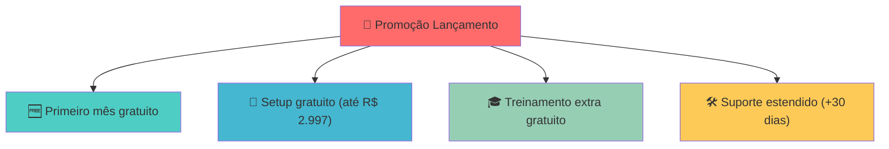

---

## 📞 Próximos Passos

### 🚀 Como Começar

1. **📋 Análise de Necessidades** (30 min)
   - Reunião para entender seu processo atual
   - Definição do plano ideal
   - Cronograma de implementação

2. **📝 Proposta Personalizada** (24h)
   - Proposta técnica detalhada
   - Cronograma específico
   - Investimento final

3. **🤝 Contratação e Kickoff** (48h)
   - Assinatura do contrato
   - Início da implementação
   - Acompanhamento dedicado

### 📞 Contatos

**Equipe Comercial:**
- 📧 Email: vendas@crmwhatsapp.com.br
- 📱 WhatsApp: (11) 99999-9999
- 🌐 Site: www.crmwhatsapp.com.br
- 📅 Agendar Demo: calendly.com/crmwhatsapp

**Suporte Técnico:**
- 📧 Email: suporte@crmwhatsapp.com.br
- 📱 WhatsApp: (11) 88888-8888
- 🕐 Horário: Segunda a Sexta, 8h às 18h

---

## 🎯 Garantias e Compromissos

### ✅ Nossos Compromissos

- 🚀 **Implementação**: Máximo 2 semanas (plano básico)
- 📈 **Performance**: Melhoria mínima de 25% na eficiência
- 🛠️ **Suporte**: Resposta em até 4 horas (planos pagos)
- 🔒 **Segurança**: 100% compliance com LGPD
- 💰 **ROI**: Retorno positivo em até 6 meses

### 🛡️ Garantias Oferecidas

- **30 dias**: Satisfação ou dinheiro de volta
- **99%**: Uptime garantido (planos Professional+)
- **24/7**: Monitoramento contínuo
- **Backup**: Recuperação garantida em até 4 horas
- **Atualizações**: Gratuitas por toda vigência

---

*Proposta Comercial - CRM WhatsApp com IA*  
*Versão: 1.0 | Data: 19/08/2025*  
*Validade: 30 dias | Condições sujeitas a alteração*

**Esta proposta foi elaborada especificamente para suas necessidades. Para dúvidas ou esclarecimentos, entre em contato conosco.**