# Especificações Técnicas - Aplicativo Desktop Tkinter

## 🖥️ Visão Geral do Aplicativo

O aplicativo desktop Tkinter funciona como o núcleo central do sistema CRM, atuando simultaneamente como servidor HTTP, processador de dados e interface de gerenciamento local. É responsável por receber dados da extensão, processar com IA e fornecer insights em tempo real.

## 🏗️ Arquitetura do Aplicativo

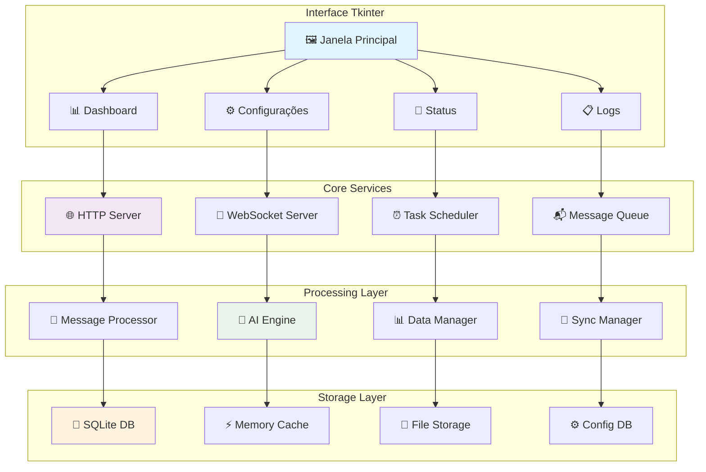

## 🎯 Funcionalidades Principais

### 1. Servidor HTTP/API

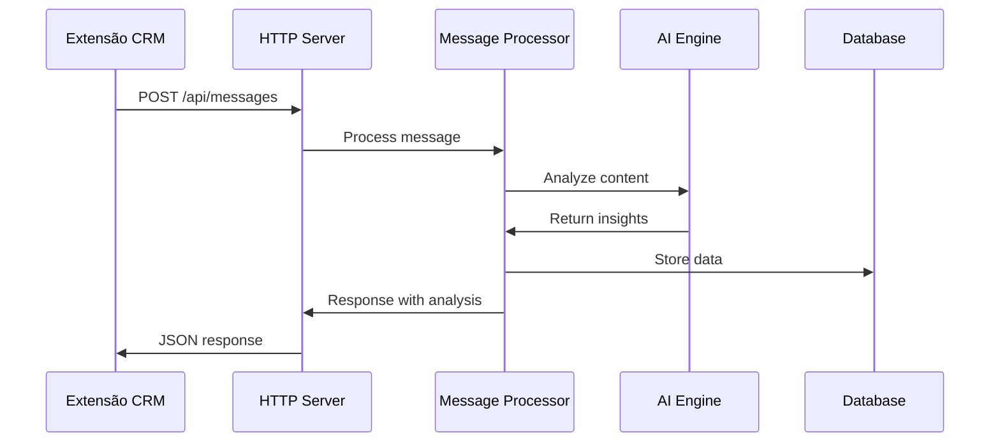

**Endpoints Implementados:**
- `GET /api/health` - Status do servidor
- `POST /api/auth/login` - Autenticação
- `POST /api/messages/capture` - Capturar mensagem
- `GET /api/messages/{id}` - Buscar mensagem
- `POST /api/analysis/generate` - Gerar análise
- `GET /api/customers/{phone}` - Dados do cliente
- `GET /api/metrics/dashboard` - Métricas em tempo real

### 2. Interface de Gerenciamento

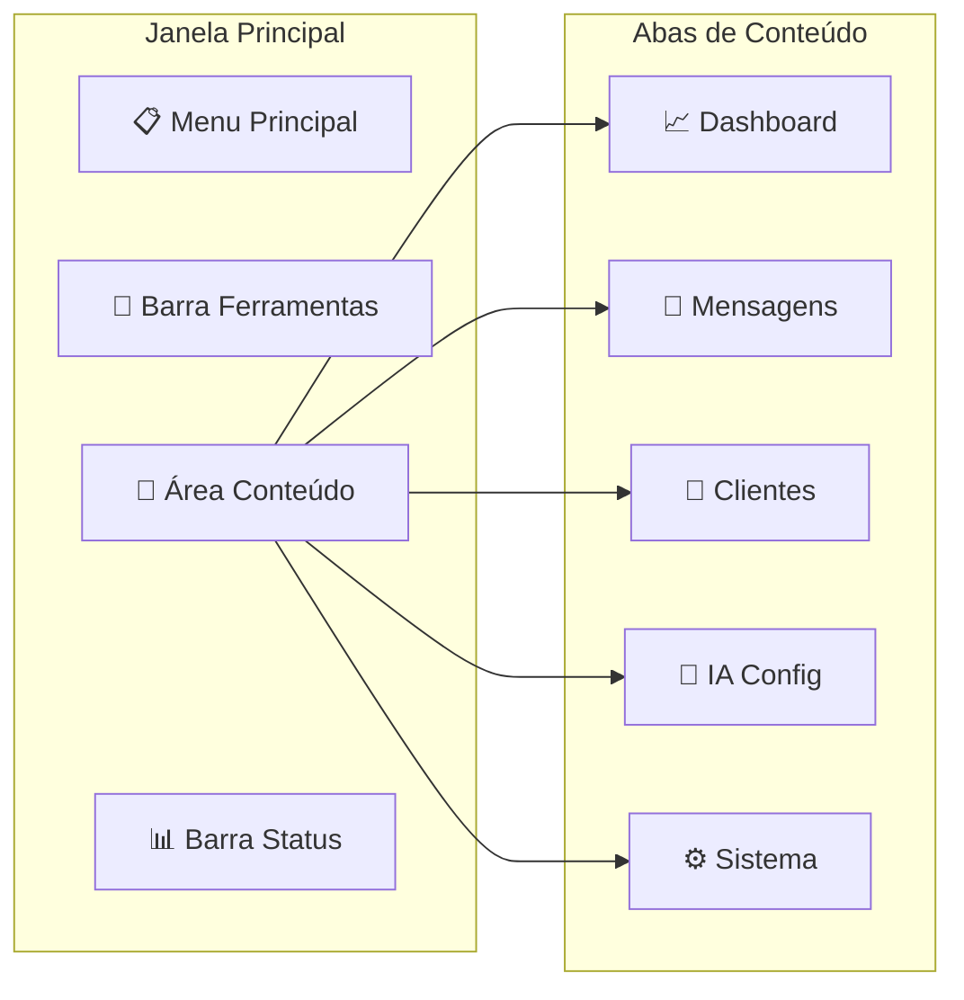

### 3. Sistema de Monitoramento

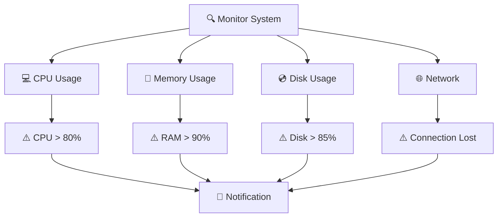

## 💻 Especificações Técnicas

### Estrutura do Projeto

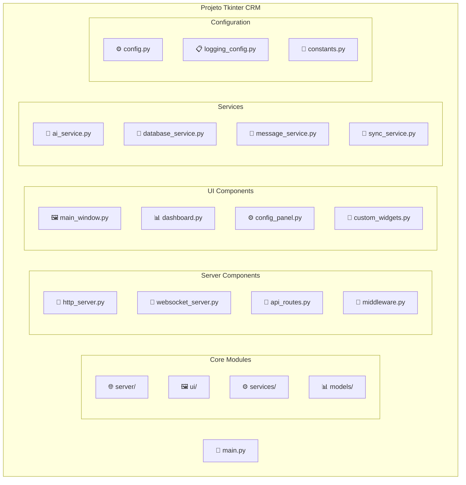

### Dependências Python

```python
# requirements.txt
tkinter>=8.6.0          # Interface gráfica
fastapi>=0.104.0        # API REST
uvicorn>=0.24.0         # ASGI server
websockets>=12.0        # WebSocket support
sqlalchemy>=2.0.0       # ORM database
sqlite3                 # Database engine
requests>=2.31.0        # HTTP client
aiofiles>=23.2.0        # Async file operations
pydantic>=2.5.0         # Data validation
jsonschema>=4.20.0      # JSON validation
psutil>=5.9.0           # System monitoring
schedule>=1.2.0         # Task scheduling
watchdog>=3.0.0         # File monitoring
cryptography>=41.0.0    # Encryption
jwt>=2.8.0              # JWT tokens
redis>=5.0.0            # Cache (optional)
pillow>=10.1.0          # Image processing
matplotlib>=3.8.0       # Charts and graphs
numpy>=1.25.0           # Numerical operations
pandas>=2.1.0           # Data analysis
```

## 🔧 Implementação dos Módulos

### 1. Servidor HTTP (http_server.py)

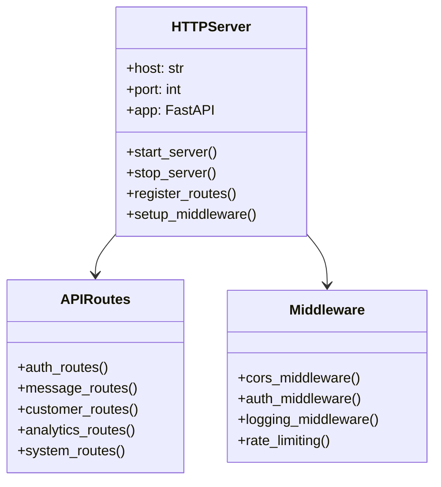

**Funcionalidades:**
- Servidor FastAPI assíncrono
- Autenticação JWT
- Rate limiting
- CORS configurável
- Logging de requisições
- Validação de dados com Pydantic

### 2. Interface Principal (main_window.py)

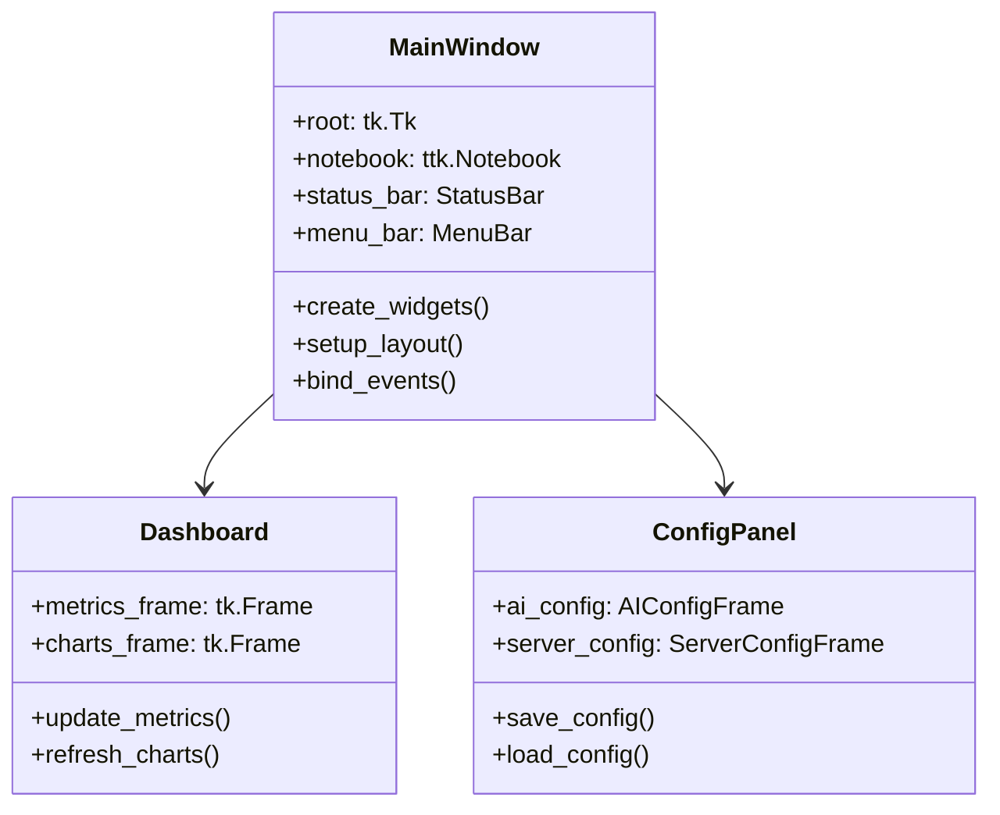

**Componentes da Interface:**
- Menu principal com ações rápidas
- Abas organizadas por funcionalidade
- Dashboard com métricas em tempo real
- Painel de configuração intuitivo
- Barra de status com indicadores
- Sistema de notificações integrado

### 3. Processador de Mensagens (message_service.py)

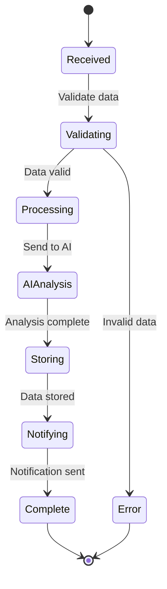

**Pipeline de Processamento:**
1. **Recepção**: Captura dados da extensão
2. **Validação**: Verifica integridade dos dados
3. **Enriquecimento**: Adiciona metadados
4. **Análise IA**: Processa com LLaMA
5. **Armazenamento**: Salva no banco de dados
6. **Notificação**: Envia resultado para extensão

## 🗄️ Modelo de Dados

### Schema do Banco SQLite

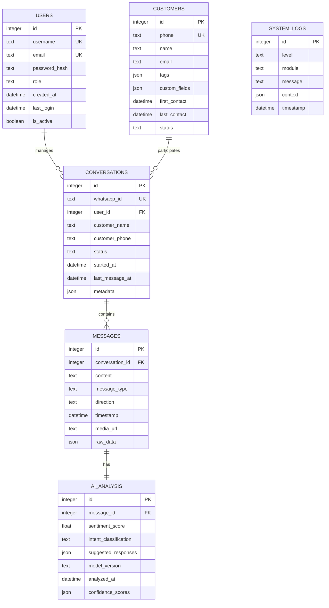

## ⚙️ Sistema de Configuração

### Arquivo de Configuração (config.json)

```json
{
  "server": {
    "host": "localhost",
    "port": 8080,
    "debug": false,
    "auto_start": true
  },
  "websocket": {
    "port": 8081,
    "max_connections": 100
  },
  "database": {
    "path": "./data/crm.db",
    "backup_interval": 3600,
    "max_backups": 10
  },
  "ai": {
    "model_path": "./models/llama",
    "max_tokens": 512,
    "temperature": 0.7,
    "use_gpu": false
  },
  "security": {
    "jwt_secret": "auto-generated",
    "token_expiry": 86400,
    "rate_limit": 100
  },
  "logging": {
    "level": "INFO",
    "file_path": "./logs/app.log",
    "max_size": "10MB",
    "backup_count": 5
  }
}
```

### Interface de Configuração

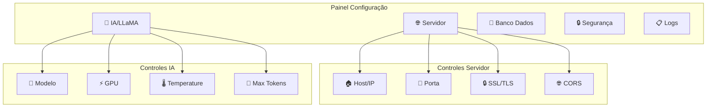

## 📊 Dashboard e Métricas

### Widgets do Dashboard

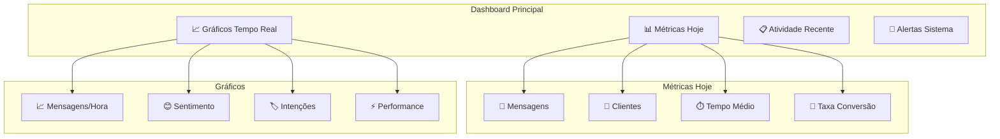

### Métricas em Tempo Real

```python
# Exemplo de métricas coletadas
class MetricsCollector:
    def collect_realtime_metrics(self):
        return {
            "messages_today": self.count_messages_today(),
            "active_conversations": self.count_active_conversations(),
            "avg_response_time": self.calculate_avg_response_time(),
            "sentiment_distribution": self.get_sentiment_distribution(),
            "system_performance": {
                "cpu_usage": psutil.cpu_percent(),
                "memory_usage": psutil.virtual_memory().percent,
                "disk_usage": psutil.disk_usage('/').percent
            }
        }
```

## 🔄 Sistema de Sincronização

### Sincronização com VPS

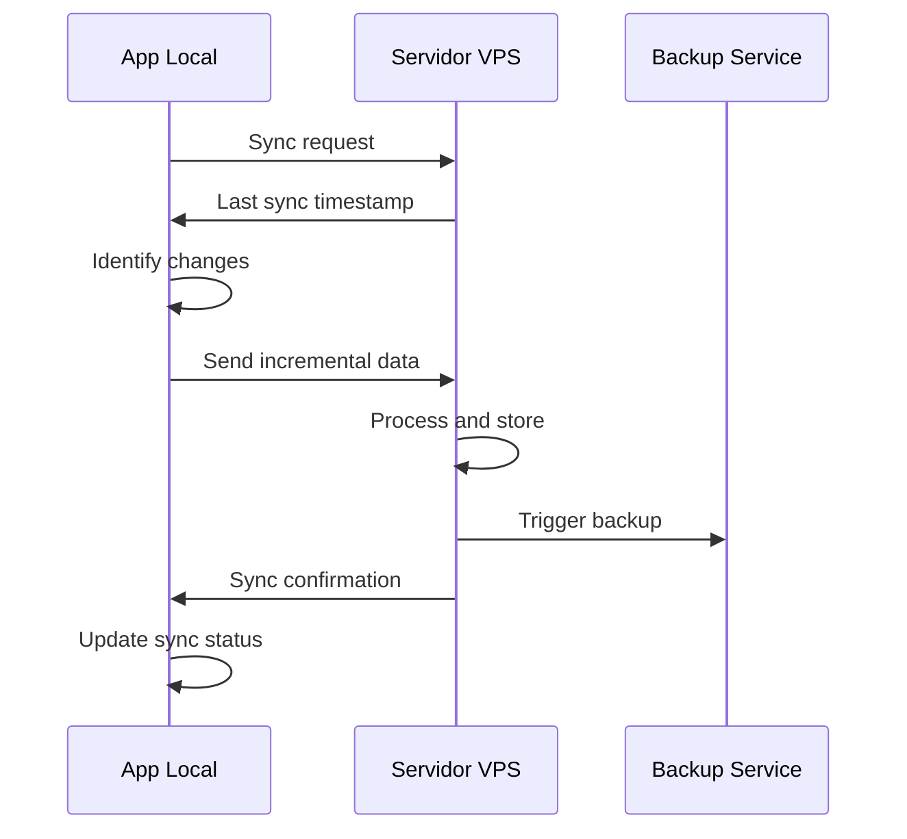

### Estratégias de Backup

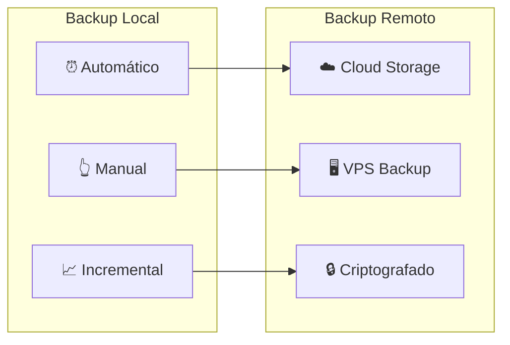

## 🚀 Performance e Otimização

### Otimizações Implementadas

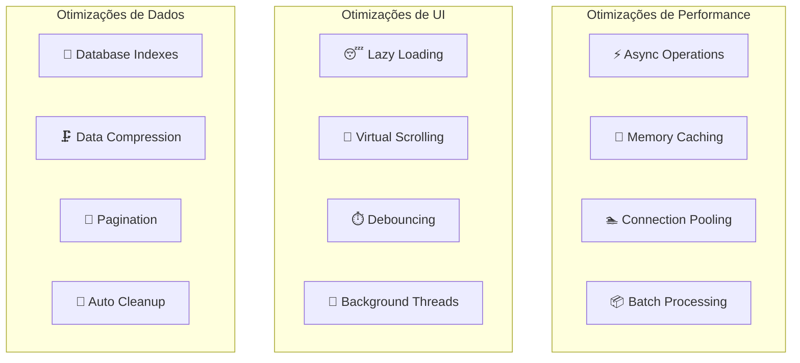

## 🔧 Instalação e Deploy

### Script de Instalação

```bash
#!/bin/bash
# install.sh

echo "🚀 Instalando CRM WhatsApp Desktop..."

# Verificar Python
if ! command -v python3 &> /dev/null; then
    echo "❌ Python 3.9+ é necessário"
    exit 1
fi

# Criar ambiente virtual
python3 -m venv venv
source venv/bin/activate

# Instalar dependências
pip install -r requirements.txt

# Criar diretórios
mkdir -p data logs models backups

# Configuração inicial
cp config.example.json config.json

# Inicializar banco
python scripts/init_database.py

echo "✅ Instalação concluída!"
echo "Execute: python main.py"
```

### Executável Standalone

```python
# build.py - Criar executável com PyInstaller
import PyInstaller.__main__

PyInstaller.__main__.run([
    'main.py',
    '--onefile',
    '--windowed',
    '--name=CRM-WhatsApp',
    '--icon=assets/icon.ico',
    '--add-data=templates;templates',
    '--add-data=static;static',
    '--hidden-import=uvicorn',
    '--hidden-import=fastapi',
])
```

## 📋 Testes e Qualidade

### Estratégia de Testes

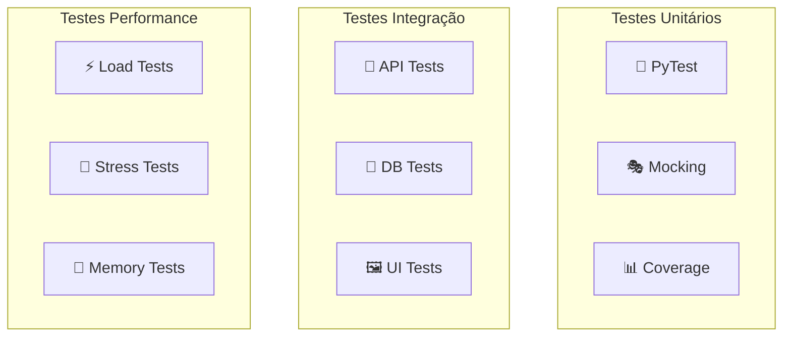

---

## 📋 Próximos Passos

1. **Setup do Ambiente Python**
2. **Implementação do Core Tkinter**
3. **Desenvolvimento do Servidor HTTP**
4. **Integração com Sistema de IA**
5. **Testes de Performance**
6. **Criação do Executável**

---

*Especificações Técnicas - Aplicativo Tkinter*  
*Versão: 1.0*  
*Data: Janeiro 2024*  
*Status: Especificação Completa*