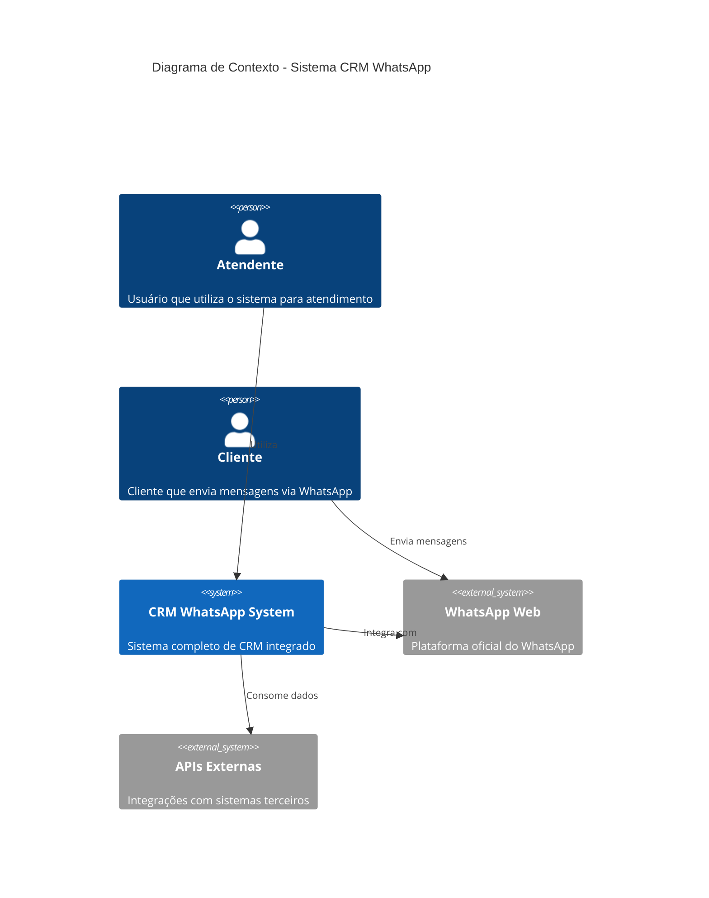
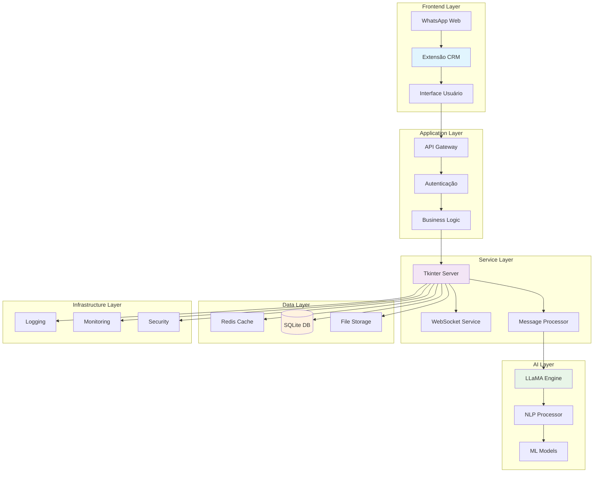
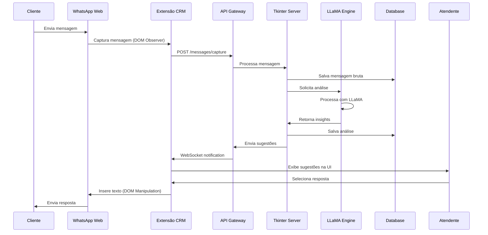
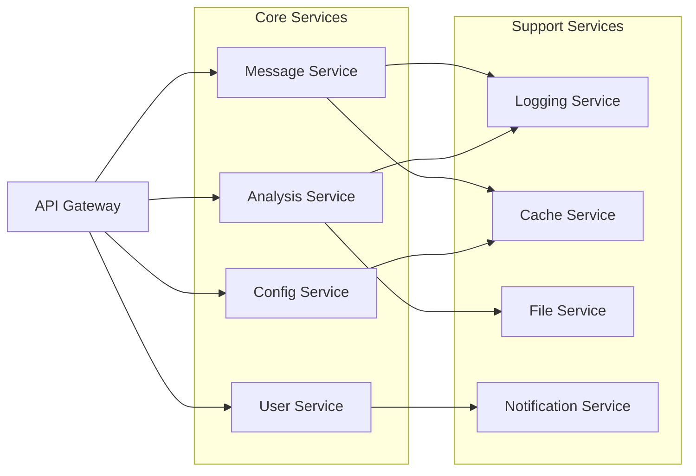
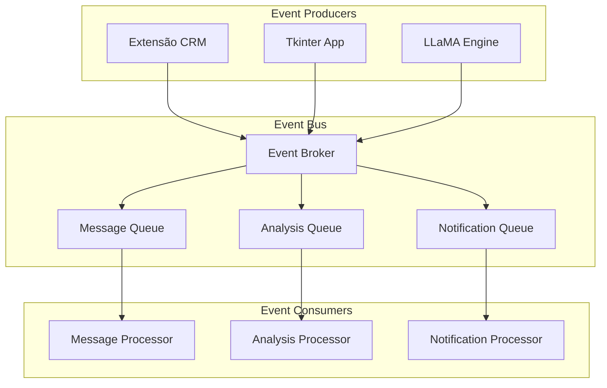
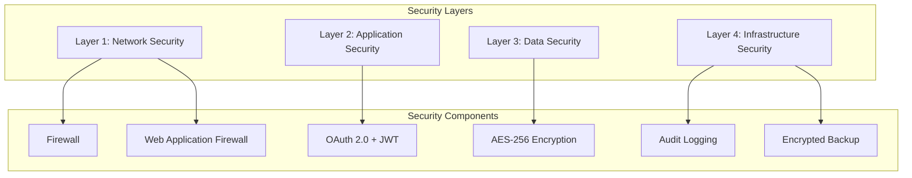
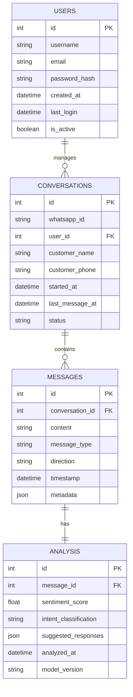
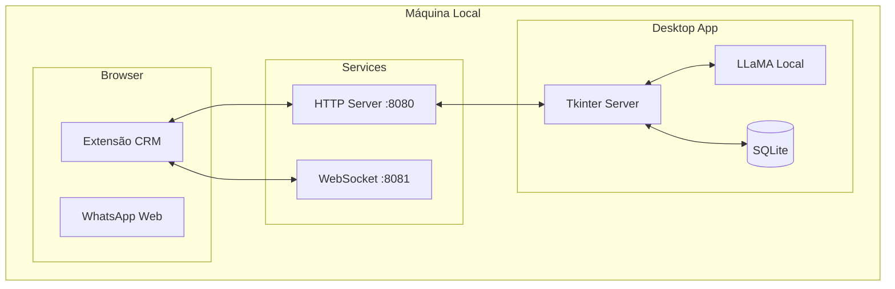
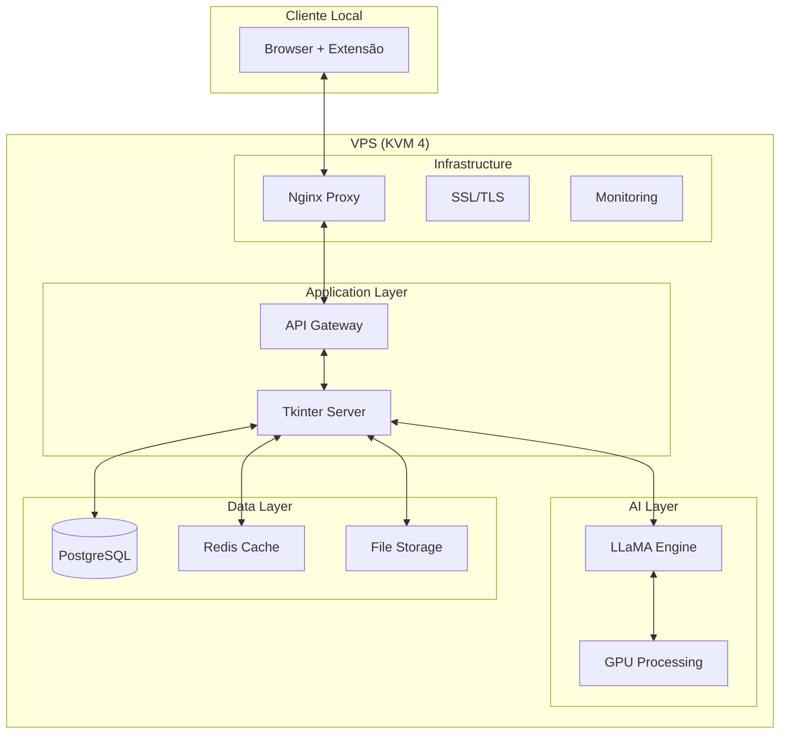
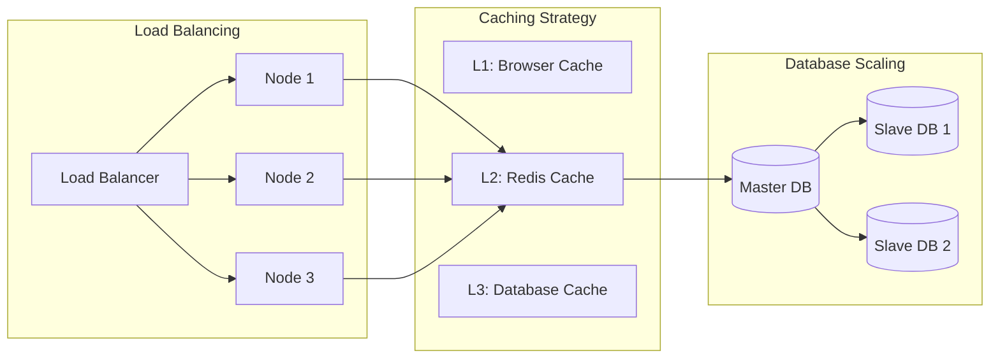

# Arquitetura do Sistema CRM WhatsApp Web

## 📐 Visão Arquitetural Geral

Este documento detalha a arquitetura técnica do sistema CRM integrado ao WhatsApp Web, abrangendo todos os componentes, suas interações e padrões arquiteturais adotados.

## 🏛️ Arquitetura de Alto Nível

## 🔧 Arquitetura de Componentes

## 🔄 Fluxo de Dados Detalhado

## 🏗️ Padrões Arquiteturais

### 1. Microserviços Modulares

### 2. Event-Driven Architecture

## 🔐 Arquitetura de Segurança

## 📊 Modelo de Dados

## 🚀 Arquitetura de Deploy

### Opção 1: Deploy Local

### Opção 2: Deploy VPS

## 📈 Escalabilidade e Performance

## 🔧 Tecnologias e Ferramentas

### Frontend
- **Extensão**: JavaScript ES6+, HTML5, CSS3
- **Build**: Webpack, Babel
- **Testing**: Jest, Cypress

### Backend
- **Core**: Python 3.9+, Tkinter
- **Web**: FastAPI, WebSockets
- **Database**: SQLite (local), PostgreSQL (VPS)
- **Cache**: Redis

### AI/ML
- **Engine**: LLaMA 2/3
- **Framework**: Transformers, PyTorch
- **Processing**: CUDA (GPU), OpenMP (CPU)

### DevOps
- **Containerização**: Docker
- **Orquestração**: Docker Compose
- **Monitoramento**: Prometheus, Grafana
- **Logs**: ELK Stack

## 📋 Considerações de Implementação

### Fases de Desenvolvimento
1. **MVP**: Extensão básica + Tkinter core
2. **AI Integration**: LLaMA + análise básica
3. **Advanced Features**: ML avançado + automações
4. **Production**: Deploy VPS + monitoramento

### Métricas de Performance
- **Latência**: < 200ms para sugestões
- **Throughput**: 1000+ mensagens/minuto
- **Disponibilidade**: 99.9% uptime
- **Precisão IA**: > 85% accuracy

---

*Documento técnico - Arquitetura do Sistema*  
*Versão: 1.0*  
*Data: Janeiro 2024*