# Especificações Técnicas - Extensão CRM WhatsApp Web

## 🎯 Visão Geral da Extensão

A extensão CRM é um componente frontend que se integra nativamente ao WhatsApp Web, fornecendo funcionalidades avançadas de gestão de relacionamento com clientes diretamente na interface do WhatsApp.

## 🏗️ Arquitetura da Extensão

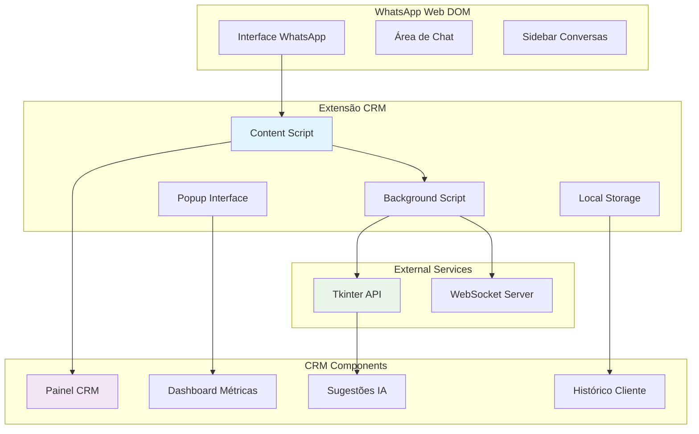

## 📋 Funcionalidades Principais

### 1. Captura Automática de Dados

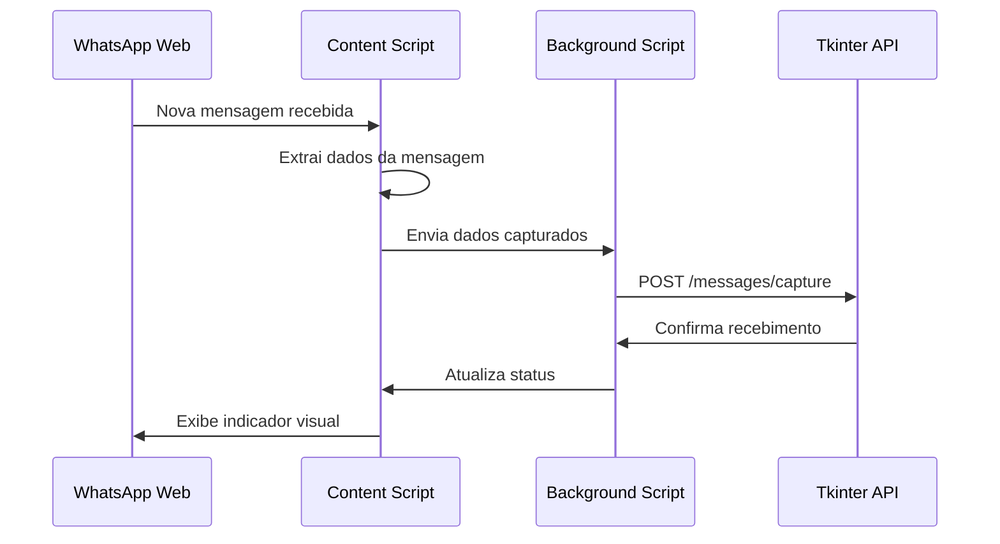

**Dados Capturados:**
- Número do telefone do cliente
- Nome do contato
- Conteúdo da mensagem
- Timestamp da mensagem
- Tipo de mídia (texto, imagem, áudio, documento)
- Status da mensagem (enviada, recebida, lida)
- Metadados do chat (grupo/individual)

### 2. Interface CRM Integrada

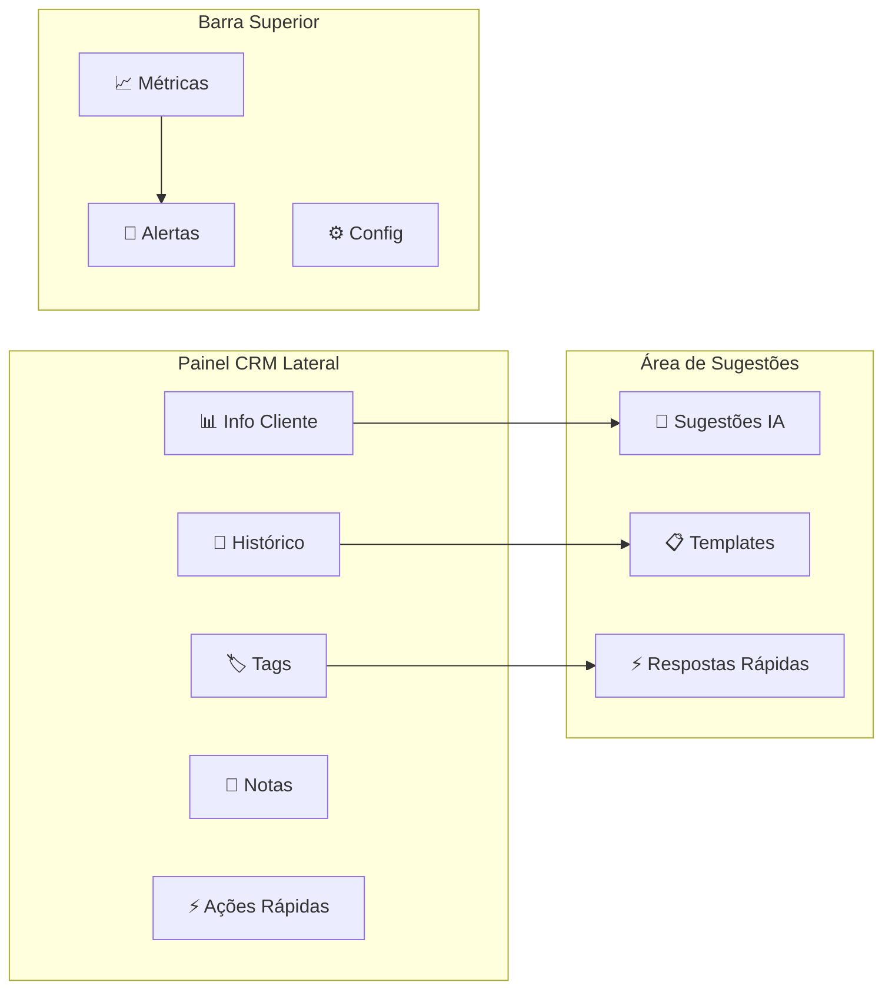

### 3. Sistema de Sugestões Inteligentes

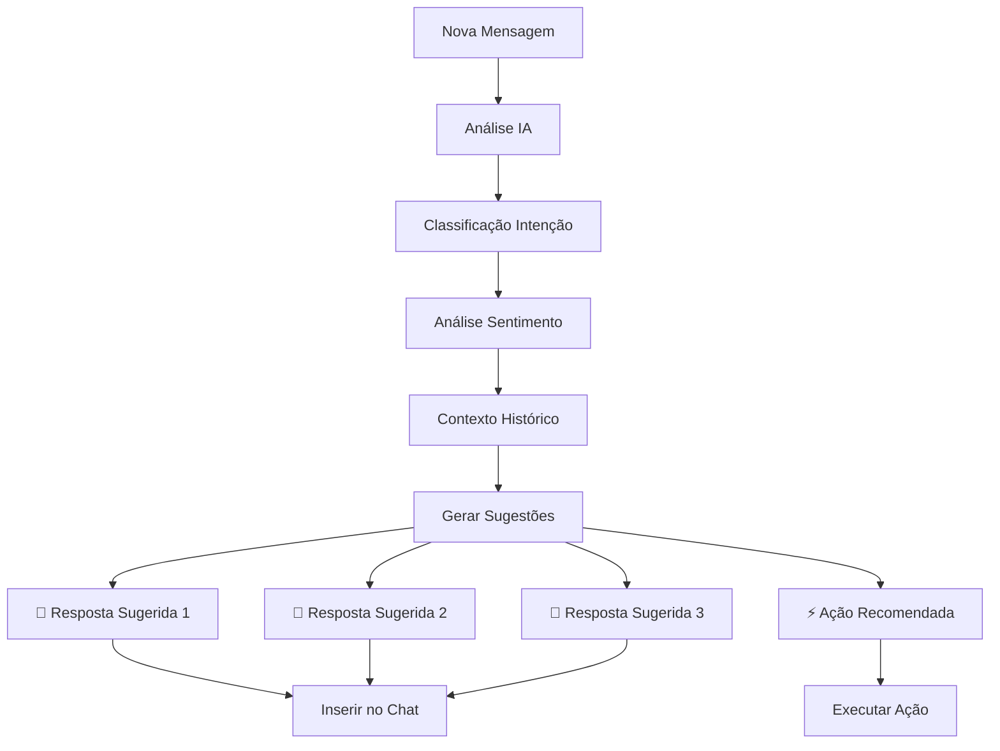

## 🔧 Especificações Técnicas

### Manifest V3 (Chrome Extension)

```json
{
  "manifest_version": 3,
  "name": "CRM WhatsApp Web",
  "version": "1.0.0",
  "description": "Extensão CRM integrada ao WhatsApp Web",
  "permissions": [
    "activeTab",
    "storage",
    "notifications",
    "webRequest"
  ],
  "host_permissions": [
    "https://web.whatsapp.com/*",
    "http://localhost:8080/*"
  ],
  "content_scripts": [{
    "matches": ["https://web.whatsapp.com/*"],
    "js": ["content.js"],
    "css": ["styles.css"],
    "run_at": "document_end"
  }],
  "background": {
    "service_worker": "background.js"
  },
  "action": {
    "default_popup": "popup.html",
    "default_title": "CRM Dashboard"
  }
}
```

### Estrutura de Arquivos

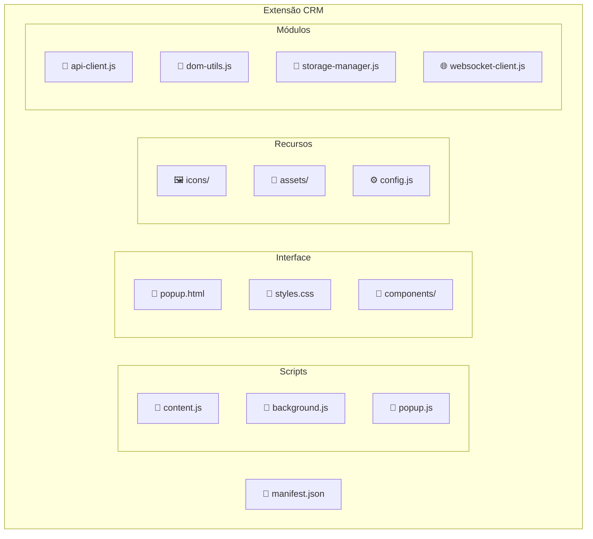

## 💻 Implementação dos Componentes

### Content Script (content.js)

**Responsabilidades:**
- Monitorar mudanças no DOM do WhatsApp Web
- Capturar mensagens em tempo real
- Injetar interface CRM na página
- Gerenciar eventos de usuário

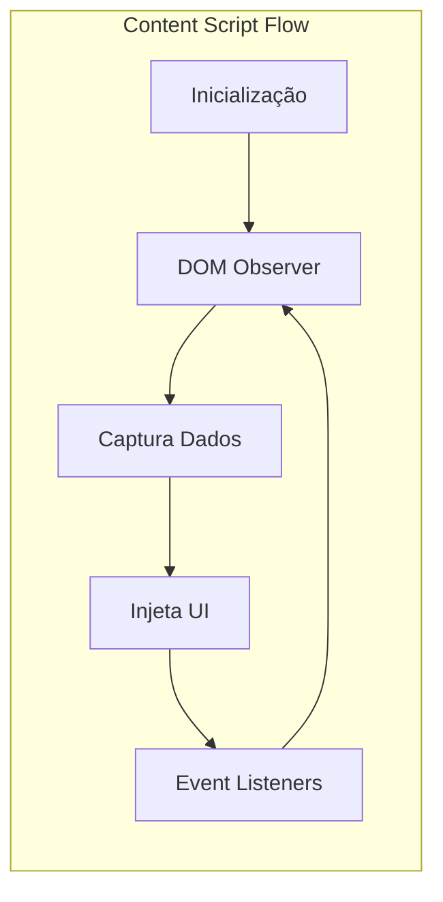

**Principais Funções:**
- `initializeCRM()` - Inicializa a extensão
- `observeMessages()` - Monitora novas mensagens
- `extractMessageData()` - Extrai dados das mensagens
- `injectCRMPanel()` - Injeta painel CRM
- `handleUserInteraction()` - Gerencia interações

### Background Script (background.js)

**Responsabilidades:**
- Comunicação com API externa
- Gerenciamento de estado global
- Processamento de dados em background
- Sincronização com servidor

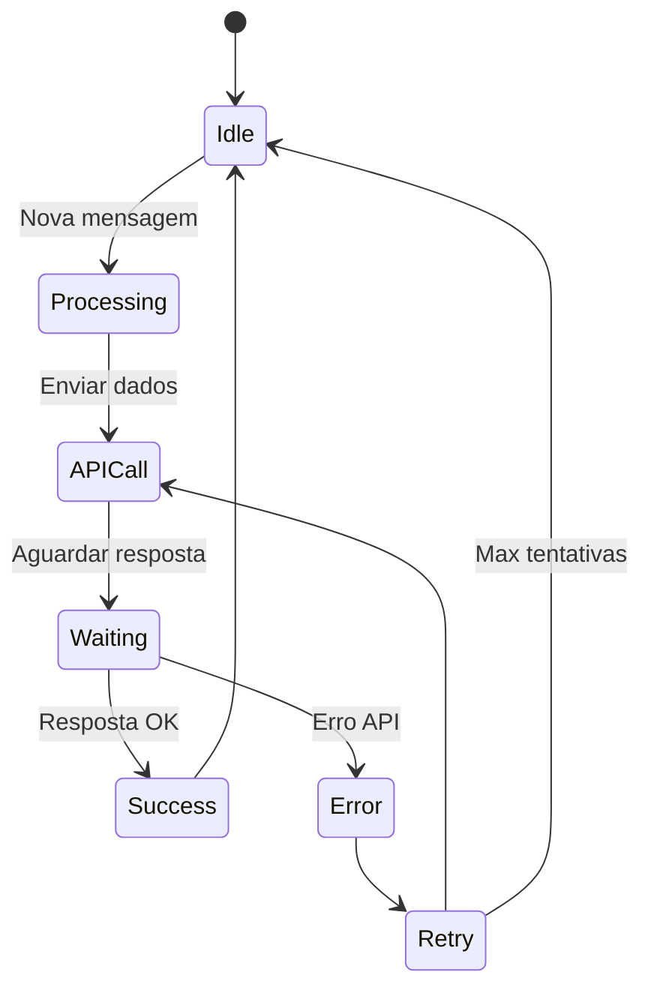

### Popup Interface (popup.html/js)

**Funcionalidades:**
- Dashboard de métricas em tempo real
- Configurações da extensão
- Histórico de atividades
- Status de conexão

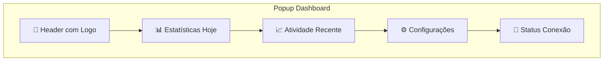

## 🎨 Design e UX

### Princípios de Design

1. **Integração Nativa**: Aparência consistente com WhatsApp Web
2. **Não Intrusivo**: Não interferir no fluxo normal de uso
3. **Responsivo**: Adaptar-se a diferentes tamanhos de tela
4. **Acessível**: Seguir padrões de acessibilidade web

### Paleta de Cores

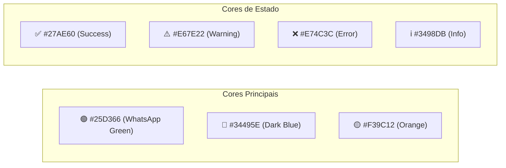

### Layout Responsivo

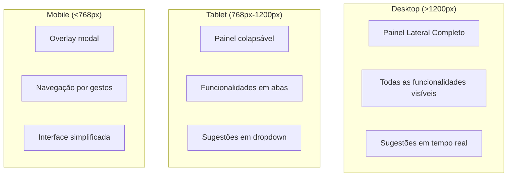

## 🔌 APIs e Integrações

### Comunicação com Tkinter Server

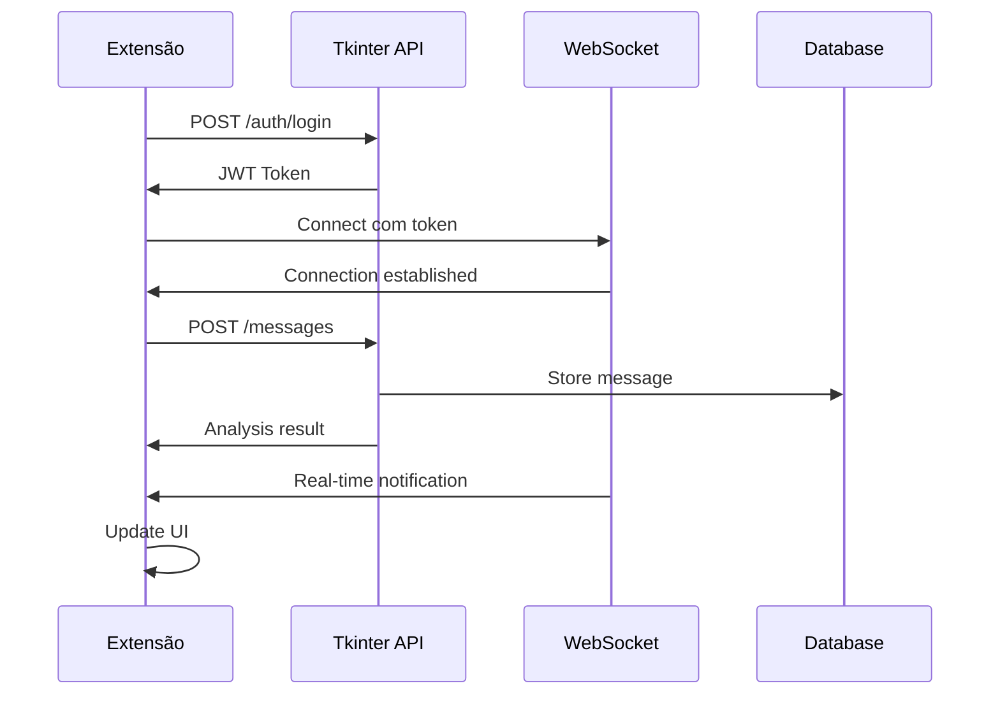

### Endpoints da API

| Método | Endpoint | Descrição |
|--------|----------|----------|
| `POST` | `/auth/login` | Autenticação do usuário |
| `GET` | `/messages/{conversation_id}` | Histórico de mensagens |
| `POST` | `/messages/capture` | Capturar nova mensagem |
| `GET` | `/analysis/{message_id}` | Análise de mensagem |
| `POST` | `/suggestions/generate` | Gerar sugestões |
| `GET` | `/customers/{phone}` | Dados do cliente |
| `PUT` | `/customers/{phone}/tags` | Atualizar tags |
| `GET` | `/metrics/dashboard` | Métricas do dashboard |

## 🔒 Segurança e Privacidade

### Medidas de Segurança

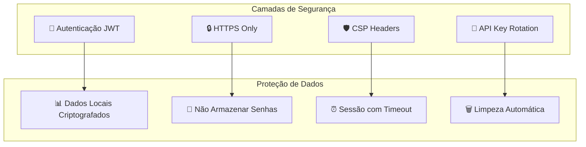

### Conformidade LGPD

- ✅ **Consentimento Explícito**: Usuário autoriza captura de dados
- ✅ **Minimização de Dados**: Apenas dados necessários são coletados
- ✅ **Direito ao Esquecimento**: Função de deletar dados do cliente
- ✅ **Portabilidade**: Export de dados em formato padrão
- ✅ **Transparência**: Log de todas as ações realizadas

## 📊 Métricas e Analytics

### KPIs Monitorados

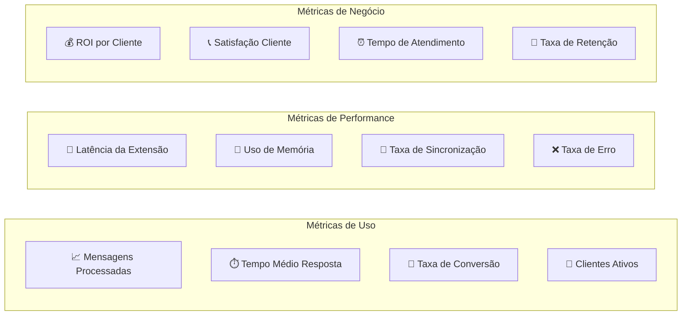

## 🚀 Roadmap de Funcionalidades

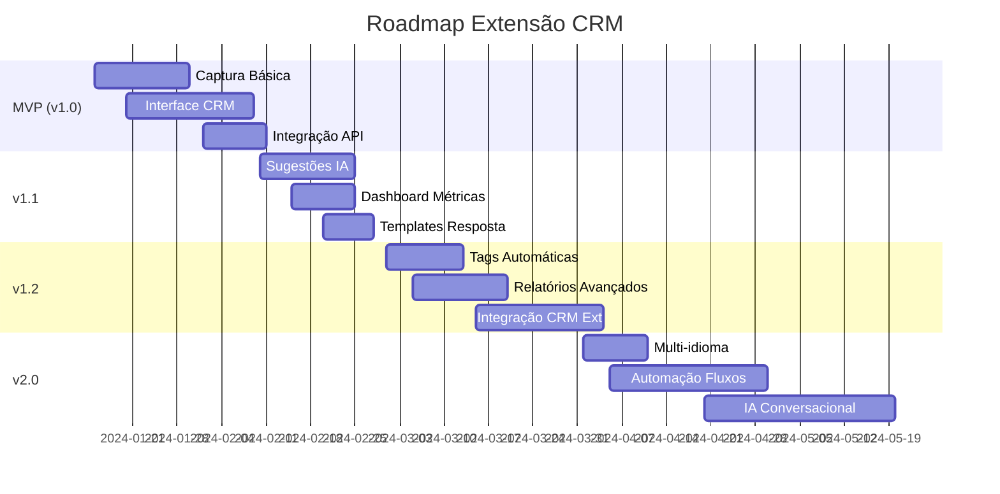

## 🧪 Testes e Qualidade

### Estratégia de Testes

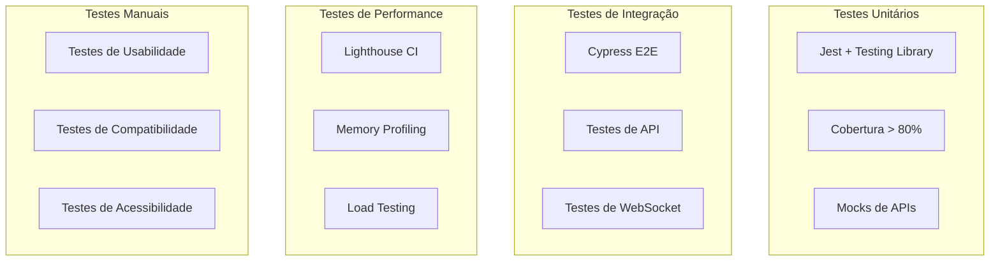

## 📦 Build e Deploy

### Pipeline CI/CD

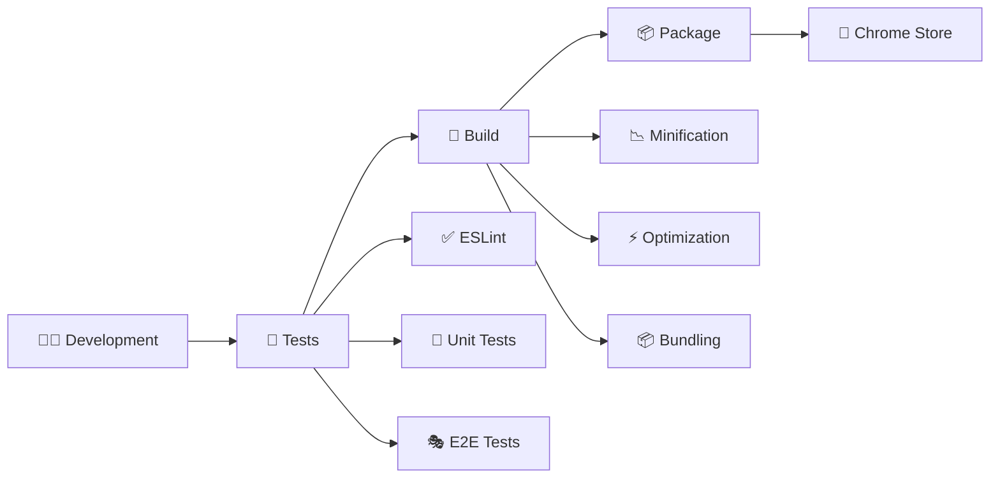

---

## 📋 Próximos Passos

1. **Setup do Ambiente de Desenvolvimento**
2. **Implementação do Content Script Base**
3. **Desenvolvimento da Interface CRM**
4. **Integração com API Tkinter**
5. **Testes e Validação**
6. **Publicação na Chrome Web Store**

---

*Especificações Técnicas - Extensão CRM*  
*Versão: 1.0*  
*Data: Janeiro 2024*  
*Status: Especificação Completa*