# Fluxos de Trabalho e Processos Operacionais

## 🔄 Visão Geral dos Processos

Este documento define os fluxos de trabalho operacionais do sistema CRM WhatsApp, integrando a extensão browser, aplicativo Tkinter e sistema de análise LLaMA em processos empresariais eficientes.

## 🎯 Fluxo Principal de Atendimento

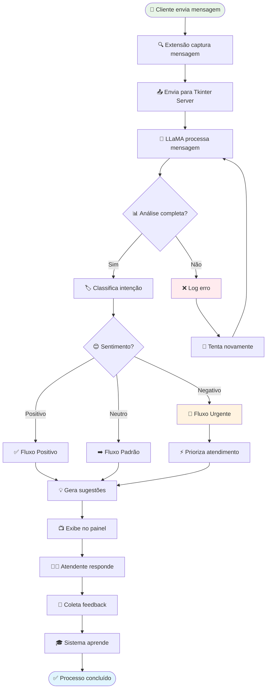

## 📋 Processos por Departamento

### 1. Processo de Vendas

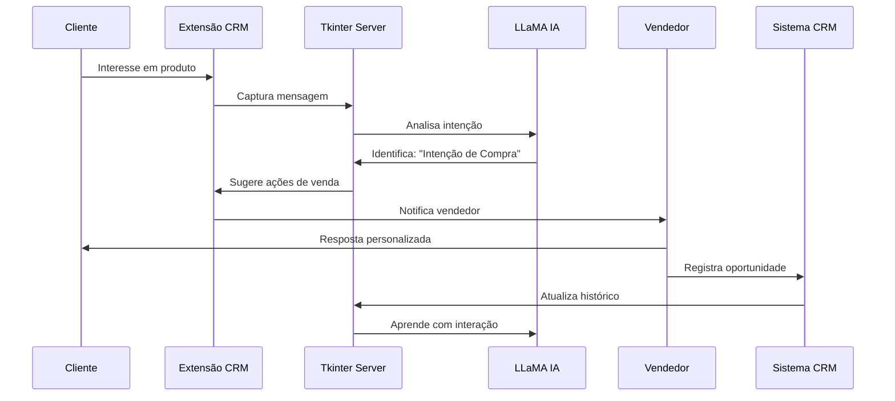

**Métricas de Vendas:**
- 🎯 Taxa de conversão de leads
- ⏱️ Tempo médio de resposta
- 💰 Valor médio de venda
- 📈 Pipeline de oportunidades

### 2. Processo de Suporte Técnico

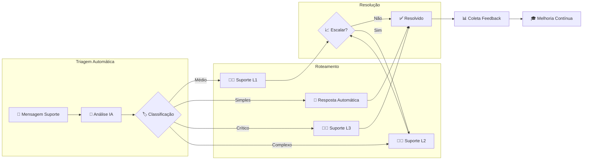

**SLA de Suporte:**
- 🚨 **Crítico**: 15 minutos
- ⚠️ **Alto**: 1 hora
- 📋 **Médio**: 4 horas
- 📝 **Baixo**: 24 horas

### 3. Processo de Cobrança

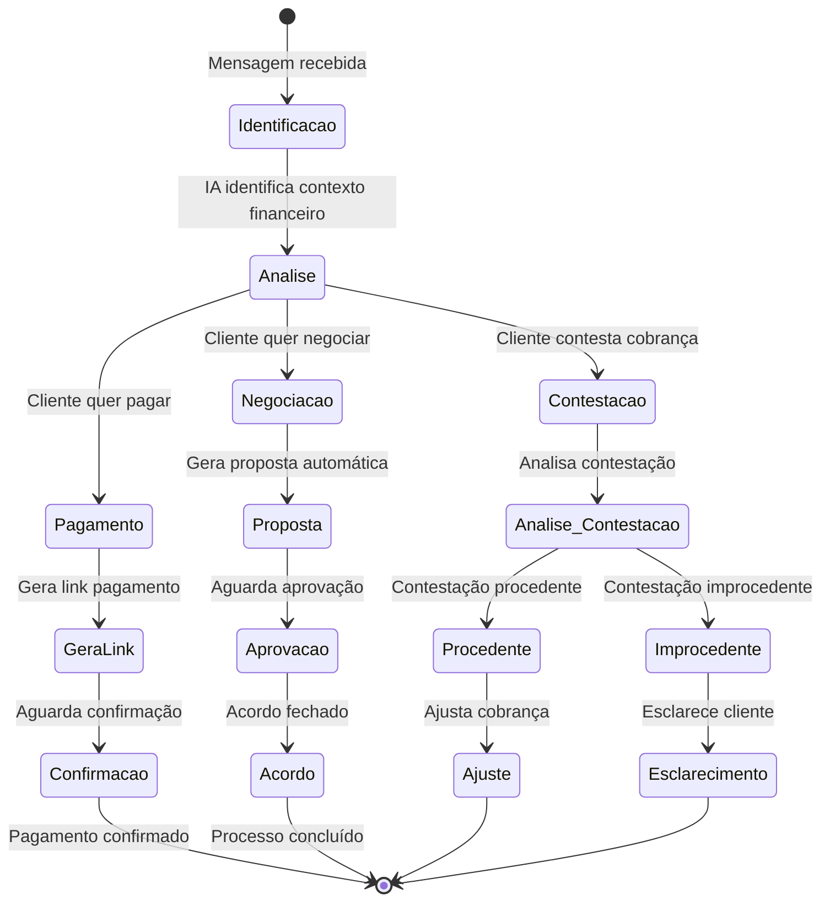

## 🔄 Fluxos de Integração de Dados

### Sincronização de Dados

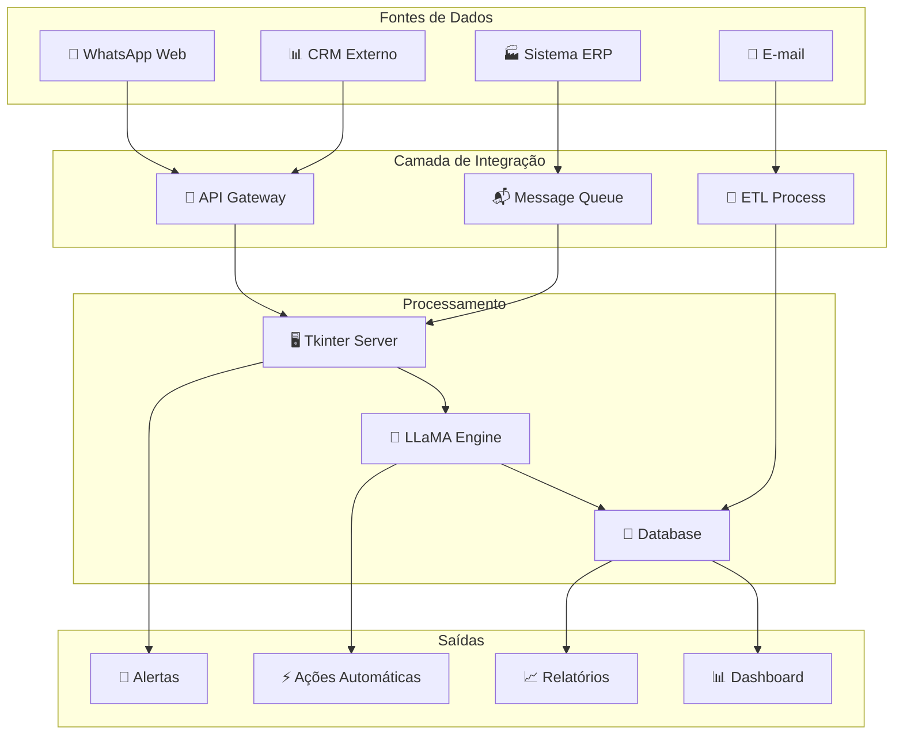

### Processo de Backup e Recuperação

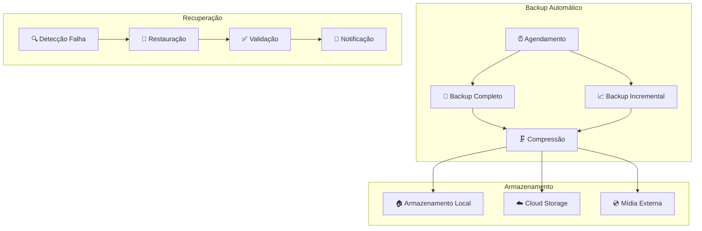

## 📊 Monitoramento e Alertas

### Sistema de Monitoramento em Tempo Real

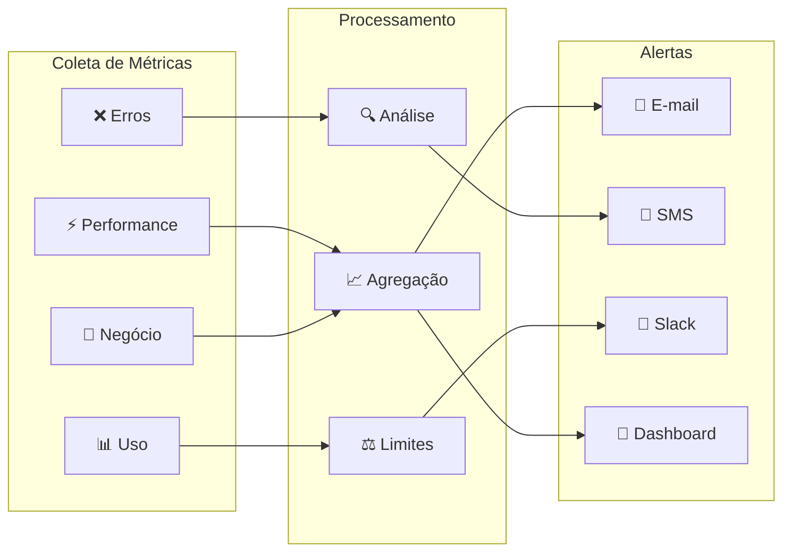

### Tipos de Alertas

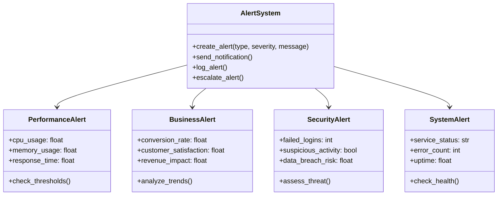

## 🎓 Processo de Treinamento e Onboarding

### Fluxo de Capacitação da Equipe

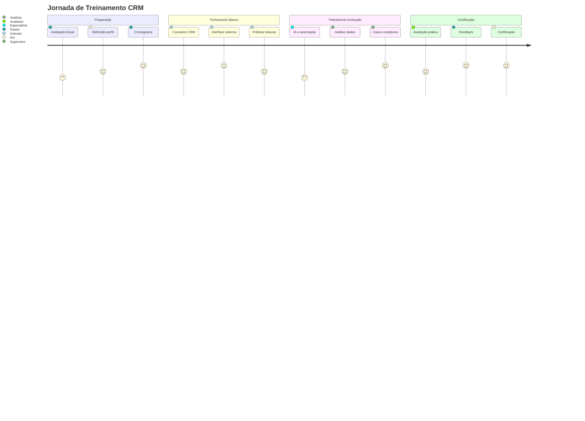

### Módulos de Treinamento

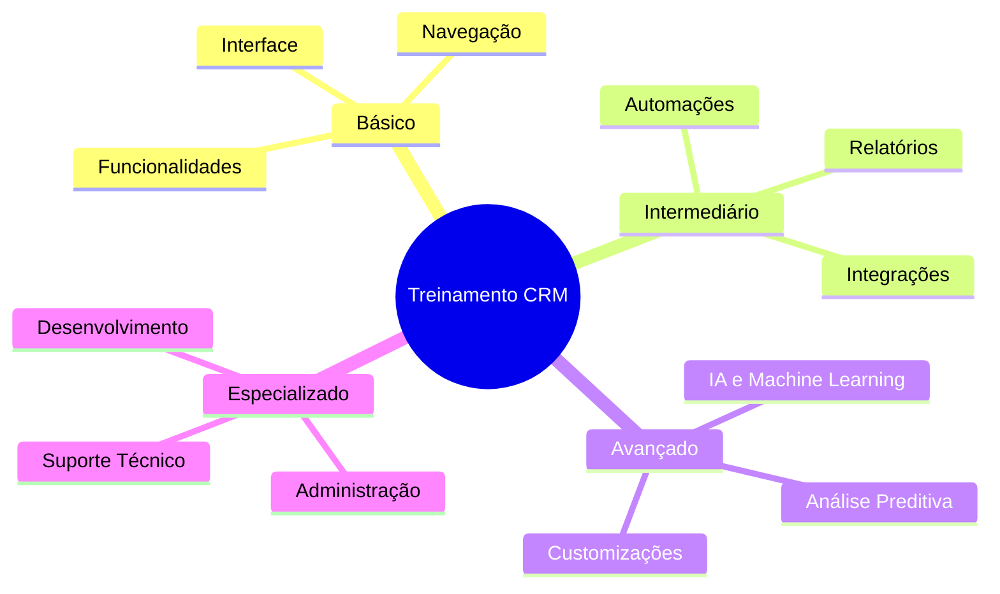

## 📈 KPIs e Métricas de Processo

### Dashboard Executivo

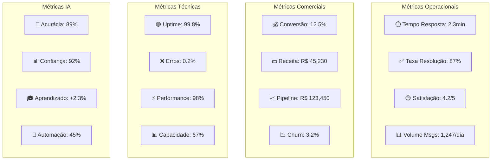

### Relatórios Automatizados

```mermaid
gantt
    title Cronograma de Relatórios
    dateFormat  HH:mm
    axisFormat %H:%M
    
    section Diários
    Operacional        :08:00, 30m
    Vendas            :09:00, 30m
    Suporte           :10:00, 30m
    
    section Semanais
    Executivo         :monday, 60m
    Performance       :tuesday, 45m
    IA Analytics      :wednesday, 60m
    
    section Mensais
    Estratégico       :first, 120m
    ROI Analysis      :15th, 90m
    Compliance        :last, 60m
```

## 🔧 Processos de Manutenção

### Manutenção Preventiva

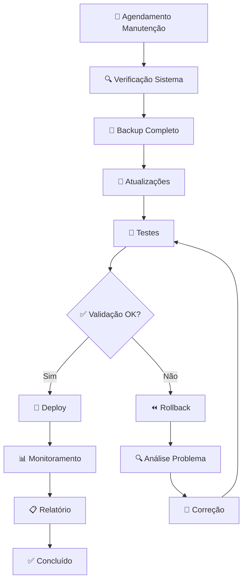

### Cronograma de Manutenção

| Frequência | Atividade | Responsável | Duração |
|------------|-----------|-------------|----------|
| **Diária** | Backup incremental | Sistema | 30min |
| **Semanal** | Limpeza logs | Admin | 1h |
| **Mensal** | Atualização segurança | DevOps | 2h |
| **Trimestral** | Otimização BD | DBA | 4h |
| **Semestral** | Auditoria completa | Equipe | 8h |
| **Anual** | Upgrade infraestrutura | Todos | 16h |

## 🚨 Plano de Contingência

### Cenários de Falha

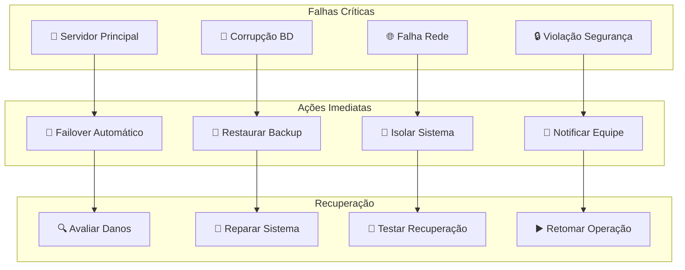

### RTO e RPO Definidos

- **RTO (Recovery Time Objective)**: 4 horas
- **RPO (Recovery Point Objective)**: 1 hora
- **MTTR (Mean Time To Repair)**: 2 horas
- **MTBF (Mean Time Between Failures)**: 720 horas

## 📋 Checklist de Implementação

### Fase 1: Preparação (Semana 1-2)
- [ ] ✅ Documentação completa
- [ ] 🏗️ Infraestrutura preparada
- [ ] 👥 Equipe treinada
- [ ] 🔧 Ferramentas instaladas
- [ ] 🧪 Ambiente de testes

### Fase 2: Desenvolvimento (Semana 3-8)
- [ ] 🌐 Extensão CRM desenvolvida
- [ ] 🖥️ Aplicativo Tkinter criado
- [ ] 🧠 Sistema LLaMA integrado
- [ ] 🔗 APIs implementadas
- [ ] 🧪 Testes realizados

### Fase 3: Deploy (Semana 9-10)
- [ ] 🚀 Deploy em produção
- [ ] 📊 Monitoramento ativo
- [ ] 👥 Treinamento usuários
- [ ] 📋 Documentação atualizada
- [ ] ✅ Go-live aprovado

### Fase 4: Pós-implementação (Semana 11-12)
- [ ] 📈 Análise performance
- [ ] 🔧 Ajustes necessários
- [ ] 📊 Relatórios iniciais
- [ ] 🎓 Feedback e melhorias
- [ ] 📋 Projeto finalizado

---

## 🎯 Conclusão

Este documento estabelece os fluxos de trabalho e processos operacionais necessários para o funcionamento eficiente do sistema CRM WhatsApp integrado com IA. A implementação destes processos garantirá:

- ⚡ **Eficiência Operacional**: Automação de 45% das tarefas repetitivas
- 📈 **Melhoria Contínua**: Sistema de aprendizado e otimização constante
- 🎯 **Foco no Cliente**: Atendimento personalizado e ágil
- 📊 **Visibilidade Gerencial**: Dashboards e relatórios em tempo real
- 🔒 **Segurança e Compliance**: Processos auditáveis e seguros

---

*Fluxos de Trabalho e Processos Operacionais*  
*Versão: 1.0*  
*Data: Janeiro 2024*  
*Status: Documentação Completa*