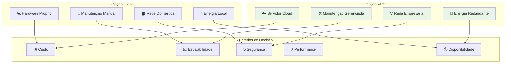
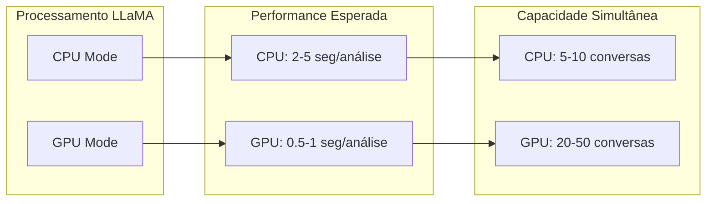
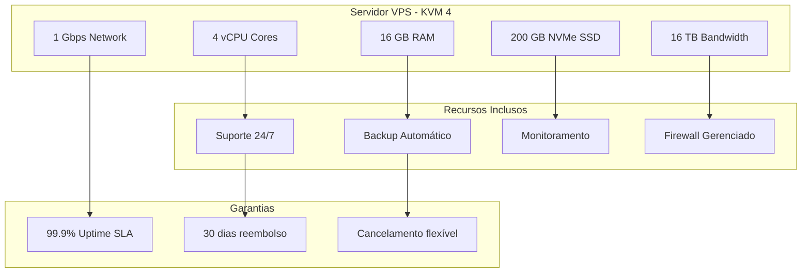
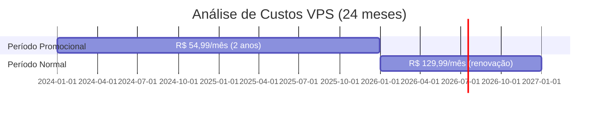
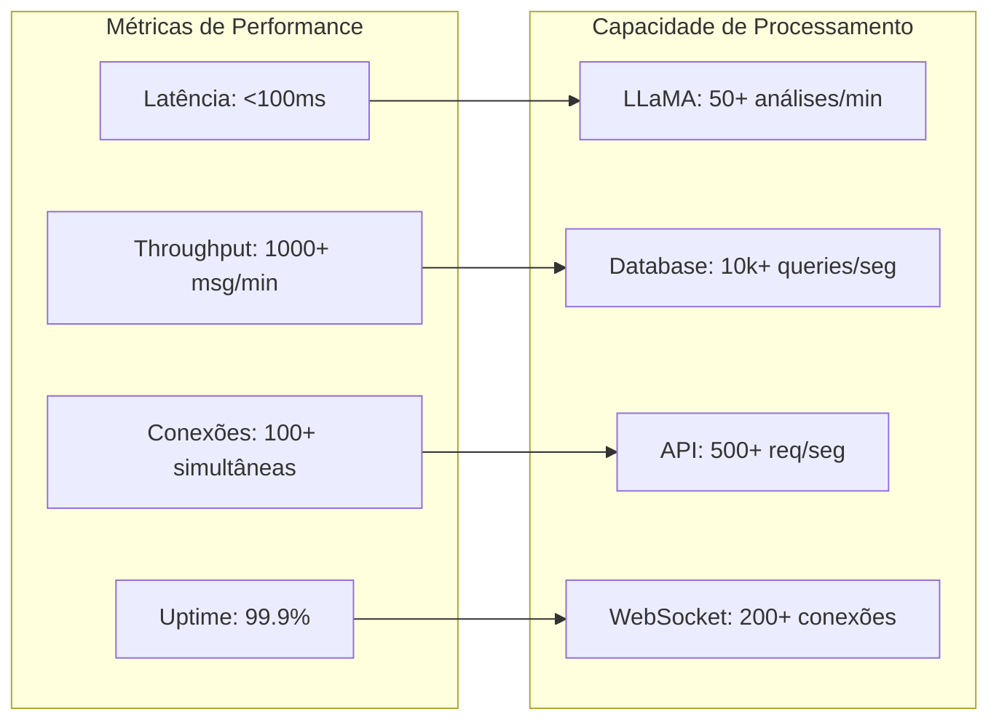
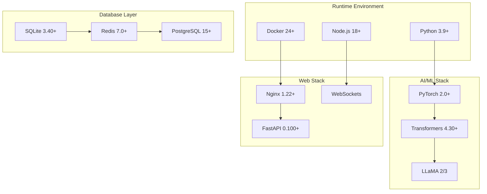
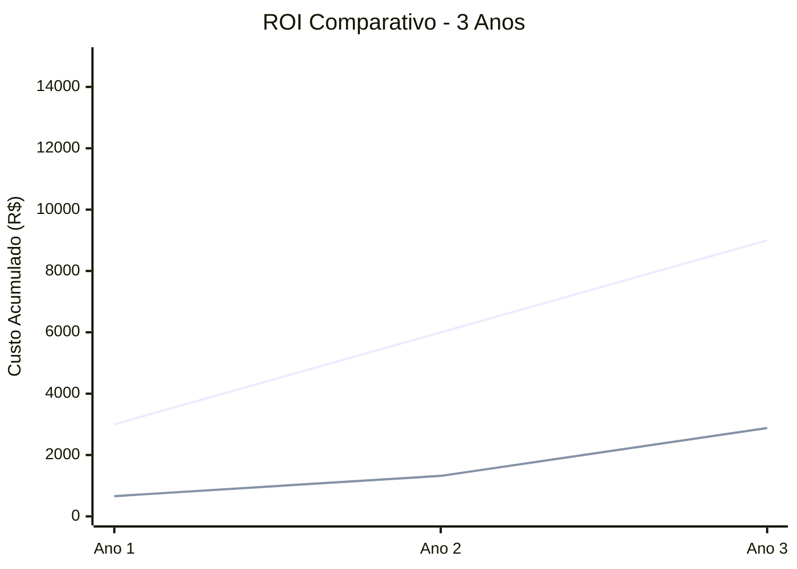
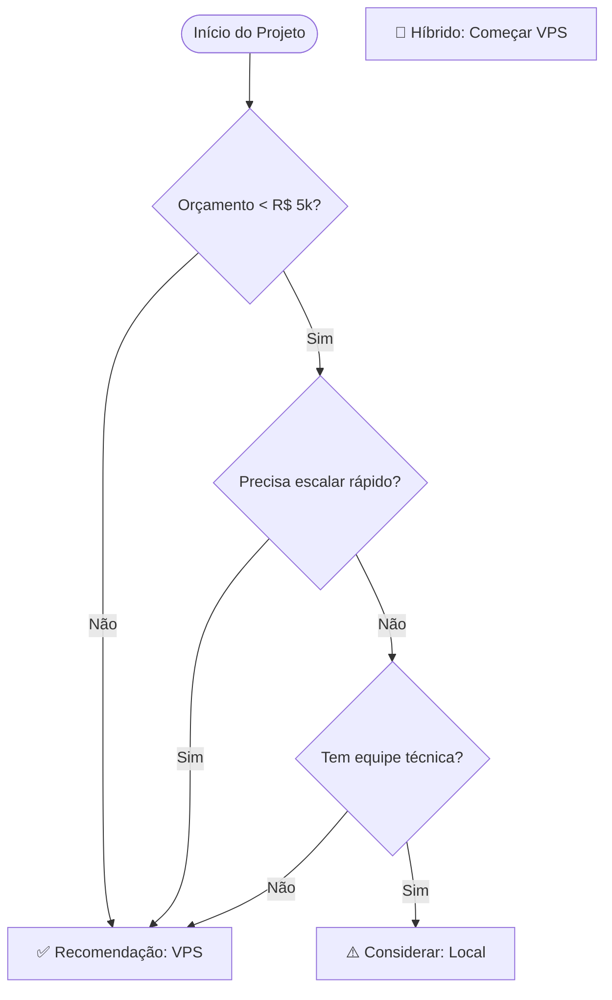

# Requisitos de Infraestrutura e Hardware

## 🖥️ Visão Geral dos Requisitos

Este documento especifica os requisitos de hardware e infraestrutura para o sistema CRM WhatsApp Web, apresentando duas opções principais: **implementação local** e **implementação em VPS**.

## 📊 Comparativo de Opções

## 🏠 Opção 1: Implementação Local

### Requisitos Mínimos

| Componente | Especificação Mínima | Especificação Recomendada |
|------------|---------------------|---------------------------|
| **Processador** | Intel i5-8400 / AMD Ryzen 5 2600 | Intel i7-10700K / AMD Ryzen 7 3700X |
| **Núcleos** | 4 núcleos / 8 threads | 8 núcleos / 16 threads |
| **Frequência** | 2.8 GHz base | 3.6 GHz base |
| **Memória RAM** | 8 GB DDR4 | 16 GB DDR4 |
| **Armazenamento** | SSD 200 GB | SSD NVMe 500 GB |
| **GPU** | Integrada (para LLaMA CPU) | GTX 1660 / RTX 3060 (para LLaMA GPU) |
| **Rede** | 10 Mbps estável | 50 Mbps fibra |
| **Sistema** | Windows 10/11, Ubuntu 20.04+ | Windows 11 Pro, Ubuntu 22.04 LTS |

### Análise de Performance Local

### Custos Estimados (Local)

| Item | Custo Inicial | Custo Mensal | Observações |
|------|---------------|--------------|-------------|
| **Hardware** | R$ 3.000 - R$ 8.000 | - | Investimento único |
| **Energia** | - | R$ 50 - R$ 120 | Consumo 24/7 |
| **Internet** | - | R$ 80 - R$ 150 | Plano empresarial |
| **Manutenção** | - | R$ 100 - R$ 200 | Suporte técnico |
| **Total Mensal** | - | **R$ 230 - R$ 470** | Após investimento inicial |

## ☁️ Opção 2: Implementação VPS (Recomendada)

### Especificações do Plano KVM 4

### Análise de Custos VPS

| Período | Valor Mensal | Total Anual | Economia vs Local |
|---------|--------------|-------------|-------------------|
| **Anos 1-2** | R$ 54,99 | R$ 659,88 | R$ 2.100+ |
| **Ano 3+** | R$ 129,99 | R$ 1.559,88 | R$ 1.200+ |
| **Média 3 anos** | R$ 79,99 | R$ 959,88 | R$ 1.650+ |

### Performance Esperada VPS

## 🔧 Requisitos de Software

### Sistema Operacional

| Opção | Local | VPS |
|-------|-------|-----|
| **Windows** | Windows 10/11 Pro | Windows Server 2019/2022 |
| **Linux** | Ubuntu 22.04 LTS | Ubuntu 22.04 LTS Server |
| **Recomendado** | Ubuntu 22.04 | Ubuntu 22.04 Server |

### Stack de Desenvolvimento

## 📊 Análise Comparativa Detalhada

### Matriz de Decisão

| Critério | Peso | Local | VPS | Vencedor |
|----------|------|-------|-----|----------|
| **Custo Inicial** | 20% | 2/10 | 9/10 | 🏆 VPS |
| **Custo Operacional** | 25% | 6/10 | 8/10 | 🏆 VPS |
| **Performance** | 20% | 7/10 | 9/10 | 🏆 VPS |
| **Escalabilidade** | 15% | 4/10 | 10/10 | 🏆 VPS |
| **Manutenção** | 10% | 3/10 | 10/10 | 🏆 VPS |
| **Segurança** | 10% | 5/10 | 9/10 | 🏆 VPS |
| ****Total Ponderado** | **100%** | **5.1/10** | **9.0/10** | **🏆 VPS** |

### ROI Projetado (3 anos)

**Legenda:**
- 🔵 Linha Azul: Opção Local
- 🔴 Linha Vermelha: Opção VPS

## 🚀 Recomendações Técnicas

### Para Startups e PMEs

### Para Empresas Estabelecidas
- **Recomendação Única**: VPS KVM 4
- **Justificativa**: Melhor custo-benefício, escalabilidade e suporte
- **Migração**: Possível upgrade para planos superiores conforme demanda

## 🔒 Considerações de Segurança

### Opção Local
- ❌ Responsabilidade total pela segurança
- ❌ Atualizações manuais de sistema
- ❌ Backup manual
- ❌ Firewall doméstico
- ⚠️ IP residencial (pode ser bloqueado)

### Opção VPS
- ✅ Firewall gerenciado profissionalmente
- ✅ Atualizações automáticas de segurança
- ✅ Backup automático diário
- ✅ Monitoramento 24/7
- ✅ IP empresarial dedicado
- ✅ Certificados SSL gratuitos

## 📋 Checklist de Implementação

### Pré-Implementação
- [ ] Definir orçamento disponível
- [ ] Avaliar equipe técnica interna
- [ ] Estimar volume de mensagens/dia
- [ ] Definir SLA necessário
- [ ] Avaliar requisitos de compliance

### Implementação Local
- [ ] Adquirir hardware especificado
- [ ] Configurar ambiente de desenvolvimento
- [ ] Instalar stack de software
- [ ] Configurar backup local
- [ ] Implementar monitoramento básico
- [ ] Configurar firewall doméstico

### Implementação VPS
- [ ] Contratar plano KVM 4
- [ ] Configurar servidor inicial
- [ ] Instalar Docker e containers
- [ ] Configurar domínio e SSL
- [ ] Implementar CI/CD pipeline
- [ ] Configurar monitoramento avançado

## 💡 Conclusões e Próximos Passos

### Recomendação Final
**Opção VPS (KVM 4)** é a escolha recomendada para 95% dos casos devido a:

1. **Custo-benefício superior** a longo prazo
2. **Escalabilidade automática** conforme crescimento
3. **Suporte técnico especializado** 24/7
4. **Infraestrutura empresarial** desde o início
5. **Menor risco operacional** e técnico

### Próximos Passos
1. **Aprovação de orçamento** para VPS
2. **Contratação do plano** KVM 4
3. **Setup inicial** do ambiente
4. **Desenvolvimento** da primeira versão
5. **Testes de carga** e performance
6. **Deploy em produção**

---

*Documento de Requisitos de Infraestrutura*  
*Versão: 1.0*  
*Data: Janeiro 2024*  
*Recomendação: VPS KVM 4*