# Especificações Técnicas - Sistema de Análise LLaMA

## 🧠 Visão Geral do Sistema de IA

O sistema de análise LLaMA é o núcleo de inteligência artificial do CRM, responsável por processar mensagens do WhatsApp, extrair insights, classificar intenções, analisar sentimentos e gerar sugestões de resposta personalizadas em tempo real.

## 🏗️ Arquitetura do Sistema LLaMA

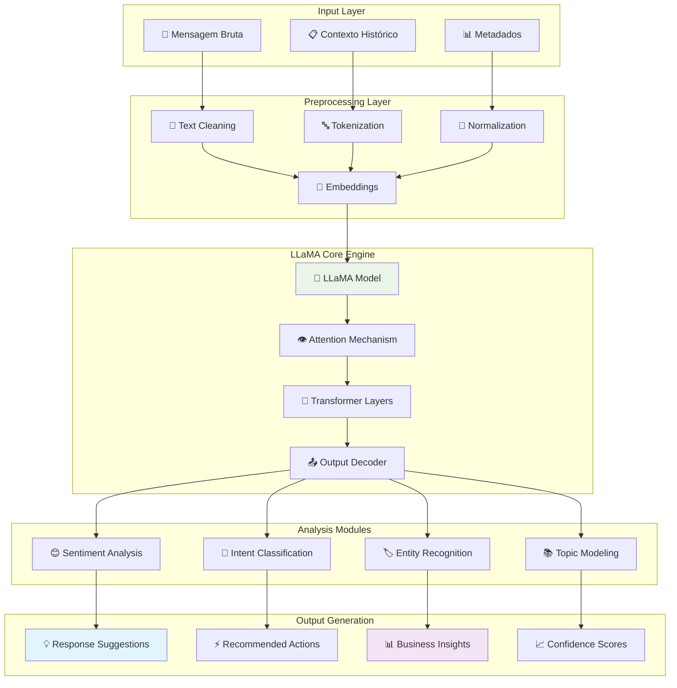

## 🎯 Funcionalidades de Análise

### 1. Análise de Sentimento

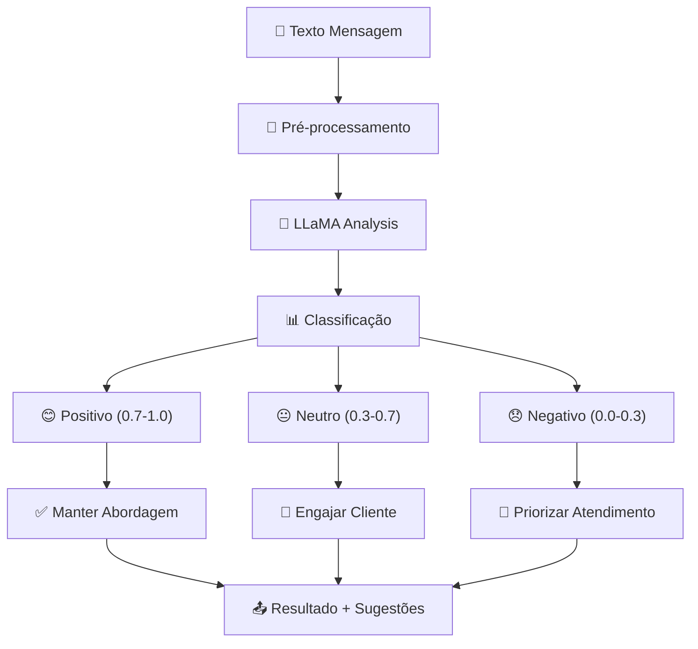

**Métricas de Sentimento:**
- **Score**: 0.0 (muito negativo) a 1.0 (muito positivo)
- **Confiança**: Nível de certeza da classificação
- **Aspectos**: Elementos específicos que influenciam o sentimento
- **Tendência**: Evolução do sentimento ao longo da conversa

### 2. Classificação de Intenções

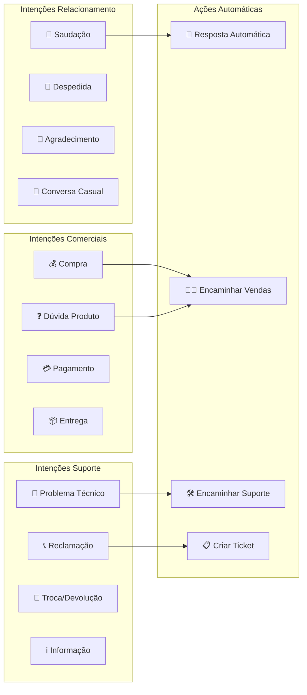

### 3. Reconhecimento de Entidades

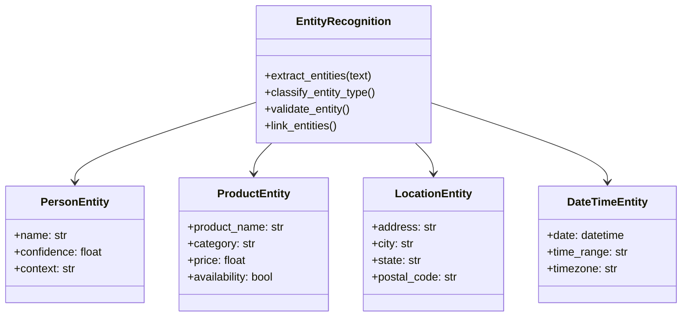

## 🔧 Especificações Técnicas do LLaMA

### Configuração do Modelo

```python
# Configuração LLaMA para CRM
LLAMA_CONFIG = {
    "model_name": "llama-2-7b-chat",  # ou llama-2-13b-chat para melhor performance
    "model_path": "./models/llama-2-7b-chat.gguf",
    "context_length": 4096,
    "max_tokens": 512,
    "temperature": 0.7,
    "top_p": 0.9,
    "top_k": 40,
    "repeat_penalty": 1.1,
    "batch_size": 1,
    "threads": 4,  # CPU threads
    "gpu_layers": 0,  # 0 para CPU, >0 para GPU
    "use_mlock": True,
    "use_mmap": True
}
```

### Requisitos de Hardware por Modelo

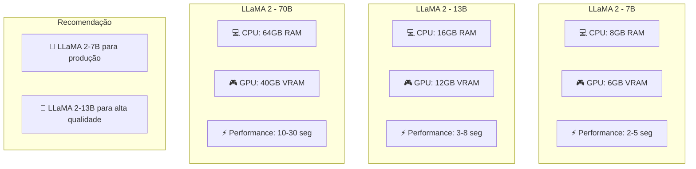

### Pipeline de Processamento

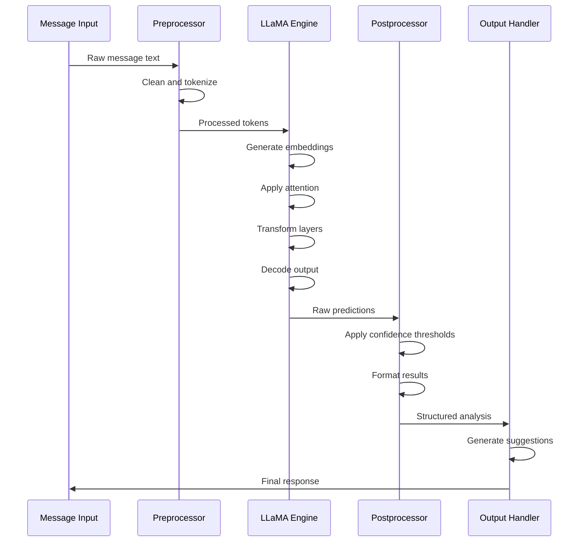

## 🎨 Prompts Especializados

### Template de Prompt para Análise CRM

```python
CRM_ANALYSIS_PROMPT = """
Você é um assistente especializado em análise de conversas de atendimento ao cliente.

Analise a seguinte mensagem do cliente:

Mensagem: "{message}"
Contexto da conversa: {conversation_history}
Informações do cliente: {customer_info}

Forneça uma análise estruturada incluindo:

1. SENTIMENTO (positivo/neutro/negativo com score 0-1)
2. INTENÇÃO PRINCIPAL (compra, suporte, informação, reclamação, etc.)
3. ENTIDADES IDENTIFICADAS (produtos, datas, valores, locais)
4. URGÊNCIA (baixa/média/alta)
5. SUGESTÕES DE RESPOSTA (3 opções diferentes)
6. AÇÕES RECOMENDADAS (próximos passos)

Responda em formato JSON estruturado.
"""
```

### Prompts Especializados por Contexto

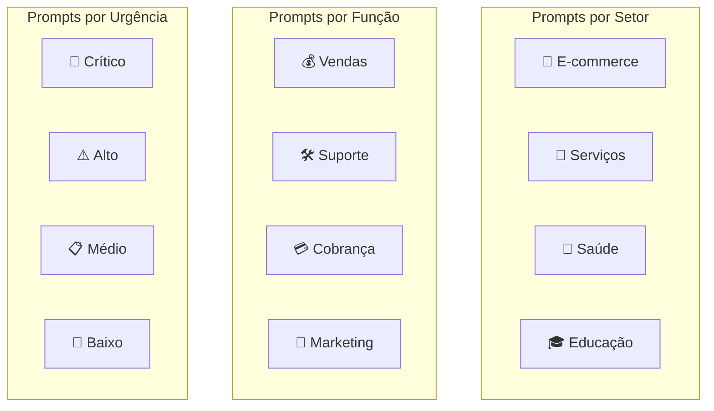

## 📊 Sistema de Métricas e Avaliação

### Métricas de Performance do Modelo

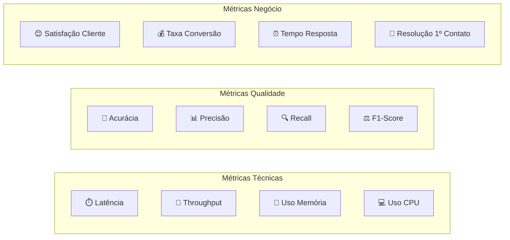

### Dashboard de Monitoramento IA

```python
# Métricas coletadas em tempo real
class AIMetrics:
    def __init__(self):
        self.metrics = {
            "model_performance": {
                "avg_latency_ms": 0,
                "requests_per_minute": 0,
                "error_rate": 0,
                "memory_usage_mb": 0
            },
            "analysis_quality": {
                "sentiment_accuracy": 0,
                "intent_accuracy": 0,
                "entity_precision": 0,
                "confidence_avg": 0
            },
            "business_impact": {
                "response_time_improvement": 0,
                "customer_satisfaction": 0,
                "conversion_rate": 0,
                "agent_productivity": 0
            }
        }
```

## 🔄 Sistema de Aprendizado Contínuo

### Feedback Loop

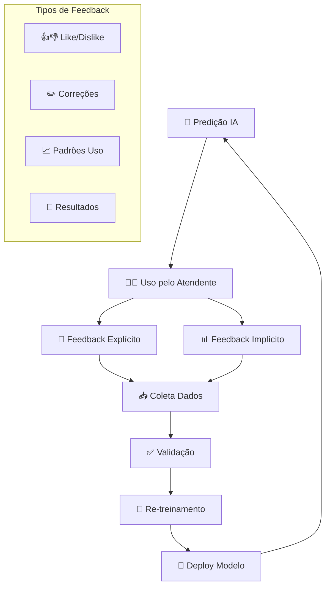

### Fine-tuning Personalizado

```python
# Configuração para fine-tuning específico do domínio
FINE_TUNING_CONFIG = {
    "base_model": "llama-2-7b-chat",
    "dataset_path": "./data/crm_conversations.jsonl",
    "training_params": {
        "learning_rate": 2e-5,
        "batch_size": 4,
        "epochs": 3,
        "warmup_steps": 100,
        "max_seq_length": 2048
    },
    "lora_config": {  # LoRA para eficiência
        "r": 16,
        "alpha": 32,
        "dropout": 0.1,
        "target_modules": ["q_proj", "v_proj"]
    }
}
```

## 🔒 Segurança e Privacidade da IA

### Proteção de Dados Sensíveis

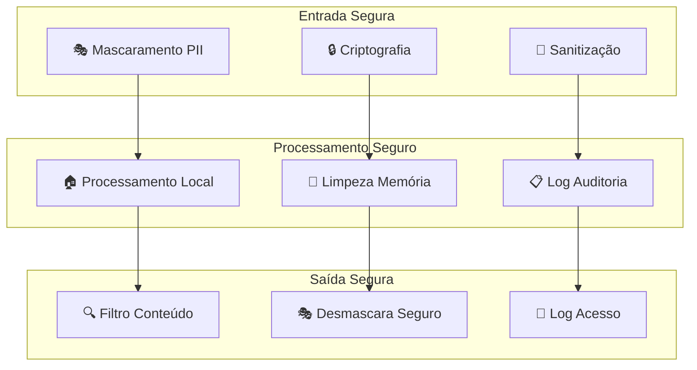

### Conformidade LGPD/GDPR

- ✅ **Processamento Local**: Dados não saem do ambiente controlado
- ✅ **Anonimização**: PII mascarado antes do processamento
- ✅ **Direito ao Esquecimento**: Remoção completa de dados
- ✅ **Auditoria**: Log completo de processamentos
- ✅ **Consentimento**: Opt-in explícito para análise IA

## ⚡ Otimizações de Performance

### Estratégias de Otimização

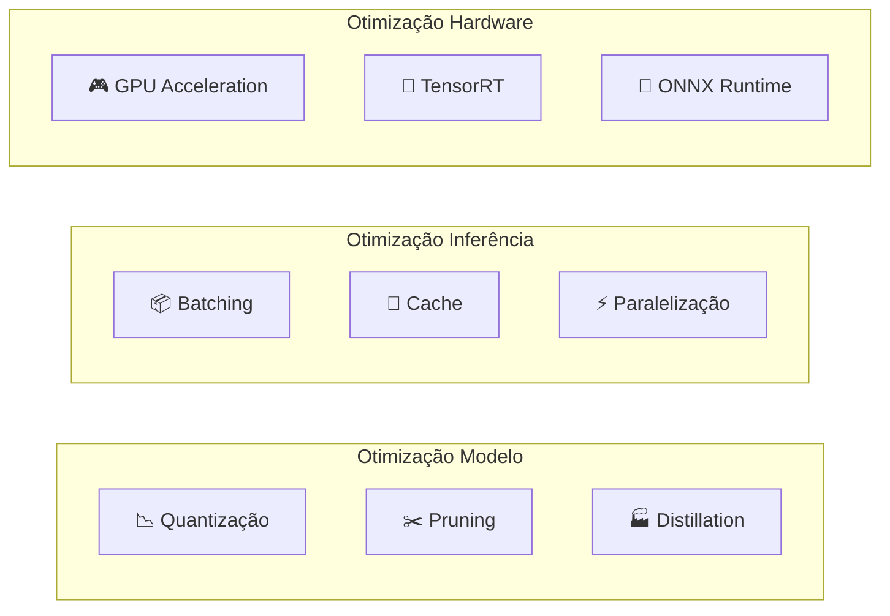

### Configurações de Performance

```python
# Configurações otimizadas para produção
PRODUCTION_CONFIG = {
    "model_optimization": {
        "quantization": "int8",  # Reduz uso de memória
        "batch_size": 4,        # Processa múltiplas mensagens
        "max_concurrent": 10,   # Limite de processamentos simultâneos
        "cache_size": 1000      # Cache de embeddings
    },
    "hardware_optimization": {
        "use_gpu": True,
        "gpu_memory_fraction": 0.8,
        "cpu_threads": 8,
        "mixed_precision": True
    }
}
```

## 📈 Roadmap de Evolução da IA

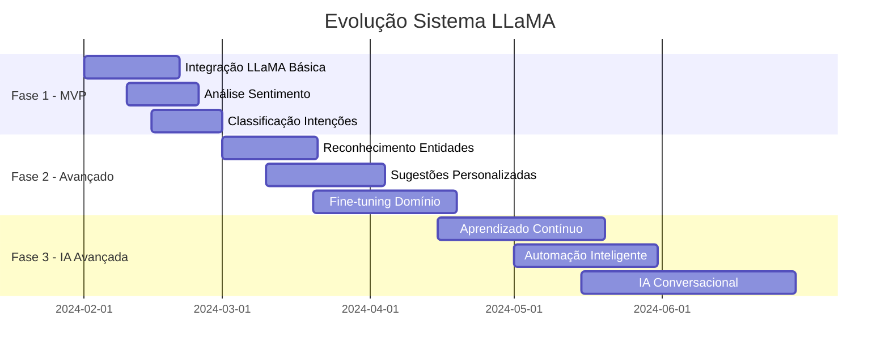

## 🧪 Testes e Validação

### Estratégia de Testes da IA

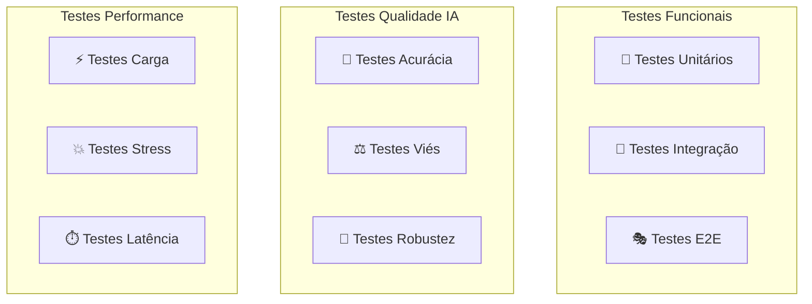

### Dataset de Validação

```python
# Estrutura do dataset de teste
VALIDATION_DATASET = {
    "sentiment_test": {
        "positive_samples": 1000,
        "negative_samples": 1000,
        "neutral_samples": 1000,
        "expected_accuracy": 0.85
    },
    "intent_test": {
        "purchase_intent": 500,
        "support_intent": 500,
        "info_intent": 500,
        "complaint_intent": 500,
        "expected_accuracy": 0.80
    },
    "entity_test": {
        "person_names": 300,
        "product_names": 300,
        "dates": 200,
        "locations": 200,
        "expected_precision": 0.75
    }
}
```

---

## 📋 Próximos Passos

1. **Download e Setup do LLaMA**
2. **Implementação do Engine Base**
3. **Desenvolvimento dos Módulos de Análise**
4. **Treinamento com Dados Específicos**
5. **Testes de Performance e Qualidade**
6. **Integração com Sistema Tkinter**

---

*Especificações Técnicas - Sistema LLaMA*  
*Versão: 1.0*  
*Data: Janeiro 2024*  
*Status: Especificação Completa*